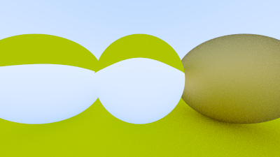
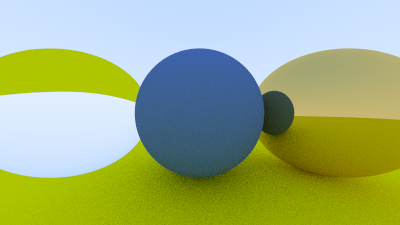
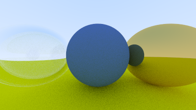

# Dielectrics

Clear materials such as water, glass, and diamonds are dielectrics. When a light ray hits them, it
splits into a reflected ray and a refracted (transmitted) ray. We'll handle that by randomly
choosing between reflection or refraction, and only generating one scattered ray per interaction.

## Refraction

The hardest part to debug is the refracted ray. I usually first just have all the light refract if
there is a refraction ray at all. For this project, I tried to put two glass balls in our scene, and
I got this (I have not told you how to do this right or wrong yet, but soon!):


Is that right? Glass balls look odd in real life. But no, it isn't right. The world should be
flipped upside down and no weird black stuff. I just printed out the ray straight through the middle
of the image and it was clearly wrong. That often does the job.

## Snell's Law

The refraction is described by Snell's law:

$\eta \cdot \sin\theta = \eta' \cdot \sin\theta'$

Where $\theta$ and $\theta'$ are the angles from the normal, and $\eta$ and $\eta'$ (pronounced
"eta" and "eta prime") are the refractive indices (typically air = 1.0, glass = 1.3–1.7, diamond =
2.4). The geometry is:

![Figure \[refraction\]: Ray refraction](../images/fig-1.13-refraction.jpg)

In order to determine the direction of the refracted ray, we have to solve for $\sin\theta'$:

$\sin\theta' = \frac{\eta}{\eta'} \cdot \sin\theta$

On the refracted side of the surface there is a refracted ray $\mathbf{R'}$ and a normal
$\mathbf{n'}$, and there exists an angle, $\theta'$, between them. We can split $\mathbf{R'}$ into
the parts of the ray that are perpendicular to $\mathbf{n'}$ and parallel to $\mathbf{n'}$:

$\mathbf{R'} = \mathbf{R'}_{\bot} + \mathbf{R'}_{\parallel}$

If we solve for $\mathbf{R'}_{\bot}$ and $\mathbf{R'}_{\parallel}$ we get:

$\mathbf{R'}_{\bot} = \frac{\eta}{\eta'} (\mathbf{R} + \cos\theta \mathbf{n})$
$\mathbf{R'}_{\parallel} = -\sqrt{1 - |\mathbf{R'}\_{\bot}|^2} \mathbf{n}$

You can go ahead and prove this for yourself if you want, but we will treat it as fact and move on.
The rest of the book will not require you to understand the proof.

We still need to solve for $\cos\theta$. It is well known that the dot product of two vectors can
be explained in terms of the cosine of the angle between them:

$\mathbf{a} \cdot \mathbf{b} = |\mathbf{a}| |\mathbf{b}| \cos\theta$

If we restrict $\mathbf{a}$ and $\mathbf{b}$ to be unit vectors:

$\mathbf{a} \cdot \mathbf{b} = \cos\theta$

We can now rewrite $\mathbf{R'}_{\bot}$ in terms of known quantities:

$$
\mathbf{R'}_{\bot} =
   \frac{\eta}{\eta'} (\mathbf{R} + (\mathbf{-R} \cdot \mathbf{n}) \mathbf{n})
$$

When we combine them back together, we can write a function to calculate $\mathbf{R'}$:

<Tabs>
  <Tab label="Rust">
    ```rust filename="vec3.rs | Refraction function" {196-202}
    use std::fmt::{Display, Formatter, Result};
    use std::ops::{Add, AddAssign, Div, DivAssign, Mul, MulAssign, Neg, Sub};

    use crate::common;

    #[derive(Copy, Clone, Default)]
    pub struct Vec3 {
        e: [f64; 3],
    }

    impl Vec3 {
        pub fn new(x: f64, y: f64, z: f64) -> Vec3 {
            Vec3 { e: [x, y, z] }
        }

        pub fn random() -> Vec3 {
            Vec3::new(
                common::random_double(),
                common::random_double(),
                common::random_double(),
            )
        }

        pub fn random_range(min: f64, max: f64) -> Vec3 {
            Vec3::new(
                common::random_double_range(min, max),
                common::random_double_range(min, max),
                common::random_double_range(min, max),
            )
        }

        pub fn x(&self) -> f64 {
            self.e[0]
        }

        pub fn y(&self) -> f64 {
            self.e[1]
        }

        pub fn z(&self) -> f64 {
            self.e[2]
        }

        pub fn length(&self) -> f64 {
            f64::sqrt(self.length_squared())
        }

        pub fn length_squared(&self) -> f64 {
            self.e[0] * self.e[0] + self.e[1] * self.e[1] + self.e[2] * self.e[2]
        }

        pub fn near_zero(&self) -> bool {
            const EPS: f64 = 1.0e-8;
            // Return true if the vector is close to zero in all dimensions
            self.e[0].abs() < EPS && self.e[1].abs() < EPS && self.e[2].abs() < EPS
        }
    }

    // Type alias
    pub type Point3 = Vec3;

    // Output formatting
    impl Display for Vec3 {
        fn fmt(&self, f: &mut Formatter) -> Result {
            write!(f, "{} {} {}", self.e[0], self.e[1], self.e[2])
        }
    }

    // -Vec3
    impl Neg for Vec3 {
        type Output = Vec3;

        fn neg(self) -> Vec3 {
            Vec3::new(-self.x(), -self.y(), -self.z())
        }
    }

    // Vec3 += Vec3
    impl AddAssign for Vec3 {
        fn add_assign(&mut self, v: Vec3) {
            *self = *self + v;
        }
    }

    // Vec3 *= f64
    impl MulAssign<f64> for Vec3 {
        fn mul_assign(&mut self, t: f64) {
            *self = *self * t;
        }
    }

    // Vec3 /= f64
    impl DivAssign<f64> for Vec3 {
        fn div_assign(&mut self, t: f64) {
            *self = *self / t;
        }
    }

    // Vec3 + Vec3
    impl Add for Vec3 {
        type Output = Vec3;

        fn add(self, v: Vec3) -> Vec3 {
            Vec3::new(self.x() + v.x(), self.y() + v.y(), self.z() + v.z())
        }
    }

    // Vec3 - Vec3
    impl Sub for Vec3 {
        type Output = Vec3;

        fn sub(self, v: Vec3) -> Vec3 {
            Vec3::new(self.x() - v.x(), self.y() - v.y(), self.z() - v.z())
        }
    }

    // Vec3 * Vec3
    impl Mul for Vec3 {
        type Output = Vec3;

        fn mul(self, v: Vec3) -> Vec3 {
            Vec3::new(self.x() * v.x(), self.y() * v.y(), self.z() * v.z())
        }
    }

    // f64 * Vec3
    impl Mul<Vec3> for f64 {
        type Output = Vec3;

        fn mul(self, v: Vec3) -> Vec3 {
            Vec3::new(self * v.x(), self * v.y(), self * v.z())
        }
    }

    // Vec3 * f64
    impl Mul<f64> for Vec3 {
        type Output = Vec3;

        fn mul(self, t: f64) -> Vec3 {
            Vec3::new(self.x() * t, self.y() * t, self.z() * t)
        }
    }

    // Vec3 / f64
    impl Div<f64> for Vec3 {
        type Output = Vec3;

        fn div(self, t: f64) -> Vec3 {
            Vec3::new(self.x() / t, self.y() / t, self.z() / t)
        }
    }

    pub fn dot(u: Vec3, v: Vec3) -> f64 {
        u.e[0] * v.e[0] + u.e[1] * v.e[1] + u.e[2] * v.e[2]
    }

    pub fn cross(u: Vec3, v: Vec3) -> Vec3 {
        Vec3::new(
            u.e[1] * v.e[2] - u.e[2] * v.e[1],
            u.e[2] * v.e[0] - u.e[0] * v.e[2],
            u.e[0] * v.e[1] - u.e[1] * v.e[0],
        )
    }

    pub fn unit_vector(v: Vec3) -> Vec3 {
        v / v.length()
    }

    pub fn random_in_unit_sphere() -> Vec3 {
        loop {
            let p = Vec3::random_range(-1.0, 1.0);
            if p.length_squared() >= 1.0 {
                continue;
            }
            return p;
        }
    }

    pub fn random_unit_vector() -> Vec3 {
        unit_vector(random_in_unit_sphere())
    }

    pub fn random_in_hemisphere(normal: Vec3) -> Vec3 {
        let in_unit_sphere = random_in_unit_sphere();
        if dot(in_unit_sphere, normal) > 0.0 {
            // In the same hemisphere as the normal
            in_unit_sphere
        } else {
            -in_unit_sphere
        }
    }

    pub fn reflect(v: Vec3, n: Vec3) -> Vec3 {
        v - 2.0 * dot(v, n) * n
    }

    pub fn refract(uv: Vec3, n: Vec3, etai_over_etat: f64) -> Vec3 {
        let cos_theta = f64::min(dot(-uv, n), 1.0);
        let r_out_perp = etai_over_etat * (uv + cos_theta * n);
        let r_out_parallel = -f64::sqrt(f64::abs(1.0 - r_out_perp.length_squared())) * n;
        r_out_perp + r_out_parallel
    }
    ```
  </Tab>

  <Tab label="C++">
    ```cpp filename="vec3.h | Refraction function" {165-171}
    #ifndef VEC3_H
    #define VEC3_H

    #include <array>
    #include <cmath>
    #include <ostream>

    #include "common.h"

    class Vec3 {
    public:
        Vec3() = default;

        Vec3(double e0, double e1, double e2) : e{e0, e1, e2} {}

        static Vec3 random() {
            return Vec3(random_double(), random_double(), random_double());
        }

        static Vec3 random_range(double min, double max) {
            return Vec3(
                random_double_range(min, max),
                random_double_range(min, max),
                random_double_range(min, max)
            );
        }

        double x() const {
            return e[0];
        }

        double y() const {
            return e[1];
        }

        double z() const {
            return e[2];
        }

        double length() const {
            return std::sqrt(length_squared());
        }

        double length_squared() const {
            return e[0] * e[0] + e[1] * e[1] + e[2] * e[2];
        }

        bool near_zero() const {
            const double EPS = 1e-8;
            // Return true if the vector is close to zero in all dimensions
            return fabs(e[0]) < EPS && fabs(e[1]) < EPS && fabs(e[2]) < EPS;
        }

        // -Vec3
        Vec3 operator-() const {
            return Vec3(-e[0], -e[1], -e[2]);
        }

        // Vec3 += Vec3
        Vec3 &operator+=(Vec3 v) {
            e[0] += v.x();
            e[1] += v.y();
            e[2] += v.z();
            return *this;
        }

        // Vec3 *= double
        Vec3 &operator*=(double t) {
            e[0] *= t;
            e[1] *= t;
            e[2] *= t;
            return *this;
        }

        // Vec3 /= double
        Vec3 &operator/=(double t) {
            return *this *= 1.0 / t;
        }

    private:
        std::array<double, 3> e = {0.0, 0.0, 0.0};
    };

    // Type alias
    using Point3 = Vec3;

    // Output formatting
    inline std::ostream &operator<<(std::ostream &out, Vec3 v) {
        return out << v.x() << ' ' << v.y() << ' ' << v.z();
    }

    // Vec3 + Vec3
    inline Vec3 operator+(Vec3 u, Vec3 v) {
        return Vec3(u.x() + v.x(), u.y() + v.y(), u.z() + v.z());
    }

    // Vec3 - Vec3
    inline Vec3 operator-(Vec3 u, Vec3 v) {
        return Vec3(u.x() - v.x(), u.y() - v.y(), u.z() - v.z());
    }

    // Vec3 * Vec3
    inline Vec3 operator*(Vec3 u, Vec3 v) {
        return Vec3(u.x() * v.x(), u.y() * v.y(), u.z() * v.z());
    }

    // double * Vec3
    inline Vec3 operator*(double t, Vec3 v) {
        return Vec3(t * v.x(), t * v.y(), t * v.z());
    }

    // Vec3 * double
    inline Vec3 operator*(Vec3 v, double t) {
        return t * v;
    }

    // Vec3 / double
    inline Vec3 operator/(Vec3 v, double t) {
        return (1.0 / t) * v;
    }

    inline double dot(Vec3 u, Vec3 v) {
        return u.x() * v.x() + u.y() * v.y() + u.z() * v.z();
    }

    inline Vec3 cross(Vec3 u, Vec3 v) {
        return Vec3(
            u.y() * v.z() - u.z() * v.y(),
            u.z() * v.x() - u.x() * v.z(),
            u.x() * v.y() - u.y() * v.x()
        );
    }

    inline Vec3 unit_vector(Vec3 v) {
        return v / v.length();
    }

    inline Vec3 random_in_unit_sphere() {
        while (true) {
            auto p = Vec3::random_range(-1.0, 1.0);
            if (p.length_squared() >= 1.0) {
                continue;
            }
            return p;
        }
    }

    inline Vec3 random_unit_vector() {
        return unit_vector(random_in_unit_sphere());
    }

    inline Vec3 random_in_hemisphere(Vec3 normal) {
        auto in_unit_sphere = random_in_unit_sphere();
        if (dot(in_unit_sphere, normal) > 0.0) {
            // In the same hemisphere as the normal
            return in_unit_sphere;
        } else {
            return -in_unit_sphere;
        }
    }

    inline Vec3 reflect(Vec3 v, Vec3 n) {
        return v - 2.0 * dot(v, n) * n;
    }

    inline Vec3 refract(const Vec3 &uv, const Vec3 &n, double etai_over_etat) {
        auto cos_theta = fmin(dot(-uv, n), 1.0);
        auto r_out_perp = etai_over_etat * (uv + cos_theta * n);
        auto r_out_parallel = -sqrt(fabs(1.0 - r_out_perp.length_squared())) * n;
        return r_out_perp + r_out_parallel;
    }

    #endif
    ```
  </Tab>
</Tabs>

And the dielectric material that always refracts is:

<Tabs>
  <Tab label="Rust">
    ```rust filename="material.rs | Dielectric Material struct that always refracts" {75-109}
    use crate::color::Color;
    use crate::hittable::HitRecord;
    use crate::ray::Ray;
    use crate::vec3;

    pub trait Material {
        fn scatter(
            &self,
            r_in: &Ray,
            rec: &HitRecord,
            attenuation: &mut Color,
            scattered: &mut Ray,
        ) -> bool;
    }

    pub struct Lambertian {
        albedo: Color,
    }

    impl Lambertian {
        pub fn new(a: Color) -> Lambertian {
            Lambertian { albedo: a }
        }
    }

    impl Material for Lambertian {
        fn scatter(
            &self,
            _r_in: &Ray,
            rec: &HitRecord,
            attenuation: &mut Color,
            scattered: &mut Ray,
        ) -> bool {
            let mut scatter_direction = rec.normal + vec3::random_unit_vector();

            // Catch degenerate scatter direction
            if scatter_direction.near_zero() {
                scatter_direction = rec.normal;
            }

            *scattered = Ray::new(rec.p, scatter_direction);
            *attenuation = self.albedo;
            true
        }
    }

    pub struct Metal {
        albedo: Color,
        fuzz: f64,
    }

    impl Metal {
        pub fn new(a: Color, f: f64) -> Metal {
            Metal {
                albedo: a,
                fuzz: if f < 1.0 { f } else { 1.0 },
            }
        }
    }

    impl Material for Metal {
        fn scatter(
            &self,
            r_in: &Ray,
            rec: &HitRecord,
            attenuation: &mut Color,
            scattered: &mut Ray,
        ) -> bool {
            let reflected = vec3::reflect(vec3::unit_vector(r_in.direction()), rec.normal);
            *scattered = Ray::new(rec.p, reflected + self.fuzz * vec3::random_in_unit_sphere());
            *attenuation = self.albedo;
            vec3::dot(scattered.direction(), rec.normal) > 0.0
        }
    }

    pub struct Dielectric {
        ir: f64, // Index of refraction
    }

    impl Dielectric {
        pub fn new(index_of_refraction: f64) -> Dielectric {
            Dielectric {
                ir: index_of_refraction,
            }
        }
    }

    impl Material for Dielectric {
        fn scatter(
            &self,
            r_in: &Ray,
            rec: &HitRecord,
            attenuation: &mut Color,
            scattered: &mut Ray,
        ) -> bool {
            let refraction_ratio = if rec.front_face {
                1.0 / self.ir
            } else {
                self.ir
            };

            let unit_direction = vec3::unit_vector(r_in.direction());
            let refracted = vec3::refract(unit_direction, rec.normal, refraction_ratio);

            *attenuation = Color::new(1.0, 1.0, 1.0);
            *scattered = Ray::new(rec.p, refracted);
            true
        }
    }
    ```
  </Tab>

  <Tab label="C++">
    ```cpp filename="material.h | Dielectric Material class that always refracts" {67-90}
    #ifndef MATERIAL_H
    #define MATERIAL_H

    #include "color.h"
    #include "hittable.h"
    #include "ray.h"
    #include "vec3.h"

    class Material {
    public:
        virtual ~Material() = default;

        virtual bool scatter( //
            const Ray &r_in,
            const HitRecord &rec,
            Color &attenuation,
            Ray &scattered
        ) const = 0;
    };

    class Lambertian : public Material {
    public:
        explicit Lambertian(Color a) : albedo{a} {}

        bool scatter( //
            const Ray & /*r_in*/,
            const HitRecord &rec,
            Color &attenuation,
            Ray &scattered
        ) const override {
            auto scatter_direction = rec.normal + random_unit_vector();

            // Catch degenerate scatter direction
            if (scatter_direction.near_zero()) {
                scatter_direction = rec.normal;
            }

            scattered = Ray(rec.p, scatter_direction);
            attenuation = albedo;
            return true;
        }

    private:
        Color albedo;
    };

    class Metal : public Material {
    public:
        Metal(Color a, double f) : albedo{a}, fuzz{f < 1.0 ? f : 1.0} {}

        bool scatter( //
            const Ray &r_in,
            const HitRecord &rec,
            Color &attenuation,
            Ray &scattered
        ) const override {
            auto reflected = reflect(unit_vector(r_in.direction()), rec.normal);
            scattered = Ray(rec.p, reflected + fuzz * random_in_unit_sphere());
            attenuation = albedo;
            return dot(scattered.direction(), rec.normal) > 0.0;
        }

    private:
        Color albedo;
        double fuzz;
    };

    class Dielectric : public Material {
    public:
        explicit Dielectric(double index_of_refraction) : ir{index_of_refraction} {}

        bool scatter( //
            const Ray &r_in,
            const HitRecord &rec,
            Color &attenuation,
            Ray &scattered
        ) const override {
            auto refraction_ratio = rec.front_face ? (1.0 / ir) : ir;

            auto unit_direction = unit_vector(r_in.direction());
            auto refracted = refract(unit_direction, rec.normal, refraction_ratio);

            attenuation = Color(1.0, 1.0, 1.0);
            scattered = Ray(rec.p, refracted);
            return true;
        }

    private:
        double ir; // Index of refraction
    };

    #endif
    ```
  </Tab>
</Tabs>

Now we'll update the scene to change the left and center spheres to glass:

<Tabs>
  <Tab label="Rust">
    ```rust filename="main.rs | Changing left and center spheres to glass" {18,63-64} genImage
    mod camera;
    mod color;
    mod common;
    mod hittable;
    mod hittable_list;
    mod material;
    mod ray;
    mod sphere;
    mod vec3;

    use std::io;
    use std::rc::Rc;

    use camera::Camera;
    use color::Color;
    use hittable::{HitRecord, Hittable};
    use hittable_list::HittableList;
    use material::{Dielectric, Lambertian, Metal};
    use ray::Ray;
    use sphere::Sphere;
    use vec3::Point3;

    fn ray_color(r: &Ray, world: &dyn Hittable, depth: i32) -> Color {
        // If we've exceeded the ray bounce limit, no more light is gathered
        if depth <= 0 {
            return Color::new(0.0, 0.0, 0.0);
        }

        let mut rec = HitRecord::new();
        if world.hit(r, 0.001, common::INFINITY, &mut rec) {
            let mut scattered = Ray::default();
            let mut attenuation = Color::default();
            if rec
                .mat
                .as_ref()
                .unwrap()
                .scatter(r, &rec, &mut attenuation, &mut scattered)
            {
                return attenuation * ray_color(&scattered, world, depth - 1);
            }
            return Color::new(0.0, 0.0, 0.0);
        }

        let unit_direction = vec3::unit_vector(r.direction());
        let t = 0.5 * (unit_direction.y() + 1.0);
        (1.0 - t) * Color::new(1.0, 1.0, 1.0) + t * Color::new(0.5, 0.7, 1.0)
    }

    fn main() {
        // Image

        const ASPECT_RATIO: f64 = 16.0 / 9.0;
        const IMAGE_WIDTH: i32 = 400;
        const IMAGE_HEIGHT: i32 = (IMAGE_WIDTH as f64 / ASPECT_RATIO) as i32;
        const SAMPLES_PER_PIXEL: i32 = 100;
        const MAX_DEPTH: i32 = 50;

        // World

        let mut world = HittableList::new();

        let material_ground = Rc::new(Lambertian::new(Color::new(0.8, 0.8, 0.0)));
        let material_center = Rc::new(Dielectric::new(1.5));
        let material_left = Rc::new(Dielectric::new(1.5));
        let material_right = Rc::new(Metal::new(Color::new(0.8, 0.6, 0.2), 1.0));

        world.add(Box::new(Sphere::new(
            Point3::new(0.0, -100.5, -1.0),
            100.0,
            material_ground,
        )));
        world.add(Box::new(Sphere::new(
            Point3::new(0.0, 0.0, -1.0),
            0.5,
            material_center,
        )));
        world.add(Box::new(Sphere::new(
            Point3::new(-1.0, 0.0, -1.0),
            0.5,
            material_left,
        )));
        world.add(Box::new(Sphere::new(
            Point3::new(1.0, 0.0, -1.0),
            0.5,
            material_right,
        )));

        // Camera

        let cam = Camera::new();

        // Render

        print!("P3\n{} {}\n255\n", IMAGE_WIDTH, IMAGE_HEIGHT);

        for j in (0..IMAGE_HEIGHT).rev() {
            eprint!("\rScanlines remaining: {} ", j);
            for i in 0..IMAGE_WIDTH {
                let mut pixel_color = Color::new(0.0, 0.0, 0.0);
                for _ in 0..SAMPLES_PER_PIXEL {
                    let u = (i as f64 + common::random_double()) / (IMAGE_WIDTH - 1) as f64;
                    let v = (j as f64 + common::random_double()) / (IMAGE_HEIGHT - 1) as f64;
                    let r = cam.get_ray(u, v);
                    pixel_color += ray_color(&r, &world, MAX_DEPTH);
                }
                color::write_color(&mut io::stdout(), pixel_color, SAMPLES_PER_PIXEL);
            }
        }

        eprint!("\nDone.\n");
    }
    ```
  </Tab>

  <Tab label="C++">
    ```cpp filename="main.cpp | Changing left and center spheres to glass" {46-47} genImage
    #include <iostream>

    #include "camera.h"
    #include "color.h"
    #include "common.h"
    #include "hittable.h"
    #include "hittable_list.h"
    #include "ray.h"
    #include "sphere.h"
    #include "vec3.h"

    Color ray_color(const Ray &r, const Hittable &world, int depth) {
        // If we've exceeded the ray bounce limit, no more light is gathered
        if (depth <= 0) {
            return Color(0.0, 0.0, 0.0);
        }

        auto rec = HitRecord();
        if (world.hit(r, 0.001, INFINITY, rec)) {
            auto scattered = Ray();
            auto attenuation = Color();
            if (rec.mat->scatter(r, rec, attenuation, scattered)) {
                return attenuation * ray_color(scattered, world, depth - 1);
            }
            return Color(0.0, 0.0, 0.0);
        }

        auto unit_direction = unit_vector(r.direction());
        auto t = 0.5 * (unit_direction.y() + 1.0);
        return (1.0 - t) * Color(1.0, 1.0, 1.0) + t * Color(0.5, 0.7, 1.0);
    }

    int main() {
        // Image

        const double ASPECT_RATIO = 16.0 / 9.0;
        const int IMAGE_WIDTH = 400;
        const int IMAGE_HEIGHT = static_cast<int>(IMAGE_WIDTH / ASPECT_RATIO);
        const int SAMPLES_PER_PIXEL = 100;
        const int MAX_DEPTH = 50;

        // World

        auto world = HittableList();
        auto material_ground = std::make_shared<Lambertian>(Color(0.8, 0.8, 0.0));
        auto material_center = std::make_shared<Dielectric>(1.5);
        auto material_left = std::make_shared<Dielectric>(1.5);
        auto material_right = std::make_shared<Metal>(Color(0.8, 0.6, 0.2), 1.0);

        world.add(std::make_unique<Sphere>(Point3(0.0, -100.5, -1.0), 100.0, material_ground));
        world.add(std::make_unique<Sphere>(Point3(0.0, 0.0, -1.0), 0.5, material_center));
        world.add(std::make_unique<Sphere>(Point3(-1.0, 0.0, -1.0), 0.5, material_left));
        world.add(std::make_unique<Sphere>(Point3(1.0, 0.0, -1.0), 0.5, material_right));

        // Camera

        auto cam = Camera();

        // Render

        std::cout << "P3\n" << IMAGE_WIDTH << ' ' << IMAGE_HEIGHT << "\n255\n";

        for (auto j = IMAGE_HEIGHT - 1; j >= 0; --j) {
            std::cerr << "\rScanlines remaining: " << j << ' ';
            for (auto i = 0; i < IMAGE_WIDTH; ++i) {
                auto pixel_color = Color(0.0, 0.0, 0.0);
                for (auto s = 0; s < SAMPLES_PER_PIXEL; ++s) {
                    auto u = (i + random_double()) / (IMAGE_WIDTH - 1);
                    auto v = (j + random_double()) / (IMAGE_HEIGHT - 1);
                    auto r = cam.get_ray(u, v);
                    pixel_color += ray_color(r, world, MAX_DEPTH);
                }
                write_color(std::cout, pixel_color, SAMPLES_PER_PIXEL);
            }
        }

        std::cerr << "\nDone.\n";

        return 0;
    }
    ```
  </Tab>
</Tabs>

This gives us the following result:



## Total Internal Reflection

That definitely doesn't look right. One troublesome practical issue is that when the ray is in the
material with the higher refractive index, there is no real solution to Snell's law, and thus there
is no refraction possible. If we refer back to Snell's law and the derivation of $\sin\theta'$:

$\sin\theta' = \frac{\eta}{\eta'} \cdot \sin\theta$

If the ray is inside glass and outside is air ($\eta = 1.5$ and $\eta' = 1.0$):

$\sin\theta' = \frac{1.5}{1.0} \cdot \sin\theta$

The value of $\sin\theta'$ cannot be greater than 1. So, if,

$\frac{1.5}{1.0} \cdot \sin\theta > 1.0$,

the equality between the two sides of the equation is broken, and a solution cannot exist. If a
solution does not exist, the glass cannot refract, and therefore must reflect the ray:

```cpp filename="Determining if the ray can refract"
    if (refraction_ratio * sin_theta > 1.0) {
        // Must Reflect
        ...
    } else {
        // Can Refract
        ...
    }
```

Here all the light is reflected, and because in practice that is usually inside solid objects, it
is called "total internal reflection". This is why sometimes the water-air boundary acts as a
perfect mirror when you are submerged.

We can solve for `sin_theta` using the trigonometric qualities:

$\sin\theta = \sqrt{1 - \cos^2\theta}$

and

$\cos\theta = \mathbf{R} \cdot \mathbf{n}$

```cpp filename="Determining if the ray can refract"
    auto cos_theta = fmin(dot(-unit_direction, rec.normal), 1.0);
    auto sin_theta = sqrt(1.0 - cos_theta*cos_theta);

    if (refraction_ratio * sin_theta > 1.0) {
        // Must Reflect
        ...
    } else {
        // Can Refract
        ...
    }
```

And the dielectric material that always refracts (when possible) is:

<Tabs>
  <Tab label="Rust">
    ```rust filename="material.rs | Dielectric Material struct with reflection" {103-111,114}
    use crate::color::Color;
    use crate::hittable::HitRecord;
    use crate::ray::Ray;
    use crate::vec3;

    pub trait Material {
        fn scatter(
            &self,
            r_in: &Ray,
            rec: &HitRecord,
            attenuation: &mut Color,
            scattered: &mut Ray,
        ) -> bool;
    }

    pub struct Lambertian {
        albedo: Color,
    }

    impl Lambertian {
        pub fn new(a: Color) -> Lambertian {
            Lambertian { albedo: a }
        }
    }

    impl Material for Lambertian {
        fn scatter(
            &self,
            _r_in: &Ray,
            rec: &HitRecord,
            attenuation: &mut Color,
            scattered: &mut Ray,
        ) -> bool {
            let mut scatter_direction = rec.normal + vec3::random_unit_vector();

            // Catch degenerate scatter direction
            if scatter_direction.near_zero() {
                scatter_direction = rec.normal;
            }

            *scattered = Ray::new(rec.p, scatter_direction);
            *attenuation = self.albedo;
            true
        }
    }

    pub struct Metal {
        albedo: Color,
        fuzz: f64,
    }

    impl Metal {
        pub fn new(a: Color, f: f64) -> Metal {
            Metal {
                albedo: a,
                fuzz: if f < 1.0 { f } else { 1.0 },
            }
        }
    }

    impl Material for Metal {
        fn scatter(
            &self,
            r_in: &Ray,
            rec: &HitRecord,
            attenuation: &mut Color,
            scattered: &mut Ray,
        ) -> bool {
            let reflected = vec3::reflect(vec3::unit_vector(r_in.direction()), rec.normal);
            *scattered = Ray::new(rec.p, reflected + self.fuzz * vec3::random_in_unit_sphere());
            *attenuation = self.albedo;
            vec3::dot(scattered.direction(), rec.normal) > 0.0
        }
    }

    pub struct Dielectric {
        ir: f64, // Index of refraction
    }

    impl Dielectric {
        pub fn new(index_of_refraction: f64) -> Dielectric {
            Dielectric {
                ir: index_of_refraction,
            }
        }
    }

    impl Material for Dielectric {
        fn scatter(
            &self,
            r_in: &Ray,
            rec: &HitRecord,
            attenuation: &mut Color,
            scattered: &mut Ray,
        ) -> bool {
            let refraction_ratio = if rec.front_face {
                1.0 / self.ir
            } else {
                self.ir
            };

            let unit_direction = vec3::unit_vector(r_in.direction());
            let cos_theta = f64::min(vec3::dot(-unit_direction, rec.normal), 1.0);
            let sin_theta = f64::sqrt(1.0 - cos_theta * cos_theta);

            let cannot_refract = refraction_ratio * sin_theta > 1.0;
            let direction = if cannot_refract {
                vec3::reflect(unit_direction, rec.normal)
            } else {
                vec3::refract(unit_direction, rec.normal, refraction_ratio)
            };

            *attenuation = Color::new(1.0, 1.0, 1.0);
            *scattered = Ray::new(rec.p, direction);
            true
        }
    }
    ```
  </Tab>

  <Tab label="C++">
    ```cpp filename="material.h | Dielectric Material class with reflection" {81-90,93}
    #ifndef MATERIAL_H
    #define MATERIAL_H

    #include "color.h"
    #include "hittable.h"
    #include "ray.h"
    #include "vec3.h"

    class Material {
    public:
        virtual ~Material() = default;

        virtual bool scatter( //
            const Ray &r_in,
            const HitRecord &rec,
            Color &attenuation,
            Ray &scattered
        ) const = 0;
    };

    class Lambertian : public Material {
    public:
        explicit Lambertian(Color a) : albedo{a} {}

        bool scatter( //
            const Ray & /*r_in*/,
            const HitRecord &rec,
            Color &attenuation,
            Ray &scattered
        ) const override {
            auto scatter_direction = rec.normal + random_unit_vector();

            // Catch degenerate scatter direction
            if (scatter_direction.near_zero()) {
                scatter_direction = rec.normal;
            }

            scattered = Ray(rec.p, scatter_direction);
            attenuation = albedo;
            return true;
        }

    private:
        Color albedo;
    };

    class Metal : public Material {
    public:
        Metal(Color a, double f) : albedo{a}, fuzz{f < 1.0 ? f : 1.0} {}

        bool scatter( //
            const Ray &r_in,
            const HitRecord &rec,
            Color &attenuation,
            Ray &scattered
        ) const override {
            auto reflected = reflect(unit_vector(r_in.direction()), rec.normal);
            scattered = Ray(rec.p, reflected + fuzz * random_in_unit_sphere());
            attenuation = albedo;
            return dot(scattered.direction(), rec.normal) > 0.0;
        }

    private:
        Color albedo;
        double fuzz;
    };

    class Dielectric : public Material {
    public:
        explicit Dielectric(double index_of_refraction) : ir{index_of_refraction} {}

        bool scatter( //
            const Ray &r_in,
            const HitRecord &rec,
            Color &attenuation,
            Ray &scattered
        ) const override {
            auto refraction_ratio = rec.front_face ? (1.0 / ir) : ir;

            auto unit_direction = unit_vector(r_in.direction());
            auto cos_theta = fmin(dot(-unit_direction, rec.normal), 1.0);
            auto sin_theta = sqrt(1.0 - cos_theta * cos_theta);

            Vec3 direction;
            auto cannot_refract = refraction_ratio * sin_theta > 1.0;
            if (cannot_refract) {
                direction = reflect(unit_direction, rec.normal);
            } else {
                direction = refract(unit_direction, rec.normal, refraction_ratio);
            }

            attenuation = Color(1.0, 1.0, 1.0);
            scattered = Ray(rec.p, direction);
            return true;
        }

    private:
        double ir; // Index of refraction
    };

    #endif
    ```
  </Tab>
</Tabs>

Attenuation is always 1 -- the glass surface absorbs nothing. If we try that out with these
parameters:

<Tabs>
  <Tab label="Rust">
    ```rust filename="main.rs | Scene with dielectric and shiny sphere" {63,65} genImage
    mod camera;
    mod color;
    mod common;
    mod hittable;
    mod hittable_list;
    mod material;
    mod ray;
    mod sphere;
    mod vec3;

    use std::io;
    use std::rc::Rc;

    use camera::Camera;
    use color::Color;
    use hittable::{HitRecord, Hittable};
    use hittable_list::HittableList;
    use material::{Dielectric, Lambertian, Metal};
    use ray::Ray;
    use sphere::Sphere;
    use vec3::Point3;

    fn ray_color(r: &Ray, world: &dyn Hittable, depth: i32) -> Color {
        // If we've exceeded the ray bounce limit, no more light is gathered
        if depth <= 0 {
            return Color::new(0.0, 0.0, 0.0);
        }

        let mut rec = HitRecord::new();
        if world.hit(r, 0.001, common::INFINITY, &mut rec) {
            let mut scattered = Ray::default();
            let mut attenuation = Color::default();
            if rec
                .mat
                .as_ref()
                .unwrap()
                .scatter(r, &rec, &mut attenuation, &mut scattered)
            {
                return attenuation * ray_color(&scattered, world, depth - 1);
            }
            return Color::new(0.0, 0.0, 0.0);
        }

        let unit_direction = vec3::unit_vector(r.direction());
        let t = 0.5 * (unit_direction.y() + 1.0);
        (1.0 - t) * Color::new(1.0, 1.0, 1.0) + t * Color::new(0.5, 0.7, 1.0)
    }

    fn main() {
        // Image

        const ASPECT_RATIO: f64 = 16.0 / 9.0;
        const IMAGE_WIDTH: i32 = 400;
        const IMAGE_HEIGHT: i32 = (IMAGE_WIDTH as f64 / ASPECT_RATIO) as i32;
        const SAMPLES_PER_PIXEL: i32 = 100;
        const MAX_DEPTH: i32 = 50;

        // World

        let mut world = HittableList::new();

        let material_ground = Rc::new(Lambertian::new(Color::new(0.8, 0.8, 0.0)));
        let material_center = Rc::new(Lambertian::new(Color::new(0.1, 0.2, 0.5)));
        let material_left = Rc::new(Dielectric::new(1.5));
        let material_right = Rc::new(Metal::new(Color::new(0.8, 0.6, 0.2), 0.0));

        world.add(Box::new(Sphere::new(
            Point3::new(0.0, -100.5, -1.0),
            100.0,
            material_ground,
        )));
        world.add(Box::new(Sphere::new(
            Point3::new(0.0, 0.0, -1.0),
            0.5,
            material_center,
        )));
        world.add(Box::new(Sphere::new(
            Point3::new(-1.0, 0.0, -1.0),
            0.5,
            material_left,
        )));
        world.add(Box::new(Sphere::new(
            Point3::new(1.0, 0.0, -1.0),
            0.5,
            material_right,
        )));

        // Camera

        let cam = Camera::new();

        // Render

        print!("P3\n{} {}\n255\n", IMAGE_WIDTH, IMAGE_HEIGHT);

        for j in (0..IMAGE_HEIGHT).rev() {
            eprint!("\rScanlines remaining: {} ", j);
            for i in 0..IMAGE_WIDTH {
                let mut pixel_color = Color::new(0.0, 0.0, 0.0);
                for _ in 0..SAMPLES_PER_PIXEL {
                    let u = (i as f64 + common::random_double()) / (IMAGE_WIDTH - 1) as f64;
                    let v = (j as f64 + common::random_double()) / (IMAGE_HEIGHT - 1) as f64;
                    let r = cam.get_ray(u, v);
                    pixel_color += ray_color(&r, &world, MAX_DEPTH);
                }
                color::write_color(&mut io::stdout(), pixel_color, SAMPLES_PER_PIXEL);
            }
        }

        eprint!("\nDone.\n");
    }
    ```
  </Tab>

  <Tab label="C++">
    ```cpp filename="main.cpp | Scene with dielectric and shiny sphere" {46,48} genImage
    #include <iostream>

    #include "camera.h"
    #include "color.h"
    #include "common.h"
    #include "hittable.h"
    #include "hittable_list.h"
    #include "ray.h"
    #include "sphere.h"
    #include "vec3.h"

    Color ray_color(const Ray &r, const Hittable &world, int depth) {
        // If we've exceeded the ray bounce limit, no more light is gathered
        if (depth <= 0) {
            return Color(0.0, 0.0, 0.0);
        }

        auto rec = HitRecord();
        if (world.hit(r, 0.001, INFINITY, rec)) {
            auto scattered = Ray();
            auto attenuation = Color();
            if (rec.mat->scatter(r, rec, attenuation, scattered)) {
                return attenuation * ray_color(scattered, world, depth - 1);
            }
            return Color(0.0, 0.0, 0.0);
        }

        auto unit_direction = unit_vector(r.direction());
        auto t = 0.5 * (unit_direction.y() + 1.0);
        return (1.0 - t) * Color(1.0, 1.0, 1.0) + t * Color(0.5, 0.7, 1.0);
    }

    int main() {
        // Image

        const double ASPECT_RATIO = 16.0 / 9.0;
        const int IMAGE_WIDTH = 400;
        const int IMAGE_HEIGHT = static_cast<int>(IMAGE_WIDTH / ASPECT_RATIO);
        const int SAMPLES_PER_PIXEL = 100;
        const int MAX_DEPTH = 50;

        // World

        auto world = HittableList();
        auto material_ground = std::make_shared<Lambertian>(Color(0.8, 0.8, 0.0));
        auto material_center = std::make_shared<Lambertian>(Color(0.1, 0.2, 0.5));
        auto material_left = std::make_shared<Dielectric>(1.5);
        auto material_right = std::make_shared<Metal>(Color(0.8, 0.6, 0.2), 0.0);

        world.add(std::make_unique<Sphere>(Point3(0.0, -100.5, -1.0), 100.0, material_ground));
        world.add(std::make_unique<Sphere>(Point3(0.0, 0.0, -1.0), 0.5, material_center));
        world.add(std::make_unique<Sphere>(Point3(-1.0, 0.0, -1.0), 0.5, material_left));
        world.add(std::make_unique<Sphere>(Point3(1.0, 0.0, -1.0), 0.5, material_right));

        // Camera

        auto cam = Camera();

        // Render

        std::cout << "P3\n" << IMAGE_WIDTH << ' ' << IMAGE_HEIGHT << "\n255\n";

        for (auto j = IMAGE_HEIGHT - 1; j >= 0; --j) {
            std::cerr << "\rScanlines remaining: " << j << ' ';
            for (auto i = 0; i < IMAGE_WIDTH; ++i) {
                auto pixel_color = Color(0.0, 0.0, 0.0);
                for (auto s = 0; s < SAMPLES_PER_PIXEL; ++s) {
                    auto u = (i + random_double()) / (IMAGE_WIDTH - 1);
                    auto v = (j + random_double()) / (IMAGE_HEIGHT - 1);
                    auto r = cam.get_ray(u, v);
                    pixel_color += ray_color(r, world, MAX_DEPTH);
                }
                write_color(std::cout, pixel_color, SAMPLES_PER_PIXEL);
            }
        }

        std::cerr << "\nDone.\n";

        return 0;
    }
    ```
  </Tab>
</Tabs>

We get:



## Schlick Approximation

Now real glass has reflectivity that varies with angle -- look at a window at a steep angle and it
becomes a mirror. There is a big ugly equation for that, but almost everybody uses a cheap and
surprisingly accurate polynomial approximation by Christophe Schlick. This yields our full glass
material:

<Tabs>
  <Tab label="Rust">
    ```rust filename="material.rs | Full glass material" {4,86-92,114-116}
    use crate::color::Color;
    use crate::hittable::HitRecord;
    use crate::ray::Ray;
    use crate::{common, vec3};

    pub trait Material {
        fn scatter(
            &self,
            r_in: &Ray,
            rec: &HitRecord,
            attenuation: &mut Color,
            scattered: &mut Ray,
        ) -> bool;
    }

    pub struct Lambertian {
        albedo: Color,
    }

    impl Lambertian {
        pub fn new(a: Color) -> Lambertian {
            Lambertian { albedo: a }
        }
    }

    impl Material for Lambertian {
        fn scatter(
            &self,
            _r_in: &Ray,
            rec: &HitRecord,
            attenuation: &mut Color,
            scattered: &mut Ray,
        ) -> bool {
            let mut scatter_direction = rec.normal + vec3::random_unit_vector();

            // Catch degenerate scatter direction
            if scatter_direction.near_zero() {
                scatter_direction = rec.normal;
            }

            *scattered = Ray::new(rec.p, scatter_direction);
            *attenuation = self.albedo;
            true
        }
    }

    pub struct Metal {
        albedo: Color,
        fuzz: f64,
    }

    impl Metal {
        pub fn new(a: Color, f: f64) -> Metal {
            Metal {
                albedo: a,
                fuzz: if f < 1.0 { f } else { 1.0 },
            }
        }
    }

    impl Material for Metal {
        fn scatter(
            &self,
            r_in: &Ray,
            rec: &HitRecord,
            attenuation: &mut Color,
            scattered: &mut Ray,
        ) -> bool {
            let reflected = vec3::reflect(vec3::unit_vector(r_in.direction()), rec.normal);
            *scattered = Ray::new(rec.p, reflected + self.fuzz * vec3::random_in_unit_sphere());
            *attenuation = self.albedo;
            vec3::dot(scattered.direction(), rec.normal) > 0.0
        }
    }

    pub struct Dielectric {
        ir: f64, // Index of refraction
    }

    impl Dielectric {
        pub fn new(index_of_refraction: f64) -> Dielectric {
            Dielectric {
                ir: index_of_refraction,
            }
        }

        fn reflectance(cosine: f64, ref_idx: f64) -> f64 {
            // Use Schlick's approximation for reflectance
            let mut r0 = (1.0 - ref_idx) / (1.0 + ref_idx);
            r0 = r0 * r0;
            r0 + (1.0 - r0) * f64::powf(1.0 - cosine, 5.0)
        }
    }

    impl Material for Dielectric {
        fn scatter(
            &self,
            r_in: &Ray,
            rec: &HitRecord,
            attenuation: &mut Color,
            scattered: &mut Ray,
        ) -> bool {
            let refraction_ratio = if rec.front_face {
                1.0 / self.ir
            } else {
                self.ir
            };

            let unit_direction = vec3::unit_vector(r_in.direction());
            let cos_theta = f64::min(vec3::dot(-unit_direction, rec.normal), 1.0);
            let sin_theta = f64::sqrt(1.0 - cos_theta * cos_theta);

            let cannot_refract = refraction_ratio * sin_theta > 1.0;
            let direction = if cannot_refract
                || Self::reflectance(cos_theta, refraction_ratio) > common::random_double()
            {
                vec3::reflect(unit_direction, rec.normal)
            } else {
                vec3::refract(unit_direction, rec.normal, refraction_ratio)
            };

            *attenuation = Color::new(1.0, 1.0, 1.0);
            *scattered = Ray::new(rec.p, direction);
            true
        }
    }
    ```
  </Tab>

  <Tab label="C++">
    ```cpp filename="material.h | Full glass material" {86,98-104}
    #ifndef MATERIAL_H
    #define MATERIAL_H

    #include "color.h"
    #include "hittable.h"
    #include "ray.h"
    #include "vec3.h"

    class Material {
    public:
        virtual ~Material() = default;

        virtual bool scatter( //
            const Ray &r_in,
            const HitRecord &rec,
            Color &attenuation,
            Ray &scattered
        ) const = 0;
    };

    class Lambertian : public Material {
    public:
        explicit Lambertian(Color a) : albedo{a} {}

        bool scatter( //
            const Ray & /*r_in*/,
            const HitRecord &rec,
            Color &attenuation,
            Ray &scattered
        ) const override {
            auto scatter_direction = rec.normal + random_unit_vector();

            // Catch degenerate scatter direction
            if (scatter_direction.near_zero()) {
                scatter_direction = rec.normal;
            }

            scattered = Ray(rec.p, scatter_direction);
            attenuation = albedo;
            return true;
        }

    private:
        Color albedo;
    };

    class Metal : public Material {
    public:
        Metal(Color a, double f) : albedo{a}, fuzz{f < 1.0 ? f : 1.0} {}

        bool scatter( //
            const Ray &r_in,
            const HitRecord &rec,
            Color &attenuation,
            Ray &scattered
        ) const override {
            auto reflected = reflect(unit_vector(r_in.direction()), rec.normal);
            scattered = Ray(rec.p, reflected + fuzz * random_in_unit_sphere());
            attenuation = albedo;
            return dot(scattered.direction(), rec.normal) > 0.0;
        }

    private:
        Color albedo;
        double fuzz;
    };

    class Dielectric : public Material {
    public:
        explicit Dielectric(double index_of_refraction) : ir{index_of_refraction} {}

        bool scatter( //
            const Ray &r_in,
            const HitRecord &rec,
            Color &attenuation,
            Ray &scattered
        ) const override {
            auto refraction_ratio = rec.front_face ? (1.0 / ir) : ir;

            auto unit_direction = unit_vector(r_in.direction());
            auto cos_theta = fmin(dot(-unit_direction, rec.normal), 1.0);
            auto sin_theta = sqrt(1.0 - cos_theta * cos_theta);

            Vec3 direction;
            auto cannot_refract = refraction_ratio * sin_theta > 1.0;
            if (cannot_refract || reflectance(cos_theta, refraction_ratio) > random_double()) {
                direction = reflect(unit_direction, rec.normal);
            } else {
                direction = refract(unit_direction, rec.normal, refraction_ratio);
            }

            attenuation = Color(1.0, 1.0, 1.0);
            scattered = Ray(rec.p, direction);
            return true;
        }

    private:
        static double reflectance(double cosine, double ref_idx) {
            // Use Schlick's approximation for reflectance
            auto r0 = (1.0 - ref_idx) / (1.0 + ref_idx);
            r0 = r0 * r0;
            return r0 + (1.0 - r0) * pow((1.0 - cosine), 5.0);
        }

        double ir; // Index of refraction
    };

    #endif
    ```
  </Tab>
</Tabs>

## Modeling a Hollow Glass Sphere

An interesting and easy trick with dielectric spheres is to note that if you use a negative radius,
the geometry is unaffected, but the surface normal points inward. This can be used as a bubble to
make a hollow glass sphere:

<Tabs>
  <Tab label="Rust">
    ```rust filename="main.rs | Scene with hollow glass sphere" {80-84} genImage
    mod camera;
    mod color;
    mod common;
    mod hittable;
    mod hittable_list;
    mod material;
    mod ray;
    mod sphere;
    mod vec3;

    use std::io;
    use std::rc::Rc;

    use camera::Camera;
    use color::Color;
    use hittable::{HitRecord, Hittable};
    use hittable_list::HittableList;
    use material::{Dielectric, Lambertian, Metal};
    use ray::Ray;
    use sphere::Sphere;
    use vec3::Point3;

    fn ray_color(r: &Ray, world: &dyn Hittable, depth: i32) -> Color {
        // If we've exceeded the ray bounce limit, no more light is gathered
        if depth <= 0 {
            return Color::new(0.0, 0.0, 0.0);
        }

        let mut rec = HitRecord::new();
        if world.hit(r, 0.001, common::INFINITY, &mut rec) {
            let mut scattered = Ray::default();
            let mut attenuation = Color::default();
            if rec
                .mat
                .as_ref()
                .unwrap()
                .scatter(r, &rec, &mut attenuation, &mut scattered)
            {
                return attenuation * ray_color(&scattered, world, depth - 1);
            }
            return Color::new(0.0, 0.0, 0.0);
        }

        let unit_direction = vec3::unit_vector(r.direction());
        let t = 0.5 * (unit_direction.y() + 1.0);
        (1.0 - t) * Color::new(1.0, 1.0, 1.0) + t * Color::new(0.5, 0.7, 1.0)
    }

    fn main() {
        // Image

        const ASPECT_RATIO: f64 = 16.0 / 9.0;
        const IMAGE_WIDTH: i32 = 400;
        const IMAGE_HEIGHT: i32 = (IMAGE_WIDTH as f64 / ASPECT_RATIO) as i32;
        const SAMPLES_PER_PIXEL: i32 = 100;
        const MAX_DEPTH: i32 = 50;

        // World

        let mut world = HittableList::new();

        let material_ground = Rc::new(Lambertian::new(Color::new(0.8, 0.8, 0.0)));
        let material_center = Rc::new(Lambertian::new(Color::new(0.1, 0.2, 0.5)));
        let material_left = Rc::new(Dielectric::new(1.5));
        let material_right = Rc::new(Metal::new(Color::new(0.8, 0.6, 0.2), 0.0));

        world.add(Box::new(Sphere::new(
            Point3::new(0.0, -100.5, -1.0),
            100.0,
            material_ground,
        )));
        world.add(Box::new(Sphere::new(
            Point3::new(0.0, 0.0, -1.0),
            0.5,
            material_center,
        )));
        world.add(Box::new(Sphere::new(
            Point3::new(-1.0, 0.0, -1.0),
            0.5,
            material_left.clone(),
        )));
        world.add(Box::new(Sphere::new(
            Point3::new(-1.0, 0.0, -1.0),
            -0.4,
            material_left,
        )));
        world.add(Box::new(Sphere::new(
            Point3::new(1.0, 0.0, -1.0),
            0.5,
            material_right,
        )));

        // Camera

        let cam = Camera::new();

        // Render

        print!("P3\n{} {}\n255\n", IMAGE_WIDTH, IMAGE_HEIGHT);

        for j in (0..IMAGE_HEIGHT).rev() {
            eprint!("\rScanlines remaining: {} ", j);
            for i in 0..IMAGE_WIDTH {
                let mut pixel_color = Color::new(0.0, 0.0, 0.0);
                for _ in 0..SAMPLES_PER_PIXEL {
                    let u = (i as f64 + common::random_double()) / (IMAGE_WIDTH - 1) as f64;
                    let v = (j as f64 + common::random_double()) / (IMAGE_HEIGHT - 1) as f64;
                    let r = cam.get_ray(u, v);
                    pixel_color += ray_color(&r, &world, MAX_DEPTH);
                }
                color::write_color(&mut io::stdout(), pixel_color, SAMPLES_PER_PIXEL);
            }
        }

        eprint!("\nDone.\n");
    }
    ```
  </Tab>

  <Tab label="C++">
    ```cpp filename="main.cpp | Scene with hollow glass sphere" {53} genImage
    #include <iostream>

    #include "camera.h"
    #include "color.h"
    #include "common.h"
    #include "hittable.h"
    #include "hittable_list.h"
    #include "ray.h"
    #include "sphere.h"
    #include "vec3.h"

    Color ray_color(const Ray &r, const Hittable &world, int depth) {
        // If we've exceeded the ray bounce limit, no more light is gathered
        if (depth <= 0) {
            return Color(0.0, 0.0, 0.0);
        }

        auto rec = HitRecord();
        if (world.hit(r, 0.001, INFINITY, rec)) {
            auto scattered = Ray();
            auto attenuation = Color();
            if (rec.mat->scatter(r, rec, attenuation, scattered)) {
                return attenuation * ray_color(scattered, world, depth - 1);
            }
            return Color(0.0, 0.0, 0.0);
        }

        auto unit_direction = unit_vector(r.direction());
        auto t = 0.5 * (unit_direction.y() + 1.0);
        return (1.0 - t) * Color(1.0, 1.0, 1.0) + t * Color(0.5, 0.7, 1.0);
    }

    int main() {
        // Image

        const double ASPECT_RATIO = 16.0 / 9.0;
        const int IMAGE_WIDTH = 400;
        const int IMAGE_HEIGHT = static_cast<int>(IMAGE_WIDTH / ASPECT_RATIO);
        const int SAMPLES_PER_PIXEL = 100;
        const int MAX_DEPTH = 50;

        // World

        auto world = HittableList();
        auto material_ground = std::make_shared<Lambertian>(Color(0.8, 0.8, 0.0));
        auto material_center = std::make_shared<Lambertian>(Color(0.1, 0.2, 0.5));
        auto material_left = std::make_shared<Dielectric>(1.5);
        auto material_right = std::make_shared<Metal>(Color(0.8, 0.6, 0.2), 0.0);

        world.add(std::make_unique<Sphere>(Point3(0.0, -100.5, -1.0), 100.0, material_ground));
        world.add(std::make_unique<Sphere>(Point3(0.0, 0.0, -1.0), 0.5, material_center));
        world.add(std::make_unique<Sphere>(Point3(-1.0, 0.0, -1.0), 0.5, material_left));
        world.add(std::make_unique<Sphere>(Point3(-1.0, 0.0, -1.0), -0.4, material_left));
        world.add(std::make_unique<Sphere>(Point3(1.0, 0.0, -1.0), 0.5, material_right));

        // Camera

        auto cam = Camera();

        // Render

        std::cout << "P3\n" << IMAGE_WIDTH << ' ' << IMAGE_HEIGHT << "\n255\n";

        for (auto j = IMAGE_HEIGHT - 1; j >= 0; --j) {
            std::cerr << "\rScanlines remaining: " << j << ' ';
            for (auto i = 0; i < IMAGE_WIDTH; ++i) {
                auto pixel_color = Color(0.0, 0.0, 0.0);
                for (auto s = 0; s < SAMPLES_PER_PIXEL; ++s) {
                    auto u = (i + random_double()) / (IMAGE_WIDTH - 1);
                    auto v = (j + random_double()) / (IMAGE_HEIGHT - 1);
                    auto r = cam.get_ray(u, v);
                    pixel_color += ray_color(r, world, MAX_DEPTH);
                }
                write_color(std::cout, pixel_color, SAMPLES_PER_PIXEL);
            }
        }

        std::cerr << "\nDone.\n";

        return 0;
    }
    ```
  </Tab>
</Tabs>

This gives:


