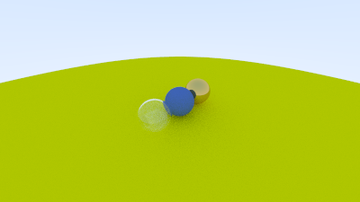
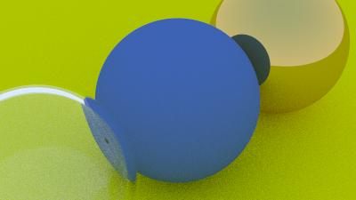

# Positionable Camera

Cameras, like dielectrics, are a pain to debug. So I always develop mine incrementally. First, let's
allow an adjustable field of view (*fov*). This is the angle you see through the portal. Since our
image is not square, the fov is different horizontally and vertically. I always use vertical fov. I
also usually specify it in degrees and change to radians inside a constructor -- a matter of
personal taste.

## Camera Viewing Geometry

I first keep the rays coming from the origin and heading to the $z = -1$ plane. We could make it the
$z = -2$ plane, or whatever, as long as we made $h$ a ratio to that distance. Here is our setup:

![Figure \[cam-view-geom\]: Camera viewing geometry](../images/fig-1.14-cam-view-geom.jpg)

This implies $h = \tan(\frac{\theta}{2})$. Our camera now becomes:

<Tabs>
  <Tab label="Rust">
    ```rust filename="camera.rs | Camera with adjustable field-of-view (fov)"
    ```
  </Tab>

  <Tab label="C++">
    ```cpp filename="camera.h | Camera with adjustable field-of-view (fov)"
        class camera {
            public:

                camera(
                    double vfov, // vertical field-of-view in degrees
                    double aspect_ratio
                ) {
                    auto theta = degrees_to_radians(vfov);
                    auto h = tan(theta/2);
                    auto viewport_height = 2.0 * h;
                    auto viewport_width = aspect_ratio * viewport_height;

                    auto focal_length = 1.0;

                    origin = point3(0, 0, 0);
                    horizontal = vec3(viewport_width, 0.0, 0.0);
                    vertical = vec3(0.0, viewport_height, 0.0);
                    lower_left_corner = origin - horizontal/2 - vertical/2 - vec3(0, 0, focal_length);
                }

                ray get_ray(double u, double v) const {
                    return ray(origin, lower_left_corner + u*horizontal + v*vertical - origin);
                }

            private:
                point3 origin;
                point3 lower_left_corner;
                vec3 horizontal;
                vec3 vertical;
        };
    ```
  </Tab>
</Tabs>

When calling it with camera `cam(90, aspect_ratio)` and these spheres:

<Tabs>
  <Tab label="Rust">
    ```rust filename="main.rs | Scene with wide-angle camera"
    ```
  </Tab>

  <Tab label="C++">
    ```cpp filename="main.cpp | Scene with wide-angle camera"
        int main() {
            ...
            // World


            auto R = cos(pi/4);
            hittable_list world;

            auto material_left  = make_shared<lambertian>(color(0,0,1));
            auto material_right = make_shared<lambertian>(color(1,0,0));

            world.add(make_shared<sphere>(point3(-R, 0, -1), R, material_left));
            world.add(make_shared<sphere>(point3( R, 0, -1), R, material_right));

            // Camera

            camera cam(90.0, aspect_ratio);

            // Render

            std::cout << "P3\n" << image_width << " " << image_height << "\n255\n";

            for (int j = image_height-1; j >= 0; --j) {
            ...
    ```
  </Tab>
</Tabs>

gives:


## Positioning and Orienting the Camera

To get an arbitrary viewpoint, let's first name the points we care about. We'll call the position
where we place the camera *lookfrom*, and the point we look at *lookat*. (Later, if you want, you
could define a direction to look in instead of a point to look at.)

We also need a way to specify the roll, or sideways tilt, of the camera: the rotation around the
lookat-lookfrom axis. Another way to think about it is that even if you keep `lookfrom` and `lookat`
constant, you can still rotate your head around your nose. What we need is a way to specify an "up"
vector for the camera. This up vector should lie in the plane orthogonal to the view direction.

![Figure \[cam-view-dir\]: Camera view direction](../images/fig-1.15-cam-view-dir.jpg)

We can actually use any up vector we want, and simply project it onto this plane to get an up vector
for the camera. I use the common convention of naming a "view up" (*vup*) vector. A couple of cross
products, and we now have a complete orthonormal basis $(u,v,w)$ to describe our camera's
orientation.

![Figure \[cam-view-up\]: Camera view up direction](../images/fig-1.16-cam-view-up.jpg)

Remember that `vup`, `v`, and `w` are all in the same plane. Note that, like before when our fixed
camera faced -Z, our arbitrary view camera faces -w. And keep in mind that we can -- but we don't
have to -- use world up $(0,1,0)$ to specify vup. This is convenient and will naturally keep your
camera horizontally level until you decide to experiment with crazy camera angles.

<Tabs>
  <Tab label="Rust">
    ```rust filename="camera.rs | Positionable and orientable camera"
    ```
  </Tab>

  <Tab label="C++">
    ```cpp filename="camera.h | Positionable and orientable camera"
        class camera {
            public:
                camera(

                    point3 lookfrom,
                    point3 lookat,
                    vec3   vup,
                    double vfov, // vertical field-of-view in degrees
                    double aspect_ratio
                ) {
                    auto theta = degrees_to_radians(vfov);
                    auto h = tan(theta/2);
                    auto viewport_height = 2.0 * h;
                    auto viewport_width = aspect_ratio * viewport_height;


                    auto w = unit_vector(lookfrom - lookat);
                    auto u = unit_vector(cross(vup, w));
                    auto v = cross(w, u);

                    origin = lookfrom;
                    horizontal = viewport_width * u;
                    vertical = viewport_height * v;
                    lower_left_corner = origin - horizontal/2 - vertical/2 - w;
                }


                ray get_ray(double s, double t) const {
                    return ray(origin, lower_left_corner + s*horizontal + t*vertical - origin);
                }

            private:
                point3 origin;
                point3 lower_left_corner;
                vec3 horizontal;
                vec3 vertical;
        };
    ```
  </Tab>
</Tabs>

We'll change back to the prior scene, and use the new viewpoint:

<Tabs>
  <Tab label="Rust">
    ```rust filename="main.rs | Scene with alternate viewpoint"
    ```
  </Tab>

  <Tab label="C++">
    ```cpp filename="main.cpp | Scene with alternate viewpoint"
        hittable_list world;

        auto material_ground = make_shared<lambertian>(color(0.8, 0.8, 0.0));
        auto material_center = make_shared<lambertian>(color(0.1, 0.2, 0.5));
        auto material_left   = make_shared<dielectric>(1.5);
        auto material_right  = make_shared<metal>(color(0.8, 0.6, 0.2), 0.0);

        world.add(make_shared<sphere>(point3( 0.0, -100.5, -1.0), 100.0, material_ground));
        world.add(make_shared<sphere>(point3( 0.0,    0.0, -1.0),   0.5, material_center));
        world.add(make_shared<sphere>(point3(-1.0,    0.0, -1.0),   0.5, material_left));
        world.add(make_shared<sphere>(point3(-1.0,    0.0, -1.0), -0.45, material_left));
        world.add(make_shared<sphere>(point3( 1.0,    0.0, -1.0),   0.5, material_right));

        camera cam(point3(-2,2,1), point3(0,0,-1), vec3(0,1,0), 90, aspect_ratio);
    ```
  </Tab>
</Tabs>

to get:



And we can change field of view:

<Tabs>
  <Tab label="Rust">
    ```rust filename="main.rs | Change field of view"
    ```
  </Tab>

  <Tab label="C++">
    ```cpp filename="main.cpp | Change field of view"
        camera cam(point3(-2,2,1), point3(0,0,-1), vec3(0,1,0), 20, aspect_ratio);
    ```
  </Tab>
</Tabs>

to get:


