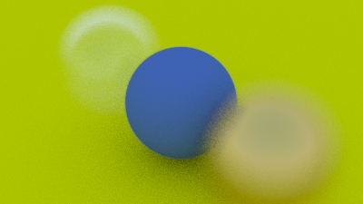

# Defocus Blur

Now our final feature: defocus blur. Note, all photographers will call it "depth of field" so be
aware of only using "defocus blur" among friends.

The reason we defocus blur in real cameras is because they need a big hole (rather than just a
pinhole) to gather light. This would defocus everything, but if we stick a lens in the hole, there
will be a certain distance where everything is in focus. You can think of a lens this way: all light
rays coming *from* a specific point at the focus distance -- and that hit the lens -- will be bent
back *to* a single point on the image sensor.

We call the distance between the projection point and the plane where everything is in perfect focus
the *focus distance*. Be aware that the focus distance is not the same as the focal length -- the
*focal length* is the distance between the projection point and the image plane.

In a physical camera, the focus distance is controlled by the distance between the lens and the
film/sensor. That is why you see the lens move relative to the camera when you change what is in
focus (that may happen in your phone camera too, but the sensor moves). The "aperture" is a hole to
control how big the lens is effectively. For a real camera, if you need more light you make the
aperture bigger, and will get more defocus blur. For our virtual camera, we can have a perfect
sensor and never need more light, so we only have an aperture when we want defocus blur.

## A Thin Lens Approximation

A real camera has a complicated compound lens. For our code we could simulate the order: sensor,
then lens, then aperture. Then we could figure out where to send the rays, and flip the image after
it's computed (the image is projected upside down on the film). Graphics people, however, usually
use a thin lens approximation:

![Figure \[cam-lens\]: Camera lens model](../images/fig-1.17-cam-lens.jpg)

We don't need to simulate any of the inside of the camera. For the purposes of rendering an image
outside the camera, that would be unnecessary complexity. Instead, I usually start rays from the
lens, and send them toward the focus plane (`focus_dist` away from the lens), where everything on
that plane is in perfect focus.

![Figure \[cam-film-plane\]: Camera focus plane](../images/fig-1.18-cam-film-plane.jpg)

## Generating Sample Rays

Normally, all scene rays originate from the `lookfrom` point. In order to accomplish defocus blur,
generate random scene rays originating from inside a disk centered at the `lookfrom` point. The
larger the radius, the greater the defocus blur. You can think of our original camera as having a
defocus disk of radius zero (no blur at all), so all rays originated at the disk center
(`lookfrom`).

<Tabs>
  <Tab label="Rust">
    ```rust filename="vec3.rs | Generate random point inside unit disk" {192-205}
    use std::fmt::{Display, Formatter, Result};
    use std::ops::{Add, AddAssign, Div, DivAssign, Mul, MulAssign, Neg, Sub};

    use crate::common;

    #[derive(Copy, Clone, Default)]
    pub struct Vec3 {
        e: [f64; 3],
    }

    impl Vec3 {
        pub fn new(x: f64, y: f64, z: f64) -> Vec3 {
            Vec3 { e: [x, y, z] }
        }

        pub fn random() -> Vec3 {
            Vec3::new(
                common::random_double(),
                common::random_double(),
                common::random_double(),
            )
        }

        pub fn random_range(min: f64, max: f64) -> Vec3 {
            Vec3::new(
                common::random_double_range(min, max),
                common::random_double_range(min, max),
                common::random_double_range(min, max),
            )
        }

        pub fn x(&self) -> f64 {
            self.e[0]
        }

        pub fn y(&self) -> f64 {
            self.e[1]
        }

        pub fn z(&self) -> f64 {
            self.e[2]
        }

        pub fn length(&self) -> f64 {
            f64::sqrt(self.length_squared())
        }

        pub fn length_squared(&self) -> f64 {
            self.e[0] * self.e[0] + self.e[1] * self.e[1] + self.e[2] * self.e[2]
        }

        pub fn near_zero(&self) -> bool {
            const EPS: f64 = 1.0e-8;
            // Return true if the vector is close to zero in all dimensions
            self.e[0].abs() < EPS && self.e[1].abs() < EPS && self.e[2].abs() < EPS
        }
    }

    // Type alias
    pub type Point3 = Vec3; // 3D point

    // Output formatting
    impl Display for Vec3 {
        fn fmt(&self, f: &mut Formatter) -> Result {
            write!(f, "{} {} {}", self.e[0], self.e[1], self.e[2])
        }
    }

    // -Vec3
    impl Neg for Vec3 {
        type Output = Vec3;

        fn neg(self) -> Vec3 {
            Vec3::new(-self.x(), -self.y(), -self.z())
        }
    }

    // Vec3 += Vec3
    impl AddAssign for Vec3 {
        fn add_assign(&mut self, v: Vec3) {
            *self = *self + v;
        }
    }

    // Vec3 *= f64
    impl MulAssign<f64> for Vec3 {
        fn mul_assign(&mut self, t: f64) {
            *self = *self * t;
        }
    }

    // Vec3 /= f64
    impl DivAssign<f64> for Vec3 {
        fn div_assign(&mut self, t: f64) {
            *self = *self / t;
        }
    }

    // Vec3 + Vec3
    impl Add for Vec3 {
        type Output = Vec3;

        fn add(self, v: Vec3) -> Vec3 {
            Vec3::new(self.x() + v.x(), self.y() + v.y(), self.z() + v.z())
        }
    }

    // Vec3 - Vec3
    impl Sub for Vec3 {
        type Output = Vec3;

        fn sub(self, v: Vec3) -> Vec3 {
            Vec3::new(self.x() - v.x(), self.y() - v.y(), self.z() - v.z())
        }
    }

    // Vec3 * Vec3
    impl Mul for Vec3 {
        type Output = Vec3;

        fn mul(self, v: Vec3) -> Vec3 {
            Vec3::new(self.x() * v.x(), self.y() * v.y(), self.z() * v.z())
        }
    }

    // f64 * Vec3
    impl Mul<Vec3> for f64 {
        type Output = Vec3;

        fn mul(self, v: Vec3) -> Vec3 {
            Vec3::new(self * v.x(), self * v.y(), self * v.z())
        }
    }

    // Vec3 * f64
    impl Mul<f64> for Vec3 {
        type Output = Vec3;

        fn mul(self, t: f64) -> Vec3 {
            Vec3::new(self.x() * t, self.y() * t, self.z() * t)
        }
    }

    // Vec3 / f64
    impl Div<f64> for Vec3 {
        type Output = Vec3;

        fn div(self, t: f64) -> Vec3 {
            Vec3::new(self.x() / t, self.y() / t, self.z() / t)
        }
    }

    pub fn dot(u: Vec3, v: Vec3) -> f64 {
        u.e[0] * v.e[0] + u.e[1] * v.e[1] + u.e[2] * v.e[2]
    }

    pub fn cross(u: Vec3, v: Vec3) -> Vec3 {
        Vec3::new(
            u.e[1] * v.e[2] - u.e[2] * v.e[1],
            u.e[2] * v.e[0] - u.e[0] * v.e[2],
            u.e[0] * v.e[1] - u.e[1] * v.e[0],
        )
    }

    pub fn unit_vector(v: Vec3) -> Vec3 {
        v / v.length()
    }

    pub fn random_in_unit_sphere() -> Vec3 {
        loop {
            let p = Vec3::random_range(-1.0, 1.0);
            if p.length_squared() >= 1.0 {
                continue;
            }
            return p;
        }
    }

    pub fn random_unit_vector() -> Vec3 {
        unit_vector(random_in_unit_sphere())
    }

    pub fn random_in_hemisphere(normal: Vec3) -> Vec3 {
        let in_unit_sphere = random_in_unit_sphere();
        if dot(in_unit_sphere, normal) > 0.0 {
            // In the same hemisphere as the normal
            in_unit_sphere
        } else {
            -in_unit_sphere
        }
    }

    pub fn random_in_unit_disk() -> Vec3 {
        loop {
            let p = Vec3::new(
                common::random_double_range(-1.0, 1.0),
                common::random_double_range(-1.0, 1.0),
                0.0,
            );
            if p.length_squared() >= 1.0 {
                continue;
            }
            return p;
        }
    }

    pub fn reflect(v: Vec3, n: Vec3) -> Vec3 {
        v - 2.0 * dot(v, n) * n
    }

    pub fn refract(uv: Vec3, n: Vec3, etai_over_etat: f64) -> Vec3 {
        let cos_theta = f64::min(dot(-uv, n), 1.0);
        let r_out_perp = etai_over_etat * (uv + cos_theta * n);
        let r_out_parallel = -f64::sqrt(f64::abs(1.0 - r_out_perp.length_squared())) * n;
        r_out_perp + r_out_parallel
    }
    ```
  </Tab>

  <Tab label="C++">
    ```cpp filename="vec3.h | Generate random point inside unit disk" {161-170}
    #ifndef VEC3_H
    #define VEC3_H

    #include <array>
    #include <cmath>
    #include <ostream>

    #include "common.h"

    class Vec3 {
    public:
        Vec3() = default;

        Vec3(double e0, double e1, double e2) : e{e0, e1, e2} {}

        static Vec3 random() {
            return Vec3(random_double(), random_double(), random_double());
        }

        static Vec3 random_range(double min, double max) {
            return Vec3(
                random_double_range(min, max),
                random_double_range(min, max),
                random_double_range(min, max)
            );
        }

        double x() const {
            return e[0];
        }

        double y() const {
            return e[1];
        }

        double z() const {
            return e[2];
        }

        // -Vec3
        Vec3 operator-() const {
            return Vec3(-e[0], -e[1], -e[2]);
        }

        // Vec3 += Vec3
        Vec3 &operator+=(Vec3 v) {
            e[0] += v.x();
            e[1] += v.y();
            e[2] += v.z();
            return *this;
        }

        // Vec3 *= double
        Vec3 &operator*=(double t) {
            e[0] *= t;
            e[1] *= t;
            e[2] *= t;
            return *this;
        }

        // Vec3 /= double
        Vec3 &operator/=(double t) {
            return *this *= 1.0 / t;
        }

        double length() const {
            return std::sqrt(length_squared());
        }

        double length_squared() const {
            return e[0] * e[0] + e[1] * e[1] + e[2] * e[2];
        }

        bool near_zero() const {
            const double EPS = 1e-8;
            // Return true if the vector is close to zero in all dimensions
            return fabs(e[0]) < EPS && fabs(e[1]) < EPS && fabs(e[2]) < EPS;
        }

    private:
        std::array<double, 3> e = {0.0, 0.0, 0.0};
    };

    // Type alias
    using Point3 = Vec3; // 3D point

    // Output formatting
    inline std::ostream &operator<<(std::ostream &out, Vec3 v) {
        return out << v.x() << ' ' << v.y() << ' ' << v.z();
    }

    // Vec3 + Vec3
    inline Vec3 operator+(Vec3 u, Vec3 v) {
        return Vec3(u.x() + v.x(), u.y() + v.y(), u.z() + v.z());
    }

    // Vec3 - Vec3
    inline Vec3 operator-(Vec3 u, Vec3 v) {
        return Vec3(u.x() - v.x(), u.y() - v.y(), u.z() - v.z());
    }

    // Vec3 * Vec3
    inline Vec3 operator*(Vec3 u, Vec3 v) {
        return Vec3(u.x() * v.x(), u.y() * v.y(), u.z() * v.z());
    }

    // double * Vec3
    inline Vec3 operator*(double t, Vec3 v) {
        return Vec3(t * v.x(), t * v.y(), t * v.z());
    }

    // Vec3 * double
    inline Vec3 operator*(Vec3 v, double t) {
        return t * v;
    }

    // Vec3 / double
    inline Vec3 operator/(Vec3 v, double t) {
        return (1.0 / t) * v;
    }

    inline double dot(Vec3 u, Vec3 v) {
        return u.x() * v.x() + u.y() * v.y() + u.z() * v.z();
    }

    inline Vec3 cross(Vec3 u, Vec3 v) {
        return Vec3(
            u.y() * v.z() - u.z() * v.y(),
            u.z() * v.x() - u.x() * v.z(),
            u.x() * v.y() - u.y() * v.x()
        );
    }

    inline Vec3 unit_vector(Vec3 v) {
        return v / v.length();
    }

    inline Vec3 random_in_unit_sphere() {
        while (true) {
            auto p = Vec3::random_range(-1.0, 1.0);
            if (p.length_squared() >= 1.0) {
                continue;
            }
            return p;
        }
    }

    inline Vec3 random_unit_vector() {
        return unit_vector(random_in_unit_sphere());
    }

    inline Vec3 random_in_hemisphere(Vec3 normal) {
        auto in_unit_sphere = random_in_unit_sphere();
        if (dot(in_unit_sphere, normal) > 0.0) {
            // In the same hemisphere as the normal
            return in_unit_sphere;
        } else {
            return -in_unit_sphere;
        }
    }

    inline Vec3 random_in_unit_disk() {
        while (true) {
            auto p = Vec3(random_double_range(-1.0, 1.0), random_double_range(-1.0, 1.0), 0.0);
            if (p.length_squared() >= 1.0) {
                continue;
            }
            return p;
        }
    }

    inline Vec3 reflect(Vec3 v, Vec3 n) {
        return v - 2.0 * dot(v, n) * n;
    }

    inline Vec3 refract(const Vec3 &uv, const Vec3 &n, double etai_over_etat) {
        auto cos_theta = fmin(dot(-uv, n), 1.0);
        Vec3 r_out_perp = etai_over_etat * (uv + cos_theta * n);
        Vec3 r_out_parallel = -sqrt(fabs(1.0 - r_out_perp.length_squared())) * n;
        return r_out_perp + r_out_parallel;
    }

    #endif
    ```
  </Tab>
</Tabs>

<Tabs>
  <Tab label="Rust">
    ```rust filename="camera.rs | Camera with adjustable depth-of-field (dof)" {10-13,23-24,36-40,47-50,55-57,59-60}
    use crate::common;
    use crate::ray::Ray;
    use crate::vec3::{self, Point3, Vec3};

    pub struct Camera {
        origin: Point3,
        lower_left_corner: Point3,
        horizontal: Vec3,
        vertical: Vec3,
        u: Vec3,
        v: Vec3,
        w: Vec3,
        lens_radius: f64,
    }

    impl Camera {
        pub fn new(
            lookfrom: Point3,
            lookat: Point3,
            vup: Vec3,
            vfov: f64, // Vertical field-of-view in degrees
            aspect_ratio: f64,
            aperture: f64,
            focus_dist: f64,
        ) -> Camera {
            let theta = common::degrees_to_radians(vfov);
            let h = f64::tan(theta / 2.0);
            let viewport_height = 2.0 * h;
            let viewport_width = aspect_ratio * viewport_height;

            let w = vec3::unit_vector(lookfrom - lookat);
            let u = vec3::unit_vector(vec3::cross(vup, w));
            let v = vec3::cross(w, u);

            let origin = lookfrom;
            let horizontal = focus_dist * viewport_width * u;
            let vertical = focus_dist * viewport_height * v;
            let lower_left_corner = origin - horizontal / 2.0 - vertical / 2.0 - focus_dist * w;

            let lens_radius = aperture / 2.0;

            Camera {
                origin,
                lower_left_corner,
                horizontal,
                vertical,
                u,
                v,
                w,
                lens_radius,
            }
        }

        pub fn get_ray(&self, s: f64, t: f64) -> Ray {
            let rd = self.lens_radius * vec3::random_in_unit_disk();
            let offset = self.u * rd.x() + self.v * rd.y();

            Ray::new(
                self.origin + offset,
                self.lower_left_corner + s * self.horizontal + t * self.vertical - self.origin - offset,
            )
        }
    }
    ```
  </Tab>

  <Tab label="C++">
    ```cpp filename="camera.h | Camera with adjustable depth-of-field (dof)" {14-16,23-25,28-32,36-42,50-53}
    #ifndef CAMERA_H
    #define CAMERA_H

    #include "ray.h"
    #include "vec3.h"

    class Camera {
    public:
        Camera(
            Point3 lookfrom,
            Point3 lookat,
            Vec3 vup,
            double vfov, // Vertical field-of-view in degrees
            double aspect_ratio,
            double aperture,
            double focus_dist
        ) {
            auto theta = degrees_to_radians(vfov);
            auto h = tan(theta / 2.0);
            auto viewport_height = 2.0 * h;
            auto viewport_width = aspect_ratio * viewport_height;

            w = unit_vector(lookfrom - lookat);
            u = unit_vector(cross(vup, w));
            v = cross(w, u);

            origin = lookfrom;
            horizontal = focus_dist * viewport_width * u;
            vertical = focus_dist * viewport_height * v;
            lower_left_corner = origin - horizontal / 2.0 - vertical / 2.0 - focus_dist * w;

            lens_radius = aperture / 2.0;
        }

        Ray get_ray(double s, double t) const {
            auto rd = lens_radius * random_in_unit_disk();
            auto offset = u * rd.x() + v * rd.y();

            return Ray(
                origin + offset,
                lower_left_corner + s * horizontal + t * vertical - origin - offset
            );
        }

    private:
        Point3 origin;
        Point3 lower_left_corner;
        Vec3 horizontal;
        Vec3 vertical;
        Vec3 u;
        Vec3 v;
        Vec3 w;
        double lens_radius;
    };

    #endif
    ```
  </Tab>
</Tabs>

Using a big aperture:

<Tabs>
  <Tab label="Rust">
    ```rust filename="main.rs | Scene camera with depth-of-field" {21,94-99,102-104,107-108} genImage
    mod camera;
    mod color;
    mod common;
    mod hittable;
    mod hittable_list;
    mod material;
    mod ray;
    mod sphere;
    mod vec3;

    use std::io;
    use std::rc::Rc;

    use camera::Camera;
    use color::Color;
    use hittable::{HitRecord, Hittable};
    use hittable_list::HittableList;
    use material::{Dielectric, Lambertian, Metal};
    use ray::Ray;
    use sphere::Sphere;
    use vec3::Point3;

    fn ray_color(r: &Ray, world: &dyn Hittable, depth: i32) -> Color {
        // If we've exceeded the ray bounce limit, no more light is gathered
        if depth <= 0 {
            return Color::new(0.0, 0.0, 0.0);
        }

        let mut rec = HitRecord::new();
        if world.hit(r, 0.001, common::INFINITY, &mut rec) {
            let mut scattered = Ray::default();
            let mut attenuation = Color::default();
            if rec
                .mat_ptr
                .as_ref()
                .unwrap()
                .scatter(r, &rec, &mut attenuation, &mut scattered)
            {
                return attenuation * ray_color(&scattered, world, depth - 1);
            }
            return Color::new(0.0, 0.0, 0.0);
        }

        let unit_direction = vec3::unit_vector(r.direction());
        let t = 0.5 * (unit_direction.y() + 1.0);
        (1.0 - t) * Color::new(1.0, 1.0, 1.0) + t * Color::new(0.5, 0.7, 1.0)
    }

    fn main() {
        // Image

        const ASPECT_RATIO: f64 = 16.0 / 9.0;
        const IMAGE_WIDTH: i32 = 400;
        const IMAGE_HEIGHT: i32 = (IMAGE_WIDTH as f64 / ASPECT_RATIO) as i32;
        const SAMPLES_PER_PIXEL: i32 = 100;
        const MAX_DEPTH: i32 = 50;

        // World

        let mut world = HittableList::new();

        let material_ground = Rc::new(Lambertian::new(Color::new(0.8, 0.8, 0.0)));
        let material_center = Rc::new(Lambertian::new(Color::new(0.1, 0.2, 0.5)));
        let material_left = Rc::new(Dielectric::new(1.5));
        let material_right = Rc::new(Metal::new(Color::new(0.8, 0.6, 0.2), 0.0));

        world.add(Box::new(Sphere::new(
            Point3::new(0.0, -100.5, -1.0),
            100.0,
            material_ground,
        )));
        world.add(Box::new(Sphere::new(
            Point3::new(0.0, 0.0, -1.0),
            0.5,
            material_center,
        )));
        world.add(Box::new(Sphere::new(
            Point3::new(-1.0, 0.0, -1.0),
            0.5,
            material_left.clone(),
        )));
        world.add(Box::new(Sphere::new(
            Point3::new(-1.0, 0.0, -1.0),
            -0.45,
            material_left,
        )));
        world.add(Box::new(Sphere::new(
            Point3::new(1.0, 0.0, -1.0),
            0.5,
            material_right,
        )));

        // Camera

        let lookfrom = Point3::new(3.0, 3.0, 2.0);
        let lookat = Point3::new(0.0, 0.0, -1.0);
        let vup = Point3::new(0.0, 1.0, 0.0);
        let dist_to_focus = (lookfrom - lookat).length();
        let aperture = 2.0;

        let cam = Camera::new(
            lookfrom,
            lookat,
            vup,
            20.0,
            ASPECT_RATIO,
            aperture,
            dist_to_focus,
        );

        // Render

        print!("P3\n{} {}\n255\n", IMAGE_WIDTH, IMAGE_HEIGHT);

        for j in (0..IMAGE_HEIGHT).rev() {
            eprint!("\rScanlines remaining: {} ", j);
            for i in 0..IMAGE_WIDTH {
                let mut pixel_color = Color::new(0.0, 0.0, 0.0);
                for _ in 0..SAMPLES_PER_PIXEL {
                    let u = (i as f64 + common::random_double()) / (IMAGE_WIDTH - 1) as f64;
                    let v = (j as f64 + common::random_double()) / (IMAGE_HEIGHT - 1) as f64;
                    let r = cam.get_ray(u, v);
                    pixel_color += ray_color(&r, &world, MAX_DEPTH);
                }
                color::write_color(&mut io::stdout(), pixel_color, SAMPLES_PER_PIXEL);
            }
        }

        eprint!("\nDone.\n");
    }
    ```
  </Tab>

  <Tab label="C++">
    ```cpp filename="main.cpp | Scene camera with depth-of-field" {59-65} genImage
    #include <iostream>

    #include "camera.h"
    #include "color.h"
    #include "common.h"
    #include "hittable.h"
    #include "hittable_list.h"
    #include "ray.h"
    #include "sphere.h"
    #include "vec3.h"

    Color ray_color(const Ray &r, const Hittable &world, int depth) {
        // If we've exceeded the ray bounce limit, no more light is gathered
        if (depth <= 0) {
            return Color(0.0, 0.0, 0.0);
        }

        HitRecord rec;
        if (world.hit(r, 0.001, INFINITY, rec)) {
            Ray scattered;
            Color attenuation;
            if (rec.mat_ptr->scatter(r, rec, attenuation, scattered)) {
                return attenuation * ray_color(scattered, world, depth - 1);
            }
            return Color(0.0, 0.0, 0.0);
        }

        Vec3 unit_direction = unit_vector(r.direction());
        auto t = 0.5 * (unit_direction.y() + 1.0);
        return (1.0 - t) * Color(1.0, 1.0, 1.0) + t * Color(0.5, 0.7, 1.0);
    }

    int main() {
        // Image

        const double ASPECT_RATIO = 16.0 / 9.0;
        const int IMAGE_WIDTH = 400;
        const int IMAGE_HEIGHT = static_cast<int>(IMAGE_WIDTH / ASPECT_RATIO);
        const int SAMPLES_PER_PIXEL = 100;
        const int MAX_DEPTH = 50;

        // World

        HittableList world;

        auto material_ground = std::make_shared<Lambertian>(Color(0.8, 0.8, 0.0));
        auto material_center = std::make_shared<Lambertian>(Color(0.1, 0.2, 0.5));
        auto material_left = std::make_shared<Dielectric>(1.5);
        auto material_right = std::make_shared<Metal>(Color(0.8, 0.6, 0.2), 0.0);

        world.add(std::make_unique<Sphere>(Point3(0.0, -100.5, -1.0), 100.0, material_ground));
        world.add(std::make_unique<Sphere>(Point3(0.0, 0.0, -1.0), 0.5, material_center));
        world.add(std::make_unique<Sphere>(Point3(-1.0, 0.0, -1.0), 0.5, material_left));
        world.add(std::make_unique<Sphere>(Point3(-1.0, 0.0, -1.0), -0.45, material_left));
        world.add(std::make_unique<Sphere>(Point3(1.0, 0.0, -1.0), 0.5, material_right));

        // Camera

        Point3 lookfrom(3.0, 3.0, 2.0);
        Point3 lookat(0.0, 0.0, -1.0);
        Vec3 vup(0.0, 1.0, 0.0);
        auto dist_to_focus = (lookfrom - lookat).length();
        auto aperture = 2.0;

        Camera cam(lookfrom, lookat, vup, 20.0, ASPECT_RATIO, aperture, dist_to_focus);

        // Render

        std::cout << "P3\n" << IMAGE_WIDTH << ' ' << IMAGE_HEIGHT << "\n255\n";

        for (int j = IMAGE_HEIGHT - 1; j >= 0; --j) {
            std::cerr << "\rScanlines remaining: " << j << ' ';
            for (int i = 0; i < IMAGE_WIDTH; ++i) {
                Color pixel_color(0.0, 0.0, 0.0);
                for (int s = 0; s < SAMPLES_PER_PIXEL; s++) {
                    auto u = (i + random_double()) / (IMAGE_WIDTH - 1);
                    auto v = (j + random_double()) / (IMAGE_HEIGHT - 1);
                    Ray r = cam.get_ray(u, v);
                    pixel_color += ray_color(r, world, MAX_DEPTH);
                }
                write_color(std::cout, pixel_color, SAMPLES_PER_PIXEL);
            }
        }

        std::cerr << "\nDone.\n";

        return 0;
    }
    ```
  </Tab>
</Tabs>

We get:


