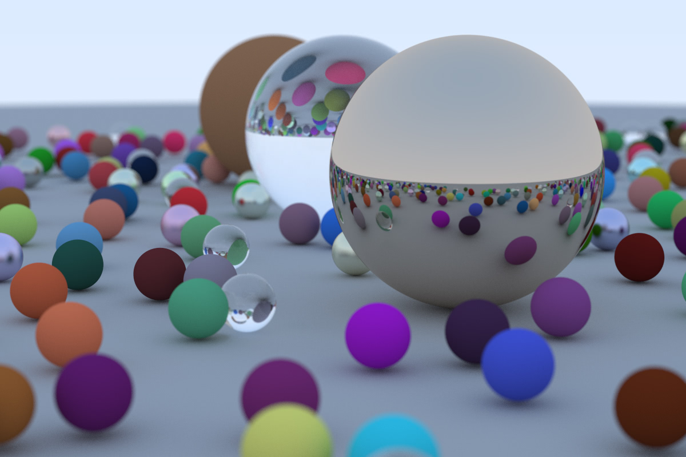

# Where Next?

## A Final Render

First let's make the image on the cover of this book -- lots of random spheres:

<Tabs>
  <Tab label="Rust">
    ```rust filename="main.rs | Final scene" {48-111,116-117,119,124,128-129,131-132} genImage
    mod camera;
    mod color;
    mod common;
    mod hittable;
    mod hittable_list;
    mod material;
    mod ray;
    mod sphere;
    mod vec3;

    use std::io;
    use std::rc::Rc;

    use camera::Camera;
    use color::Color;
    use hittable::{HitRecord, Hittable};
    use hittable_list::HittableList;
    use material::{Dielectric, Lambertian, Metal};
    use ray::Ray;
    use sphere::Sphere;
    use vec3::Point3;

    fn ray_color(r: &Ray, world: &dyn Hittable, depth: i32) -> Color {
        // If we've exceeded the ray bounce limit, no more light is gathered
        if depth <= 0 {
            return Color::new(0.0, 0.0, 0.0);
        }

        let mut rec = HitRecord::new();
        if world.hit(r, 0.001, common::INFINITY, &mut rec) {
            let mut scattered = Ray::default();
            let mut attenuation = Color::default();
            if rec
                .mat_ptr
                .as_ref()
                .unwrap()
                .scatter(r, &rec, &mut attenuation, &mut scattered)
            {
                return attenuation * ray_color(&scattered, world, depth - 1);
            }
            return Color::new(0.0, 0.0, 0.0);
        }

        let unit_direction = vec3::unit_vector(r.direction());
        let t = 0.5 * (unit_direction.y() + 1.0);
        (1.0 - t) * Color::new(1.0, 1.0, 1.0) + t * Color::new(0.5, 0.7, 1.0)
    }

    fn random_scene() -> HittableList {
        let mut world = HittableList::new();

        let ground_material = Rc::new(Lambertian::new(Color::new(0.5, 0.5, 0.5)));
        world.add(Box::new(Sphere::new(
            Point3::new(0.0, -1000.0, 0.0),
            1000.0,
            ground_material,
        )));

        for a in -11..11 {
            for b in -11..11 {
                let choose_mat = common::random_double();
                let center = Point3::new(
                    a as f64 + 0.9 * common::random_double(),
                    0.2,
                    b as f64 + 0.9 * common::random_double(),
                );

                if (center - Point3::new(4.0, 0.2, 0.0)).length() > 0.9 {
                    if choose_mat < 0.8 {
                        // Diffuse
                        let albedo = Color::random() * Color::random();
                        let sphere_material = Rc::new(Lambertian::new(albedo));
                        world.add(Box::new(Sphere::new(center, 0.2, sphere_material)));
                    } else if choose_mat < 0.95 {
                        // Metal
                        let albedo = Color::random_range(0.5, 1.0);
                        let fuzz = common::random_double_range(0.0, 0.5);
                        let sphere_material = Rc::new(Metal::new(albedo, fuzz));
                        world.add(Box::new(Sphere::new(center, 0.2, sphere_material)));
                    } else {
                        // Glass
                        let sphere_material = Rc::new(Dielectric::new(1.5));
                        world.add(Box::new(Sphere::new(center, 0.2, sphere_material)));
                    }
                }
            }
        }

        let material1 = Rc::new(Dielectric::new(1.5));
        world.add(Box::new(Sphere::new(
            Point3::new(0.0, 1.0, 0.0),
            1.0,
            material1,
        )));

        let material2 = Rc::new(Lambertian::new(Color::new(0.4, 0.2, 0.1)));
        world.add(Box::new(Sphere::new(
            Point3::new(-4.0, 1.0, 0.0),
            1.0,
            material2,
        )));

        let material3 = Rc::new(Metal::new(Color::new(0.7, 0.6, 0.5), 0.0));
        world.add(Box::new(Sphere::new(
            Point3::new(4.0, 1.0, 0.0),
            1.0,
            material3,
        )));

        world
    }

    fn main() {
        // Image

        const ASPECT_RATIO: f64 = 3.0 / 2.0;
        const IMAGE_WIDTH: i32 = 1200;
        const IMAGE_HEIGHT: i32 = (IMAGE_WIDTH as f64 / ASPECT_RATIO) as i32;
        const SAMPLES_PER_PIXEL: i32 = 500;
        const MAX_DEPTH: i32 = 50;

        // World

        let world = random_scene();

        // Camera

        let lookfrom = Point3::new(13.0, 2.0, 3.0);
        let lookat = Point3::new(0.0, 0.0, 0.0);
        let vup = Point3::new(0.0, 1.0, 0.0);
        let dist_to_focus = 10.0;
        let aperture = 0.1;

        let cam = Camera::new(
            lookfrom,
            lookat,
            vup,
            20.0,
            ASPECT_RATIO,
            aperture,
            dist_to_focus,
        );

        // Render

        print!("P3\n{} {}\n255\n", IMAGE_WIDTH, IMAGE_HEIGHT);

        for j in (0..IMAGE_HEIGHT).rev() {
            eprint!("\rScanlines remaining: {} ", j);
            for i in 0..IMAGE_WIDTH {
                let mut pixel_color = Color::new(0.0, 0.0, 0.0);
                for _ in 0..SAMPLES_PER_PIXEL {
                    let u = (i as f64 + common::random_double()) / (IMAGE_WIDTH - 1) as f64;
                    let v = (j as f64 + common::random_double()) / (IMAGE_HEIGHT - 1) as f64;
                    let r = cam.get_ray(u, v);
                    pixel_color += ray_color(&r, &world, MAX_DEPTH);
                }
                color::write_color(&mut io::stdout(), pixel_color, SAMPLES_PER_PIXEL);
            }
        }

        eprint!("\nDone.\n");
    }
    ```
  </Tab>

  <Tab label="C++">
    ```cpp filename="main.cpp | Final scene" {32-75,80-81,83,88,92-93,95-96} genImage
    #include <iostream>

    #include "camera.h"
    #include "color.h"
    #include "common.h"
    #include "hittable.h"
    #include "hittable_list.h"
    #include "ray.h"
    #include "sphere.h"
    #include "vec3.h"

    Color ray_color(const Ray &r, const Hittable &world, int depth) {
        // If we've exceeded the ray bounce limit, no more light is gathered
        if (depth <= 0) {
            return Color(0.0, 0.0, 0.0);
        }

        HitRecord rec;
        if (world.hit(r, 0.001, INFINITY, rec)) {
            Ray scattered;
            Color attenuation;
            if (rec.mat_ptr->scatter(r, rec, attenuation, scattered)) {
                return attenuation * ray_color(scattered, world, depth - 1);
            }
            return Color(0.0, 0.0, 0.0);
        }

        Vec3 unit_direction = unit_vector(r.direction());
        auto t = 0.5 * (unit_direction.y() + 1.0);
        return (1.0 - t) * Color(1.0, 1.0, 1.0) + t * Color(0.5, 0.7, 1.0);
    }

    HittableList random_scene() {
        HittableList world;

        auto ground_material = std::make_shared<Lambertian>(Color(0.5, 0.5, 0.5));
        world.add(std::make_unique<Sphere>(Point3(0.0, -1000.0, 0.0), 1000.0, ground_material));

        for (int a = -11; a < 11; ++a) {
            for (int b = -11; b < 11; ++b) {
                auto choose_mat = random_double();
                Point3 center(a + 0.9 * random_double(), 0.2, b + 0.9 * random_double());

                if ((center - Point3(4.0, 0.2, 0.0)).length() > 0.9) {
                    if (choose_mat < 0.8) {
                        // Diffuse
                        auto albedo = Color::random() * Color::random();
                        auto sphere_material = std::make_shared<Lambertian>(albedo);
                        world.add(std::make_unique<Sphere>(center, 0.2, sphere_material));
                    } else if (choose_mat < 0.95) {
                        // Metal
                        auto albedo = Color::random_range(0.5, 1.0);
                        auto fuzz = random_double_range(0.0, 0.5);
                        auto sphere_material = std::make_shared<Metal>(albedo, fuzz);
                        world.add(std::make_unique<Sphere>(center, 0.2, sphere_material));
                    } else {
                        // Glass
                        auto sphere_material = std::make_shared<Dielectric>(1.5);
                        world.add(std::make_unique<Sphere>(center, 0.2, sphere_material));
                    }
                }
            }
        }

        auto material1 = std::make_shared<Dielectric>(1.5);
        world.add(std::make_unique<Sphere>(Point3(0.0, 1.0, 0.0), 1.0, material1));

        auto material2 = std::make_shared<Lambertian>(Color(0.4, 0.2, 0.1));
        world.add(std::make_unique<Sphere>(Point3(-4.0, 1.0, 0.0), 1.0, material2));

        auto material3 = std::make_shared<Metal>(Color(0.7, 0.6, 0.5), 0.0);
        world.add(std::make_unique<Sphere>(Point3(4.0, 1.0, 0.0), 1.0, material3));

        return world;
    }

    int main() {
        // Image

        const double ASPECT_RATIO = 3.0 / 2.0;
        const int IMAGE_WIDTH = 1200;
        const int IMAGE_HEIGHT = static_cast<int>(IMAGE_WIDTH / ASPECT_RATIO);
        const int SAMPLES_PER_PIXEL = 500;
        const int MAX_DEPTH = 50;

        // World

        auto world = random_scene();

        // Camera

        Point3 lookfrom(13.0, 2.0, 3.0);
        Point3 lookat(0.0, 0.0, 0.0);
        Vec3 vup(0.0, 1.0, 0.0);
        auto dist_to_focus = 10.0;
        auto aperture = 0.1;

        Camera cam(lookfrom, lookat, vup, 20.0, ASPECT_RATIO, aperture, dist_to_focus);

        // Render

        std::cout << "P3\n" << IMAGE_WIDTH << ' ' << IMAGE_HEIGHT << "\n255\n";

        for (int j = IMAGE_HEIGHT - 1; j >= 0; --j) {
            std::cerr << "\rScanlines remaining: " << j << ' ';
            for (int i = 0; i < IMAGE_WIDTH; ++i) {
                Color pixel_color(0.0, 0.0, 0.0);
                for (int s = 0; s < SAMPLES_PER_PIXEL; s++) {
                    auto u = (i + random_double()) / (IMAGE_WIDTH - 1);
                    auto v = (j + random_double()) / (IMAGE_HEIGHT - 1);
                    Ray r = cam.get_ray(u, v);
                    pixel_color += ray_color(r, world, MAX_DEPTH);
                }
                write_color(std::cout, pixel_color, SAMPLES_PER_PIXEL);
            }
        }

        std::cerr << "\nDone.\n";

        return 0;
    }
    ```
  </Tab>
</Tabs>

This gives:



An interesting thing you might note is the glass balls don't really have shadows which makes them
look like they are floating. This is not a bug -- you don't see glass balls much in real life, where
they also look a bit strange, and indeed seem to float on cloudy days. A point on the big sphere
under a glass ball still has lots of light hitting it because the sky is re-ordered rather than
blocked.

## Next Steps

You now have a cool ray tracer! What next?

1.  Lights -- You can do this explicitly, by sending shadow rays to lights, or it can be done
    implicitly by making some objects emit light, biasing scattered rays toward them, and then
    downweighting those rays to cancel out the bias. Both work. I am in the minority in favoring
    the latter approach.

2.  Triangles -- Most cool models are in triangle form. The model I/O is the worst and almost
    everybody tries to get somebody else's code to do this.

3.  Surface Textures -- This lets you paste images on like wall paper. Pretty easy and a good thing
    to do.

4.  Solid textures -- Ken Perlin has his code online. Andrew Kensler has some very cool info at his
    blog.

5.  Volumes and Media -- Cool stuff and will challenge your software architecture. I favor making
    volumes have the hittable interface and probabilistically have intersections based on density.
    Your rendering code doesn't even have to know it has volumes with that method.

6.  Parallelism -- Run $N$ copies of your code on $N$ cores with different random seeds. Average
    the $N$ runs. This averaging can also be done hierarchically where $N/2$ pairs can be averaged
    to get $N/4$ images, and pairs of those can be averaged. That method of parallelism should
    extend well into the thousands of cores with very little coding.

Have fun, and please send me your cool images!
