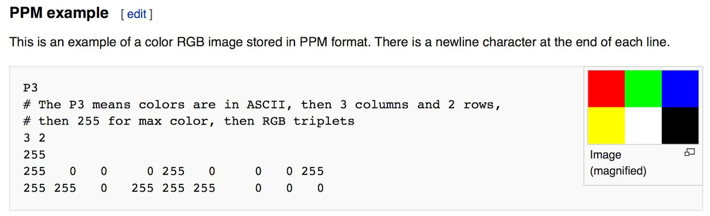
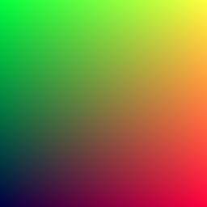

## The PPM Image Format

Whenever you start a renderer, you need a way to see an image. The most straightforward way is to write it to a file. The catch is, there are so many formats. Many of those are complex. We choose to start with a plain text ppm file.

Here's a nice description from Wikipedia:



Let's make some code to output such a thing:

<Tabs>
<Tab label="Rust">

```rust filename="main.rs | Creating your first image"
fn main() {
    // Image

    const IMAGE_WIDTH: i32 = 256;
    const IMAGE_HEIGHT: i32 = 256;

    // Render

    print!("P3\n{} {}\n255\n", IMAGE_WIDTH, IMAGE_HEIGHT);

    for j in (0..IMAGE_HEIGHT).rev() {
        for i in 0..IMAGE_WIDTH {
            let r = i as f64 / (IMAGE_WIDTH - 1) as f64;
            let g = j as f64 / (IMAGE_HEIGHT - 1) as f64;
            let b = 0.25;

            let ir = (255.999 * r) as i32;
            let ig = (255.999 * g) as i32;
            let ib = (255.999 * b) as i32;

            print!("{} {} {}\n", ir, ig, ib);
        }
    }
}
```

</Tab>
<Tab label="C++">

```cpp filename="main.cpp | Creating your first image"
#include <iostream>

int main() {
    // Image

    const int IMAGE_WIDTH = 256;
    const int IMAGE_HEIGHT = 256;

    // Render

    std::cout << "P3\n" << IMAGE_WIDTH << ' ' << IMAGE_HEIGHT << "\n255\n";

    for (int j = IMAGE_HEIGHT - 1; j >= 0; --j) {
        for (int i = 0; i < IMAGE_WIDTH; ++i) {
            auto r = static_cast<double>(i) / (IMAGE_WIDTH - 1);
            auto g = static_cast<double>(j) / (IMAGE_HEIGHT - 1);
            auto b = 0.25;

            int ir = static_cast<int>(255.999 * r);
            int ig = static_cast<int>(255.999 * g);
            int ib = static_cast<int>(255.999 * b);

            std::cout << ir << ' ' << ig << ' ' << ib << '\n';
        }
    }

    return 0;
}
```

</Tab>
</Tabs>

There are some things to note in that code:

1. The pixels are written out in rows with pixels left to right.

2. The rows are written out from top to bottom.

3. By convention, each of the red/green/blue components ranges from 0.0 to 1.0. We will relax that later when we internally use high dynamic range, but before output we will tone map to the zero to one range, so this code won't change.

4. Red goes from fully off (black) to fully on (bright red) from left to right, and green goes from black at the bottom to fully on at the top. Red and green together make yellow so we should expect the upper right corner to be yellow.

## Creating an Image File

Because the file is written to the standard output, you'll need to redirect it to an image file. Typically this is done from the command line by using the `>` redirection operator, like so:

```sh
cargo run > image.ppm
```

Opening the output file in an image viewer shows this result:



Hooray! This is the graphics "hello world."

<Callout type="info">

You can try opening the PPM file in your favorite viewer. Google "ppm viewer" if your viewer doesn't support it. If you are on macOS, you can use the built-in Preview app. If you are using Visual Studio Code, you can install an extension that supports PPM and view the image within the code editor.

</Callout>

If your image doesn't look like that, open the output file in a text editor and see what it looks like. It should start something like this:

```ppm filename="image.ppm | First image output"
P3
256 256
255
0 255 63
1 255 63
2 255 63
3 255 63
4 255 63
5 255 63
6 255 63
7 255 63
8 255 63
9 255 63
...
```

If it doesn't, then you probably just have some newlines or something similar that is confusing the image reader.

## Adding a Progress Indicator

Before we continue, let's add a progress indicator to our output. This is a handy way to track the progress of a long render, and also to possibly identify a run that's stalled out due to an infinite loop or other problem.

Our program outputs the image to the standard output stream, so leave that alone and instead write to the error output stream:

<Tabs>
<Tab label="Rust">

```rust filename="main.rs | Main render loop with progress reporting" {12,25-26}
fn main() {
    // Image

    const IMAGE_WIDTH: i32 = 256;
    const IMAGE_HEIGHT: i32 = 256;

    // Render

    print!("P3\n{} {}\n255\n", IMAGE_WIDTH, IMAGE_HEIGHT);

    for j in (0..IMAGE_HEIGHT).rev() {
        eprint!("\rScanlines remaining: {} ", j);
        for i in 0..IMAGE_WIDTH {
            let r = i as f64 / (IMAGE_WIDTH - 1) as f64;
            let g = j as f64 / (IMAGE_HEIGHT - 1) as f64;
            let b = 0.25;

            let ir = (255.999 * r) as i32;
            let ig = (255.999 * g) as i32;
            let ib = (255.999 * b) as i32;

            print!("{} {} {}\n", ir, ig, ib);
        }
    }

    eprint!("\nDone.\n");
}
```

</Tab>
<Tab label="C++">

```cpp filename="main.cpp | Main render loop with progress reporting" {14,28-29}
#include <iostream>

int main() {
    // Image

    const int IMAGE_WIDTH = 256;
    const int IMAGE_HEIGHT = 256;

    // Render

    std::cout << "P3\n" << IMAGE_WIDTH << ' ' << IMAGE_HEIGHT << "\n255\n";

    for (int j = IMAGE_HEIGHT - 1; j >= 0; --j) {
        std::cerr << "\rScanlines remaining: " << j << ' ';
        for (int i = 0; i < IMAGE_WIDTH; ++i) {
            auto r = static_cast<double>(i) / (IMAGE_WIDTH - 1);
            auto g = static_cast<double>(j) / (IMAGE_HEIGHT - 1);
            auto b = 0.25;

            int ir = static_cast<int>(255.999 * r);
            int ig = static_cast<int>(255.999 * g);
            int ib = static_cast<int>(255.999 * b);

            std::cout << ir << ' ' << ig << ' ' << ib << '\n';
        }
    }

    std::cerr << "\nDone.\n";

    return 0;
}
```

</Tab>
</Tabs>
