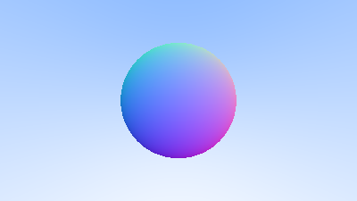
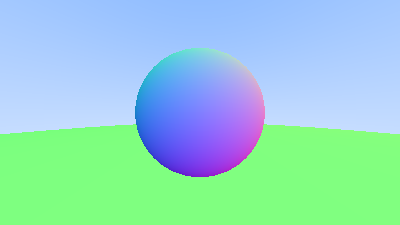

## Shading with Surface Normals

First, let's get ourselves a surface normal so we can shade. This is a vector that is perpendicular
to the surface at the point of intersection. There are two design decisions to make for normals.
The first is whether these normals are unit length. That is convenient for shading so I will say
yes, but I won't enforce that in the code. This could allow subtle bugs, so be aware this is
personal preference as are most design decisions like that. For a sphere, the outward normal is in
the direction of the hit point minus the center:

![Figure \[sphere-normal\]: Sphere surface-normal geometry](../images/fig-1.05-sphere-normal.jpg)

On the earth, this implies that the vector from the earth's center to you points straight up. Let's
throw that into the code now, and shade it. We don't have any lights or anything yet, so let's just
visualize the normals with a color map. A common trick used for visualizing normals (because it's
easy and somewhat intuitive to assume $\mathbf{n}$ is a unit length vector -- so each
component is between -1 and 1) is to map each component to the interval from 0 to 1, and then map
x/y/z to r/g/b. For the normal, we need the hit point, not just whether we hit or not. We only have
one sphere in the scene, and it's directly in front of the camera, so we won't worry about negative
values of $t$ yet. We'll just assume the closest hit point (smallest $t$). These changes in the code
let us compute and visualize $\mathbf{n}$:

<Tabs>
  <Tab label="Rust">
    ```rust filename="main.rs | Rendering surface normals on a sphere"
    ```
  </Tab>

  <Tab label="C++">
    ```cpp filename="main.cpp | Rendering surface normals on a sphere"
    double hit_sphere(const point3& center, double radius, const ray& r) {
        vec3 oc = r.origin() - center;
        auto a = dot(r.direction(), r.direction());
        auto b = 2.0 * dot(oc, r.direction());
        auto c = dot(oc, oc) - radius*radius;
        auto discriminant = b*b - 4*a*c;

        if (discriminant < 0) {
            return -1.0;
        } else {
            return (-b - sqrt(discriminant) ) / (2.0*a);
        }
    }

    color ray_color(const ray& r) {
        auto t = hit_sphere(point3(0,0,-1), 0.5, r);
        if (t > 0.0) {
            vec3 N = unit_vector(r.at(t) - vec3(0,0,-1));
            return 0.5*color(N.x()+1, N.y()+1, N.z()+1);
        }
        vec3 unit_direction = unit_vector(r.direction());
        t = 0.5*(unit_direction.y() + 1.0);
        return (1.0-t)*color(1.0, 1.0, 1.0) + t*color(0.5, 0.7, 1.0);
    }
    ```
  </Tab>
</Tabs>

And that yields this picture:



## Simplifying the Ray-Sphere Intersection Code

Let's revisit the ray-sphere equation:

```cpp filename="Ray-sphere intersection code (before)"
double hit_sphere(const point3& center, double radius, const ray& r) {
    vec3 oc = r.origin() - center;
    auto a = dot(r.direction(), r.direction());
    auto b = 2.0 * dot(oc, r.direction());
    auto c = dot(oc, oc) - radius*radius;
    auto discriminant = b*b - 4*a*c;

    if (discriminant < 0) {
        return -1.0;
    } else {
        return (-b - sqrt(discriminant) ) / (2.0*a);
    }
}
```

First, recall that a vector dotted with itself is equal to the squared length of that vector.

Second, notice how the equation for `b` has a factor of two in it. Consider what happens to the
quadratic equation if $b = 2h$:

$$
\frac{-b \pm \sqrt{b^2 - 4ac}}{2a}
$$

$$
= \frac{-2h \pm \sqrt{(2h)^2 - 4ac}}{2a}
$$

$$
= \frac{-2h \pm 2\sqrt{h^2 - ac}}{2a}
$$

$$
= \frac{-h \pm \sqrt{h^2 - ac}}{a}
$$

Using these observations, we can now simplify the sphere-intersection code to this:

<Tabs>
  <Tab label="Rust">
    ```rust filename="main.rs | Ray-sphere intersection code (after)"
    ```
  </Tab>

  <Tab label="C++">
    ```cpp filename="main.cpp | Ray-sphere intersection code (after)"
    double hit_sphere(const point3& center, double radius, const ray& r) {
        vec3 oc = r.origin() - center;
        auto a = r.direction().length_squared();
        auto half_b = dot(oc, r.direction());
        auto c = oc.length_squared() - radius*radius;
        auto discriminant = half_b*half_b - a*c;

        if (discriminant < 0) {
            return -1.0;
        } else {
            return (-half_b - sqrt(discriminant) ) / a;
        }
    }
    ```
  </Tab>
</Tabs>

## An Abstraction for Hittable Objects

Now, how about several spheres? While it is tempting to have an array of spheres, a very clean
solution is the make an "abstract class" for anything a ray might hit, and make both a sphere and a
list of spheres just something you can hit. What that class should be called is something of a
quandary -- calling it an "object" would be good if not for "object oriented" programming. "Surface"
is often used, with the weakness being maybe we will want volumes. "hittable" emphasizes the member
function that unites them. I don't love any of these, but I will go with "hittable".

This `hittable` abstract class will have a hit function that takes in a ray. Most ray tracers have
found it convenient to add a valid interval for hits $t_{min}$ to $t_{max}$, so the hit only
"counts" if $t_{min} < t < t_{max}$. For the initial rays this is positive $t$, but as we will see,
it can help some details in the code to have an interval $t_{min}$ to $t_{max}$. One design question
is whether to do things like compute the normal if we hit something. We might end up hitting
something closer as we do our search, and we will only need the normal of the closest thing. I will
go with the simple solution and compute a bundle of stuff I will store in some structure. Here's
the abstract class:

<Tabs>
  <Tab label="Rust">
    ```rust filename="hittable.rs | The Hittable trait"
    ```
  </Tab>

  <Tab label="C++">
    ```cpp filename="hittable.h | The Hittable abstract class"
    #ifndef HITTABLE_H
    #define HITTABLE_H

    #include "ray.h"

    struct hit_record {
        point3 p;
        vec3 normal;
        double t;
    };

    class hittable {
        public:
            virtual bool hit(const ray& r, double t_min, double t_max, hit_record& rec) const = 0;
    };

    #endif
    ```
  </Tab>
</Tabs>

And here's the sphere:

<Tabs>
  <Tab label="Rust">
    ```rust filename="sphere.rs | The Sphere struct"
    ```
  </Tab>

  <Tab label="C++">
    ```cpp filename="sphere.h | The Sphere class"
    #ifndef SPHERE_H
    #define SPHERE_H

    #include "hittable.h"
    #include "vec3.h"

    class sphere : public hittable {
        public:
            sphere() {}
            sphere(point3 cen, double r) : center(cen), radius(r) {};

            virtual bool hit(
                const ray& r, double t_min, double t_max, hit_record& rec) const override;

        public:
            point3 center;
            double radius;
    };

    bool sphere::hit(const ray& r, double t_min, double t_max, hit_record& rec) const {
        vec3 oc = r.origin() - center;
        auto a = r.direction().length_squared();
        auto half_b = dot(oc, r.direction());
        auto c = oc.length_squared() - radius*radius;

        auto discriminant = half_b*half_b - a*c;
        if (discriminant < 0) return false;
        auto sqrtd = sqrt(discriminant);

        // Find the nearest root that lies in the acceptable range.
        auto root = (-half_b - sqrtd) / a;
        if (root < t_min || t_max < root) {
            root = (-half_b + sqrtd) / a;
            if (root < t_min || t_max < root)
                return false;
        }

        rec.t = root;
        rec.p = r.at(rec.t);
        rec.normal = (rec.p - center) / radius;

        return true;
    }

    #endif
    ```
  </Tab>
</Tabs>

## Front Faces Versus Back Faces

The second design decision for normals is whether they should always point out. At present, the
normal found will always be in the direction of the center to the intersection point (the normal
points out). If the ray intersects the sphere from the outside, the normal points against the ray.
If the ray intersects the sphere from the inside, the normal (which always points out) points with
the ray. Alternatively, we can have the normal always point against the ray. If the ray is outside
the sphere, the normal will point outward, but if the ray is inside the sphere, the normal will
point inward.

![Figure \[normal-sides\]: Possible directions for sphere surface-normal geometry](../images/fig-1.06-normal-sides.jpg)

We need to choose one of these possibilities because we will eventually want to determine which
side of the surface that the ray is coming from. This is important for objects that are rendered
differently on each side, like the text on a two-sided sheet of paper, or for objects that have an
inside and an outside, like glass balls.

If we decide to have the normals always point out, then we will need to determine which side the
ray is on when we color it. We can figure this out by comparing the ray with the normal. If the ray
and the normal face in the same direction, the ray is inside the object, if the ray and the normal
face in the opposite direction, then the ray is outside the object. This can be determined by
taking the dot product of the two vectors, where if their dot is positive, the ray is inside the
sphere.

```cpp filename="Comparing the ray and the normal"
if (dot(ray_direction, outward_normal) > 0.0) {
    // ray is inside the sphere
    ...
} else {
    // ray is outside the sphere
    ...
}
```

If we decide to have the normals always point against the ray, we won't be able to use the dot
product to determine which side of the surface the ray is on. Instead, we would need to store that
information:

```cpp filename="Remembering the side of the surface"
bool front_face;
if (dot(ray_direction, outward_normal) > 0.0) {
    // ray is inside the sphere
    normal = -outward_normal;
    front_face = false;
} else {
    // ray is outside the sphere
    normal = outward_normal;
    front_face = true;
}
```

We can set things up so that normals always point "outward" from the surface, or always point
against the incident ray. This decision is determined by whether you want to determine the side of
the surface at the time of geometry intersection or at the time of coloring. In this book we have
more material types than we have geometry types, so we'll go for less work and put the determination
at geometry time. This is simply a matter of preference, and you'll see both implementations in the
literature.

We add the `front_face` bool to the `hit_record` struct. We'll also add a function to solve this
calculation for us.

<Tabs>
  <Tab label="Rust">
    ```rust filename="hittable.rs | Adding front-face tracking to HitRecord"
    ```
  </Tab>

  <Tab label="C++">
    ```cpp filename="hittable.h | Adding front-face tracking to HitRecord"
    struct hit_record {
        point3 p;
        vec3 normal;
        double t;
        bool front_face;

        inline void set_face_normal(const ray& r, const vec3& outward_normal) {
            front_face = dot(r.direction(), outward_normal) < 0;
            normal = front_face ? outward_normal :-outward_normal;
        }
    };
    ```
  </Tab>
</Tabs>

And then we add the surface side determination to the class:

<Tabs>
  <Tab label="Rust">
    ```rust filename="sphere.rs | The Sphere struct with normal determination"
    ```
  </Tab>

  <Tab label="C++">
    ```cpp filename="sphere.h | The Sphere class with normal determination"
    bool sphere::hit(const ray& r, double t_min, double t_max, hit_record& rec) const {
        ...

        rec.t = root;
        rec.p = r.at(rec.t);
        vec3 outward_normal = (rec.p - center) / radius;
        rec.set_face_normal(r, outward_normal);

        return true;
    }
    ```
  </Tab>
</Tabs>

## A List of Hittable Objects

We have a generic object called a `hittable` that the ray can intersect with. We now add a class
that stores a list of `hittable`s:

<Tabs>
  <Tab label="Rust">
    ```rust filename="hittable_list.rs | The HittableList struct"
    ```
  </Tab>

  <Tab label="C++">
    ```cpp filename="hittable_list.h | The HittableList class"
    #ifndef HITTABLE_LIST_H
    #define HITTABLE_LIST_H

    #include "hittable.h"

    #include <memory>
    #include <vector>

    using std::shared_ptr;
    using std::make_shared;

    class hittable_list : public hittable {
        public:
            hittable_list() {}
            hittable_list(shared_ptr<hittable> object) { add(object); }

            void clear() { objects.clear(); }
            void add(shared_ptr<hittable> object) { objects.push_back(object); }

            virtual bool hit(
                const ray& r, double t_min, double t_max, hit_record& rec) const override;

        public:
            std::vector<shared_ptr<hittable>> objects;
    };

    bool hittable_list::hit(const ray& r, double t_min, double t_max, hit_record& rec) const {
        hit_record temp_rec;
        bool hit_anything = false;
        auto closest_so_far = t_max;

        for (const auto& object : objects) {
            if (object->hit(r, t_min, closest_so_far, temp_rec)) {
                hit_anything = true;
                closest_so_far = temp_rec.t;
                rec = temp_rec;
            }
        }

        return hit_anything;
    }

    #endif
    ```
  </Tab>
</Tabs>

## Some New C++ Features

The `hittable_list` class code uses two C++ features that may trip you up if you're not normally a
C++ programmer: `vector` and `shared_ptr`.

`shared_ptr<type>` is a pointer to some allocated type, with reference-counting semantics.
Every time you assign its value to another shared pointer (usually with a simple assignment), the
reference count is incremented. As shared pointers go out of scope (like at the end of a block or
function), the reference count is decremented. Once the count goes to zero, the object is deleted.

Typically, a shared pointer is first initialized with a newly-allocated object, something like this:

```cpp filename="An example allocation using shared_ptr"
shared_ptr<double> double_ptr = make_shared<double>(0.37);
shared_ptr<vec3>   vec3_ptr   = make_shared<vec3>(1.414214, 2.718281, 1.618034);
shared_ptr<sphere> sphere_ptr = make_shared<sphere>(point3(0,0,0), 1.0);
```

`make_shared<thing>(thing_constructor_params ...)` allocates a new instance of type `thing`, using
the constructor parameters. It returns a `shared_ptr<thing>`.

Since the type can be automatically deduced by the return type of `make_shared<type>(...)`, the
above lines can be more simply expressed using C++'s `auto` type specifier:

```cpp filename="An example allocation using shared_ptr with auto type"
auto double_ptr = make_shared<double>(0.37);
auto vec3_ptr   = make_shared<vec3>(1.414214, 2.718281, 1.618034);
auto sphere_ptr = make_shared<sphere>(point3(0,0,0), 1.0);
```

We'll use shared pointers in our code, because it allows multiple geometries to share a common
instance (for example, a bunch of spheres that all use the same texture map material), and because
it makes memory management automatic and easier to reason about.

`std::shared_ptr` is included with the `<memory>` header.

The second C++ feature you may be unfamiliar with is `std::vector`. This is a generic array-like
collection of an arbitrary type. Above, we use a collection of pointers to `hittable`. `std::vector`
automatically grows as more values are added: `objects.push_back(object)` adds a value to the end of
the `std::vector` member variable `objects`.

`std::vector` is included with the `<vector>` header.

Finally, the `using` statements in listing \[hittable-list-initial] tell the compiler that we'll be
getting `shared_ptr` and `make_shared` from the `std` library, so we don't need to prefex these with
`std::` every time we reference them.

## Common Constants and Utility Functions

We need some math constants that we conveniently define in their own header file. For now we only
need infinity, but we will also throw our own definition of pi in there, which we will need later.
There is no standard portable definition of pi, so we just define our own constant for it. We'll
throw common useful constants and future utility functions in `rtweekend.h`, our general main header
file.

<Tabs>
  <Tab label="Rust">
    ```rust filename="common.rs | The common module"
    ```
  </Tab>

  <Tab label="C++">
    ```cpp filename="common.h | The common header"
    #ifndef RTWEEKEND_H
    #define RTWEEKEND_H

    #include <cmath>
    #include <limits>
    #include <memory>


    // Usings

    using std::shared_ptr;
    using std::make_shared;
    using std::sqrt;

    // Constants

    const double infinity = std::numeric_limits<double>::infinity();
    const double pi = 3.1415926535897932385;

    // Utility Functions

    inline double degrees_to_radians(double degrees) {
        return degrees * pi / 180.0;
    }

    // Common Headers

    #include "ray.h"
    #include "vec3.h"

    #endif
    ```
  </Tab>
</Tabs>

And the new main:

<Tabs>
  <Tab label="Rust">
    ```rust filename="main.rs | The new main() with Hittables"
    ```
  </Tab>

  <Tab label="C++">
    ```cpp filename="main.cpp | The new main() with Hittables"
    #include "rtweekend.h"

    #include "color.h"
    #include "hittable_list.h"
    #include "sphere.h"

    #include <iostream>

    color ray_color(const ray& r, const hittable& world) {
        hit_record rec;
        if (world.hit(r, 0, infinity, rec)) {
            return 0.5 * (rec.normal + color(1,1,1));
        }

        vec3 unit_direction = unit_vector(r.direction());
        auto t = 0.5*(unit_direction.y() + 1.0);
        return (1.0-t)*color(1.0, 1.0, 1.0) + t*color(0.5, 0.7, 1.0);
    }

    int main() {

        // Image

        const auto aspect_ratio = 16.0 / 9.0;
        const int image_width = 400;
        const int image_height = static_cast<int>(image_width / aspect_ratio);

        // World

        hittable_list world;
        world.add(make_shared<sphere>(point3(0,0,-1), 0.5));
        world.add(make_shared<sphere>(point3(0,-100.5,-1), 100));

        // Camera

        auto viewport_height = 2.0;
        auto viewport_width = aspect_ratio * viewport_height;
        auto focal_length = 1.0;

        auto origin = point3(0, 0, 0);
        auto horizontal = vec3(viewport_width, 0, 0);
        auto vertical = vec3(0, viewport_height, 0);
        auto lower_left_corner = origin - horizontal/2 - vertical/2 - vec3(0, 0, focal_length);

        // Render

        std::cout << "P3\n" << image_width << ' ' << image_height << "\n255\n";

        for (int j = image_height-1; j >= 0; --j) {
            std::cerr << "\rScanlines remaining: " << j << ' ' << std::flush;
            for (int i = 0; i < image_width; ++i) {
                auto u = double(i) / (image_width-1);
                auto v = double(j) / (image_height-1);
                ray r(origin, lower_left_corner + u*horizontal + v*vertical);
                color pixel_color = ray_color(r, world);
                write_color(std::cout, pixel_color);
            }
        }

        std::cerr << "\nDone.\n";
    }
    ```
  </Tab>
</Tabs>

This yields a picture that is really just a visualization of where the spheres are along with their
surface normal. This is often a great way to look at your model for flaws and characteristics.


