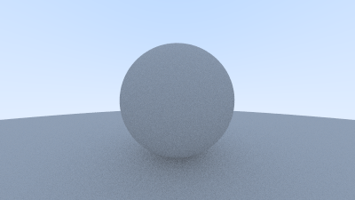

# Diffuse Materials

Now that we have objects and multiple rays per pixel, we can make some realistic looking materials.
We'll start with diffuse (matte) materials. One question is whether we mix and match geometry and
materials (so we can assign a material to multiple spheres, or vice versa) or if geometry and
material are tightly bound (that could be useful for procedural objects where the geometry and
material are linked). We'll go with separate -- which is usual in most renderers -- but do be aware
of the limitation.

## A Simple Diffuse Material

Diffuse objects that don't emit light merely take on the color of their surroundings, but they
modulate that with their own intrinsic color. Light that reflects off a diffuse surface has its
direction randomized. So, if we send three rays into a crack between two diffuse surfaces they will
each have different random behavior:

![Figure \[light-bounce\]: Light ray bounces](../images/fig-1.08-light-bounce.jpg)

They also might be absorbed rather than reflected. The darker the surface, the more likely
absorption is. (That's why it is dark!) Really any algorithm that randomizes direction will produce
surfaces that look matte. One of the simplest ways to do this turns out to be exactly correct for
ideal diffuse surfaces. (I used to do it as a lazy hack that approximates mathematically ideal
Lambertian.)

(Reader Vassillen Chizhov proved that the lazy hack is indeed just a lazy hack and is inaccurate.
The correct representation of ideal Lambertian isn't much more work, and is presented at the end of
the chapter.)

There are two unit radius spheres tangent to the hit point $p$ of a surface. These two spheres have
a center of $(\mathbf{P} + \mathbf{n})$ and $(\mathbf{P} - \mathbf{n})$, where $\mathbf{n}$ is the
normal of the surface. The sphere with a center at $(\mathbf{P} - \mathbf{n})$ is considered
*inside* the surface, whereas the sphere with center $(\mathbf{P} + \mathbf{n})$ is considered
*outside* the surface. Select the tangent unit radius sphere that is on the same side of the surface
as the ray origin. Pick a random point $\mathbf{S}$ inside this unit radius sphere and send a ray
from the hit point $\mathbf{P}$ to the random point $\mathbf{S}$ (this is the vector
$(\mathbf{S}-\mathbf{P})$):

![Figure \[rand-vec\]: Generating a random diffuse bounce ray](../images/fig-1.09-rand-vec.jpg)

We need a way to pick a random point in a unit radius sphere. We'll use what is usually the easiest
algorithm: a rejection method. First, pick a random point in the unit cube where x, y, and z all
range from -1 to +1. Reject this point and try again if the point is outside the sphere.

```cpp filename="vec3.h | Vec3 random utility functions"
    class vec3 {
      public:
        ...
        inline static vec3 random() {
            return vec3(random_double(), random_double(), random_double());
        }

        inline static vec3 random(double min, double max) {
            return vec3(random_double(min,max), random_double(min,max), random_double(min,max));
        }
```

```cpp filename="Vec3.h | The random_in_unit_sphere() function"
    vec3 random_in_unit_sphere() {
        while (true) {
            auto p = vec3::random(-1,1);
            if (p.length_squared() >= 1) continue;
            return p;
        }
    }
```

Then update the `ray_color()` function to use the new random direction generator:

```cpp filename="main.cpp | ray_color() using a random ray direction"
    color ray_color(const ray& r, const hittable& world) {
        hit_record rec;

        if (world.hit(r, 0, infinity, rec)) {

            point3 target = rec.p + rec.normal + random_in_unit_sphere();
            return 0.5 * ray_color(ray(rec.p, target - rec.p), world);
        }

        vec3 unit_direction = unit_vector(r.direction());
        auto t = 0.5*(unit_direction.y() + 1.0);
        return (1.0-t)*color(1.0, 1.0, 1.0) + t*color(0.5, 0.7, 1.0);
    }
```

## Limiting the Number of Child Rays

There's one potential problem lurking here. Notice that the `ray_color` function is recursive. When
will it stop recursing? When it fails to hit anything. In some cases, however, that may be a long
time — long enough to blow the stack. To guard against that, let's limit the maximum recursion
depth, returning no light contribution at the maximum depth:

```cpp filename="main.cpp | ray_color() with depth limiting"
    color ray_color(const ray& r, const hittable& world, int depth) {

        hit_record rec;


        // If we've exceeded the ray bounce limit, no more light is gathered.
        if (depth <= 0)
            return color(0,0,0);

        if (world.hit(r, 0, infinity, rec)) {
            point3 target = rec.p + rec.normal + random_in_unit_sphere();

            return 0.5 * ray_color(ray(rec.p, target - rec.p), world, depth-1);
        }

        vec3 unit_direction = unit_vector(r.direction());
        auto t = 0.5*(unit_direction.y() + 1.0);
        return (1.0-t)*color(1.0, 1.0, 1.0) + t*color(0.5, 0.7, 1.0);
    }

    ...

    int main() {

        // Image

        const auto aspect_ratio = 16.0 / 9.0;
        const int image_width = 400;
        const int image_height = static_cast<int>(image_width / aspect_ratio);
        const int samples_per_pixel = 100;

        const int max_depth = 50;
        ...

        // Render

        std::cout << "P3\n" << image_width << " " << image_height << "\n255\n";

        for (int j = image_height-1; j >= 0; --j) {
            std::cerr << "\rScanlines remaining: " << j << ' ' << std::flush;
            for (int i = 0; i < image_width; ++i) {
                color pixel_color(0, 0, 0);
                for (int s = 0; s < samples_per_pixel; ++s) {
                    auto u = (i + random_double()) / (image_width-1);
                    auto v = (j + random_double()) / (image_height-1);
                    ray r = cam.get_ray(u, v);

                    pixel_color += ray_color(r, world, max_depth);
                }
                write_color(std::cout, pixel_color, samples_per_pixel);
            }
        }

        std::cerr << "\nDone.\n";
    }
```

This gives us:


## Using Gamma Correction for Accurate Color Intensity

Note the shadowing under the sphere. This picture is very dark, but our spheres only absorb half the
energy on each bounce, so they are 50% reflectors. If you can't see the shadow, don't worry, we will
fix that now. These spheres should look pretty light (in real life, a light grey). The reason for
this is that almost all image viewers assume that the image is "gamma corrected", meaning the 0 to 1
values have some transform before being stored as a byte. There are many good reasons for that, but
for our purposes we just need to be aware of it. To a first approximation, we can use "gamma 2"
which means raising the color to the power $1/gamma$, or in our simple case ½, which is just
square-root:

```cpp filename="color.h | write_color(), with gamma correction"
    void write_color(std::ostream &out, color pixel_color, int samples_per_pixel) {
        auto r = pixel_color.x();
        auto g = pixel_color.y();
        auto b = pixel_color.z();

        // Divide the color by the number of samples and gamma-correct for gamma=2.0.
        auto scale = 1.0 / samples_per_pixel;
        r = sqrt(scale * r);
        g = sqrt(scale * g);
        b = sqrt(scale * b);

        // Write the translated [0,255] value of each color component.
        out << static_cast<int>(256 * clamp(r, 0.0, 0.999)) << ' '
            << static_cast<int>(256 * clamp(g, 0.0, 0.999)) << ' '
            << static_cast<int>(256 * clamp(b, 0.0, 0.999)) << '\n';
    }
```

That yields light grey, as we desire:


## Fixing Shadow Acne

There's also a subtle bug in there. Some of the reflected rays hit the object they are reflecting
off of not at exactly $t=0$, but instead at $t=-0.0000001$ or $t=0.00000001$ or whatever floating
point approximation the sphere intersector gives us. So we need to ignore hits very near zero:

```cpp filename="main.cpp | Calculating reflected ray origins with tolerance"
    if (world.hit(r, 0.001, infinity, rec)) {
```

This gets rid of the shadow acne problem. Yes it is really called that.

## True Lambertian Reflection

The rejection method presented here produces random points in the unit ball offset along the surface
normal. This corresponds to picking directions on the hemisphere with high probability close to the
normal, and a lower probability of scattering rays at grazing angles. This distribution scales by
the $\cos^3 (\phi)$ where $\phi$ is the angle from the normal. This is useful since light arriving
at shallow angles spreads over a larger area, and thus has a lower contribution to the final color.

However, we are interested in a Lambertian distribution, which has a distribution of $\cos (\phi)$.
True Lambertian has the probability higher for ray scattering close to the normal, but the
distribution is more uniform. This is achieved by picking random points on the surface of the unit
sphere, offset along the surface normal. Picking random points on the unit sphere can be achieved by
picking random points *in* the unit sphere, and then normalizing those.

```cpp filename="vec3.h | The random_unit_vector() function"
inline vec3 random_in_unit_sphere() {
    ...
}


vec3 random_unit_vector() {
    return unit_vector(random_in_unit_sphere());
}
```

![Figure \[rand-unitvec\]: Generating a random unit vector](../images/fig-1.10-rand-unitvec.png)

This `random_unit_vector()` is a drop-in replacement for the existing `random_in_unit_sphere()`
function.

```cpp filename="main.cpp | ray_color() with replacement diffuse"
color ray_color(const ray& r, const hittable& world, int depth) {
    hit_record rec;

    // If we've exceeded the ray bounce limit, no more light is gathered.
    if (depth <= 0)
        return color(0,0,0);

    if (world.hit(r, 0.001, infinity, rec)) {

        point3 target = rec.p + rec.normal + random_unit_vector();
        return 0.5 * ray_color(ray(rec.p, target - rec.p), world, depth-1);
    }

    vec3 unit_direction = unit_vector(r.direction());
    auto t = 0.5*(unit_direction.y() + 1.0);
    return (1.0-t)*color(1.0, 1.0, 1.0) + t*color(0.5, 0.7, 1.0);
}
```

After rendering we get a similar image:


It's hard to tell the difference between these two diffuse methods, given that our scene of two
spheres is so simple, but you should be able to notice two important visual differences:

1.  The shadows are less pronounced after the change
2.  Both spheres are lighter in appearance after the change

Both of these changes are due to the more uniform scattering of the light rays, fewer rays are
scattering toward the normal. This means that for diffuse objects, they will appear *lighter*
because more light bounces toward the camera. For the shadows, less light bounces straight-up, so
the parts of the larger sphere directly underneath the smaller sphere are brighter.

## An Alternative Diffuse Formulation

The initial hack presented in this book lasted a long time before it was proven to be an incorrect
approximation of ideal Lambertian diffuse. A big reason that the error persisted for so long is
that it can be difficult to:

1.  Mathematically prove that the probability distribution is incorrect
2.  Intuitively explain why a $\cos (\phi)$ distribution is desirable (and what it would look like)

Not a lot of common, everyday objects are perfectly diffuse, so our visual intuition of how these
objects behave under light can be poorly formed.

In the interest of learning, we are including an intuitive and easy to understand diffuse method.
For the two methods above we had a random vector, first of random length and then of unit length,
offset from the hit point by the normal. It may not be immediately obvious why the vectors should be
displaced by the normal.

A more intuitive approach is to have a uniform scatter direction for all angles away from the hit
point, with no dependence on the angle from the normal. Many of the first raytracing papers used
this diffuse method (before adopting Lambertian diffuse).

```cpp filename="vec3.h | The random_in_hemisphere(normal) function"
vec3 random_in_hemisphere(const vec3& normal) {
    vec3 in_unit_sphere = random_in_unit_sphere();
    if (dot(in_unit_sphere, normal) > 0.0) // In the same hemisphere as the normal
        return in_unit_sphere;
    else
        return -in_unit_sphere;
}
```

Plugging the new formula into the `ray_color()` function:

```cpp filename="main.cpp | ray_color() with hemispherical scattering"
color ray_color(const ray& r, const hittable& world, int depth) {
    hit_record rec;

    // If we've exceeded the ray bounce limit, no more light is gathered.
    if (depth <= 0)
        return color(0,0,0);

    if (world.hit(r, 0.001, infinity, rec)) {

        point3 target = rec.p + random_in_hemisphere(rec.normal);
        return 0.5 * ray_color(ray(rec.p, target - rec.p), world, depth-1);
    }

    vec3 unit_direction = unit_vector(r.direction());
    auto t = 0.5*(unit_direction.y() + 1.0);
    return (1.0-t)*color(1.0, 1.0, 1.0) + t*color(0.5, 0.7, 1.0);
}
```

Gives us the following image:



Scenes will become more complicated over the course of the book. You are
encouraged to switch between the different diffuse renderers presented here.
Most scenes of interest will contain a disproportionate amount of diffuse
materials. You can gain valuable insight by understanding the effect of
different diffuse methods on the lighting of the scene.
