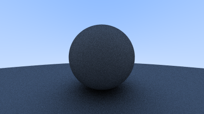
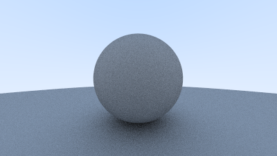
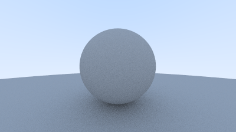

# Diffuse Materials

Now that we have objects and multiple rays per pixel, we can make some realistic looking materials.  We'll start with diffuse (matte) materials. One question is whether we mix and match geometry and materials (so we can assign a material to multiple spheres, or vice versa) or if geometry and material are tightly bound (that could be useful for procedural objects where the geometry and material are linked). We'll go with separate -- which is usual in most renderers -- but do be aware of the limitation.

## A Simple Diffuse Material

Diffuse objects that don't emit light merely take on the color of their surroundings, but they modulate that with their own intrinsic color. Light that reflects off a diffuse surface has its direction randomized. So, if we send three rays into a crack between two diffuse surfaces they will each have different random behavior:

![Figure \[light-bounce\]: Light ray bounces](../images/fig-1.08-light-bounce.jpg)

They also might be absorbed rather than reflected. The darker the surface, the more likely absorption is. (That's why it is dark!) Really any algorithm that randomizes direction will produce surfaces that look matte.

There are two unit radius spheres tangent to the hit point $p$ of a surface. These two spheres have a center of $(\mathbf{P} + \mathbf{n})$ and $(\mathbf{P} - \mathbf{n})$, where $\mathbf{n}$ is the normal of the surface. The sphere with a center at $(\mathbf{P} - \mathbf{n})$ is considered *inside* the surface, whereas the sphere with center $(\mathbf{P} + \mathbf{n})$ is considered *outside* the surface.

Let's select the tangent unit radius sphere that is on the same side of the surface as the ray origin. Pick a random point $\mathbf{S}$ inside this unit radius sphere and send a ray from the hit point $\mathbf{P}$ to the random point $\mathbf{S}$ (this is the vector $(\mathbf{S}-\mathbf{P})$):

![Figure \[rand-vec\]: Generating a random diffuse bounce ray](../images/fig-1.09-rand-vec.jpg)

We need a way to pick a random point in a unit radius sphere. We'll use what is usually the easiest
algorithm: a rejection method. First, pick a random point in the unit cube where x, y, and z all
range from -1 to +1. Reject this point and try again if the point is outside the sphere.

<Tabs>
  <Tab label="Rust">
    ```rust filename="vec3.rs | Vec3 random utility functions" {3-4,15-30}
    use std::fmt::{Display, Formatter, Result};
    use std::ops::{Add, AddAssign, Div, DivAssign, Mul, MulAssign, Neg, Sub};

    use crate::common;

    #[derive(Copy, Clone, Default)]
    pub struct Vec3 {
        e: [f64; 3],
    }

    impl Vec3 {
        pub fn new(x: f64, y: f64, z: f64) -> Vec3 {
            Vec3 { e: [x, y, z] }
        }

        pub fn random() -> Vec3 {
            Vec3::new(
                common::random_double(),
                common::random_double(),
                common::random_double(),
            )
        }

        pub fn random_range(min: f64, max: f64) -> Vec3 {
            Vec3::new(
                common::random_double_range(min, max),
                common::random_double_range(min, max),
                common::random_double_range(min, max),
            )
        }

        pub fn x(&self) -> f64 {
            self.e[0]
        }

        pub fn y(&self) -> f64 {
            self.e[1]
        }

        pub fn z(&self) -> f64 {
            self.e[2]
        }

        pub fn length(&self) -> f64 {
            f64::sqrt(self.length_squared())
        }

        pub fn length_squared(&self) -> f64 {
            self.e[0] * self.e[0] + self.e[1] * self.e[1] + self.e[2] * self.e[2]
        }
    }

    // Type alias
    pub type Point3 = Vec3;

    // Output formatting
    impl Display for Vec3 {
        fn fmt(&self, f: &mut Formatter) -> Result {
            write!(f, "{} {} {}", self.e[0], self.e[1], self.e[2])
        }
    }

    // -Vec3
    impl Neg for Vec3 {
        type Output = Vec3;

        fn neg(self) -> Vec3 {
            Vec3::new(-self.x(), -self.y(), -self.z())
        }
    }

    // Vec3 += Vec3
    impl AddAssign for Vec3 {
        fn add_assign(&mut self, v: Vec3) {
            *self = *self + v;
        }
    }

    // Vec3 *= f64
    impl MulAssign<f64> for Vec3 {
        fn mul_assign(&mut self, t: f64) {
            *self = *self * t;
        }
    }

    // Vec3 /= f64
    impl DivAssign<f64> for Vec3 {
        fn div_assign(&mut self, t: f64) {
            *self = *self / t;
        }
    }

    // Vec3 + Vec3
    impl Add for Vec3 {
        type Output = Vec3;

        fn add(self, v: Vec3) -> Vec3 {
            Vec3::new(self.x() + v.x(), self.y() + v.y(), self.z() + v.z())
        }
    }

    // Vec3 - Vec3
    impl Sub for Vec3 {
        type Output = Vec3;

        fn sub(self, v: Vec3) -> Vec3 {
            Vec3::new(self.x() - v.x(), self.y() - v.y(), self.z() - v.z())
        }
    }

    // Vec3 * Vec3
    impl Mul for Vec3 {
        type Output = Vec3;

        fn mul(self, v: Vec3) -> Vec3 {
            Vec3::new(self.x() * v.x(), self.y() * v.y(), self.z() * v.z())
        }
    }

    // f64 * Vec3
    impl Mul<Vec3> for f64 {
        type Output = Vec3;

        fn mul(self, v: Vec3) -> Vec3 {
            Vec3::new(self * v.x(), self * v.y(), self * v.z())
        }
    }

    // Vec3 * f64
    impl Mul<f64> for Vec3 {
        type Output = Vec3;

        fn mul(self, t: f64) -> Vec3 {
            Vec3::new(self.x() * t, self.y() * t, self.z() * t)
        }
    }

    // Vec3 / f64
    impl Div<f64> for Vec3 {
        type Output = Vec3;

        fn div(self, t: f64) -> Vec3 {
            Vec3::new(self.x() / t, self.y() / t, self.z() / t)
        }
    }

    pub fn dot(u: Vec3, v: Vec3) -> f64 {
        u.e[0] * v.e[0] + u.e[1] * v.e[1] + u.e[2] * v.e[2]
    }

    pub fn cross(u: Vec3, v: Vec3) -> Vec3 {
        Vec3::new(
            u.e[1] * v.e[2] - u.e[2] * v.e[1],
            u.e[2] * v.e[0] - u.e[0] * v.e[2],
            u.e[0] * v.e[1] - u.e[1] * v.e[0],
        )
    }

    pub fn unit_vector(v: Vec3) -> Vec3 {
        v / v.length()
    }
    ```
  </Tab>

  <Tab label="C++">
    ```cpp filename="vec3.h | Vec3 random utility functions" {7-8,15-26}
    #ifndef VEC3_H
    #define VEC3_H

    #include <array>
    #include <cmath>
    #include <ostream>

    #include "common.h"

    class Vec3 {
    public:
        Vec3() = default;

        Vec3(double e0, double e1, double e2) : e{e0, e1, e2} {}

        static Vec3 random() {
            return Vec3(random_double(), random_double(), random_double());
        }

        static Vec3 random_range(double min, double max) {
            return Vec3(
                random_double_range(min, max),
                random_double_range(min, max),
                random_double_range(min, max)
            );
        }

        double x() const {
            return e[0];
        }

        double y() const {
            return e[1];
        }

        double z() const {
            return e[2];
        }

        double length() const {
            return std::sqrt(length_squared());
        }

        double length_squared() const {
            return e[0] * e[0] + e[1] * e[1] + e[2] * e[2];
        }

        // -Vec3
        Vec3 operator-() const {
            return Vec3(-e[0], -e[1], -e[2]);
        }

        // Vec3 += Vec3
        Vec3 &operator+=(Vec3 v) {
            e[0] += v.x();
            e[1] += v.y();
            e[2] += v.z();
            return *this;
        }

        // Vec3 *= double
        Vec3 &operator*=(double t) {
            e[0] *= t;
            e[1] *= t;
            e[2] *= t;
            return *this;
        }

        // Vec3 /= double
        Vec3 &operator/=(double t) {
            return *this *= 1.0 / t;
        }

    private:
        std::array<double, 3> e = {0.0, 0.0, 0.0};
    };

    // Type alias
    using Point3 = Vec3;

    // Output formatting
    inline std::ostream &operator<<(std::ostream &out, Vec3 v) {
        return out << v.x() << ' ' << v.y() << ' ' << v.z();
    }

    // Vec3 + Vec3
    inline Vec3 operator+(Vec3 u, Vec3 v) {
        return Vec3(u.x() + v.x(), u.y() + v.y(), u.z() + v.z());
    }

    // Vec3 - Vec3
    inline Vec3 operator-(Vec3 u, Vec3 v) {
        return Vec3(u.x() - v.x(), u.y() - v.y(), u.z() - v.z());
    }

    // Vec3 * Vec3
    inline Vec3 operator*(Vec3 u, Vec3 v) {
        return Vec3(u.x() * v.x(), u.y() * v.y(), u.z() * v.z());
    }

    // double * Vec3
    inline Vec3 operator*(double t, Vec3 v) {
        return Vec3(t * v.x(), t * v.y(), t * v.z());
    }

    // Vec3 * double
    inline Vec3 operator*(Vec3 v, double t) {
        return t * v;
    }

    // Vec3 / double
    inline Vec3 operator/(Vec3 v, double t) {
        return (1.0 / t) * v;
    }

    inline double dot(Vec3 u, Vec3 v) {
        return u.x() * v.x() + u.y() * v.y() + u.z() * v.z();
    }

    inline Vec3 cross(Vec3 u, Vec3 v) {
        return Vec3(
            u.y() * v.z() - u.z() * v.y(),
            u.z() * v.x() - u.x() * v.z(),
            u.x() * v.y() - u.y() * v.x()
        );
    }

    inline Vec3 unit_vector(Vec3 v) {
        return v / v.length();
    }

    #endif
    ```
  </Tab>
</Tabs>

<Tabs>
  <Tab label="Rust">
    ```rust filename="vec3.rs | The random_in_unit_sphere() function" {162-171}
    use std::fmt::{Display, Formatter, Result};
    use std::ops::{Add, AddAssign, Div, DivAssign, Mul, MulAssign, Neg, Sub};

    use crate::common;

    #[derive(Copy, Clone, Default)]
    pub struct Vec3 {
        e: [f64; 3],
    }

    impl Vec3 {
        pub fn new(x: f64, y: f64, z: f64) -> Vec3 {
            Vec3 { e: [x, y, z] }
        }

        pub fn random() -> Vec3 {
            Vec3::new(
                common::random_double(),
                common::random_double(),
                common::random_double(),
            )
        }

        pub fn random_range(min: f64, max: f64) -> Vec3 {
            Vec3::new(
                common::random_double_range(min, max),
                common::random_double_range(min, max),
                common::random_double_range(min, max),
            )
        }

        pub fn x(&self) -> f64 {
            self.e[0]
        }

        pub fn y(&self) -> f64 {
            self.e[1]
        }

        pub fn z(&self) -> f64 {
            self.e[2]
        }

        pub fn length(&self) -> f64 {
            f64::sqrt(self.length_squared())
        }

        pub fn length_squared(&self) -> f64 {
            self.e[0] * self.e[0] + self.e[1] * self.e[1] + self.e[2] * self.e[2]
        }
    }

    // Type alias
    pub type Point3 = Vec3;

    // Output formatting
    impl Display for Vec3 {
        fn fmt(&self, f: &mut Formatter) -> Result {
            write!(f, "{} {} {}", self.e[0], self.e[1], self.e[2])
        }
    }

    // -Vec3
    impl Neg for Vec3 {
        type Output = Vec3;

        fn neg(self) -> Vec3 {
            Vec3::new(-self.x(), -self.y(), -self.z())
        }
    }

    // Vec3 += Vec3
    impl AddAssign for Vec3 {
        fn add_assign(&mut self, v: Vec3) {
            *self = *self + v;
        }
    }

    // Vec3 *= f64
    impl MulAssign<f64> for Vec3 {
        fn mul_assign(&mut self, t: f64) {
            *self = *self * t;
        }
    }

    // Vec3 /= f64
    impl DivAssign<f64> for Vec3 {
        fn div_assign(&mut self, t: f64) {
            *self = *self / t;
        }
    }

    // Vec3 + Vec3
    impl Add for Vec3 {
        type Output = Vec3;

        fn add(self, v: Vec3) -> Vec3 {
            Vec3::new(self.x() + v.x(), self.y() + v.y(), self.z() + v.z())
        }
    }

    // Vec3 - Vec3
    impl Sub for Vec3 {
        type Output = Vec3;

        fn sub(self, v: Vec3) -> Vec3 {
            Vec3::new(self.x() - v.x(), self.y() - v.y(), self.z() - v.z())
        }
    }

    // Vec3 * Vec3
    impl Mul for Vec3 {
        type Output = Vec3;

        fn mul(self, v: Vec3) -> Vec3 {
            Vec3::new(self.x() * v.x(), self.y() * v.y(), self.z() * v.z())
        }
    }

    // f64 * Vec3
    impl Mul<Vec3> for f64 {
        type Output = Vec3;

        fn mul(self, v: Vec3) -> Vec3 {
            Vec3::new(self * v.x(), self * v.y(), self * v.z())
        }
    }

    // Vec3 * f64
    impl Mul<f64> for Vec3 {
        type Output = Vec3;

        fn mul(self, t: f64) -> Vec3 {
            Vec3::new(self.x() * t, self.y() * t, self.z() * t)
        }
    }

    // Vec3 / f64
    impl Div<f64> for Vec3 {
        type Output = Vec3;

        fn div(self, t: f64) -> Vec3 {
            Vec3::new(self.x() / t, self.y() / t, self.z() / t)
        }
    }

    pub fn dot(u: Vec3, v: Vec3) -> f64 {
        u.e[0] * v.e[0] + u.e[1] * v.e[1] + u.e[2] * v.e[2]
    }

    pub fn cross(u: Vec3, v: Vec3) -> Vec3 {
        Vec3::new(
            u.e[1] * v.e[2] - u.e[2] * v.e[1],
            u.e[2] * v.e[0] - u.e[0] * v.e[2],
            u.e[0] * v.e[1] - u.e[1] * v.e[0],
        )
    }

    pub fn unit_vector(v: Vec3) -> Vec3 {
        v / v.length()
    }

    pub fn random_in_unit_sphere() -> Vec3 {
        loop {
            let p = Vec3::random_range(-1.0, 1.0);
            if p.length_squared() >= 1.0 {
                continue;
            }
            return p;
        }
    }
    ```
  </Tab>

  <Tab label="C++">
    ```cpp filename="vec3.h | The random_in_unit_sphere() function" {131-140}
    #ifndef VEC3_H
    #define VEC3_H

    #include <array>
    #include <cmath>
    #include <ostream>

    #include "common.h"

    class Vec3 {
    public:
        Vec3() = default;

        Vec3(double e0, double e1, double e2) : e{e0, e1, e2} {}

        static Vec3 random() {
            return Vec3(random_double(), random_double(), random_double());
        }

        static Vec3 random_range(double min, double max) {
            return Vec3(
                random_double_range(min, max),
                random_double_range(min, max),
                random_double_range(min, max)
            );
        }

        double x() const {
            return e[0];
        }

        double y() const {
            return e[1];
        }

        double z() const {
            return e[2];
        }

        double length() const {
            return std::sqrt(length_squared());
        }

        double length_squared() const {
            return e[0] * e[0] + e[1] * e[1] + e[2] * e[2];
        }

        // -Vec3
        Vec3 operator-() const {
            return Vec3(-e[0], -e[1], -e[2]);
        }

        // Vec3 += Vec3
        Vec3 &operator+=(Vec3 v) {
            e[0] += v.x();
            e[1] += v.y();
            e[2] += v.z();
            return *this;
        }

        // Vec3 *= double
        Vec3 &operator*=(double t) {
            e[0] *= t;
            e[1] *= t;
            e[2] *= t;
            return *this;
        }

        // Vec3 /= double
        Vec3 &operator/=(double t) {
            return *this *= 1.0 / t;
        }

    private:
        std::array<double, 3> e = {0.0, 0.0, 0.0};
    };

    // Type alias
    using Point3 = Vec3;

    // Output formatting
    inline std::ostream &operator<<(std::ostream &out, Vec3 v) {
        return out << v.x() << ' ' << v.y() << ' ' << v.z();
    }

    // Vec3 + Vec3
    inline Vec3 operator+(Vec3 u, Vec3 v) {
        return Vec3(u.x() + v.x(), u.y() + v.y(), u.z() + v.z());
    }

    // Vec3 - Vec3
    inline Vec3 operator-(Vec3 u, Vec3 v) {
        return Vec3(u.x() - v.x(), u.y() - v.y(), u.z() - v.z());
    }

    // Vec3 * Vec3
    inline Vec3 operator*(Vec3 u, Vec3 v) {
        return Vec3(u.x() * v.x(), u.y() * v.y(), u.z() * v.z());
    }

    // double * Vec3
    inline Vec3 operator*(double t, Vec3 v) {
        return Vec3(t * v.x(), t * v.y(), t * v.z());
    }

    // Vec3 * double
    inline Vec3 operator*(Vec3 v, double t) {
        return t * v;
    }

    // Vec3 / double
    inline Vec3 operator/(Vec3 v, double t) {
        return (1.0 / t) * v;
    }

    inline double dot(Vec3 u, Vec3 v) {
        return u.x() * v.x() + u.y() * v.y() + u.z() * v.z();
    }

    inline Vec3 cross(Vec3 u, Vec3 v) {
        return Vec3(
            u.y() * v.z() - u.z() * v.y(),
            u.z() * v.x() - u.x() * v.z(),
            u.x() * v.y() - u.y() * v.x()
        );
    }

    inline Vec3 unit_vector(Vec3 v) {
        return v / v.length();
    }

    inline Vec3 random_in_unit_sphere() {
        while (true) {
            auto p = Vec3::random_range(-1.0, 1.0);
            if (p.length_squared() >= 1.0) {
                continue;
            }
            return p;
        }
    }

    #endif
    ```
  </Tab>
</Tabs>

Then update the `ray_color()` function to use the new random direction generator:

<Tabs>
  <Tab label="Rust">
    ```rust filename="main.rs | ray_color() using a random ray direction" {23-24}
    mod camera;
    mod color;
    mod common;
    mod hittable;
    mod hittable_list;
    mod ray;
    mod sphere;
    mod vec3;

    use std::io;

    use camera::Camera;
    use color::Color;
    use hittable::{HitRecord, Hittable};
    use hittable_list::HittableList;
    use ray::Ray;
    use sphere::Sphere;
    use vec3::Point3;

    fn ray_color(r: &Ray, world: &dyn Hittable) -> Color {
        let mut rec = HitRecord::new();
        if world.hit(r, 0.0, common::INFINITY, &mut rec) {
            let direction = rec.normal + vec3::random_in_unit_sphere();
            return 0.5 * ray_color(&Ray::new(rec.p, direction), world);
        }

        let unit_direction = vec3::unit_vector(r.direction());
        let t = 0.5 * (unit_direction.y() + 1.0);
        (1.0 - t) * Color::new(1.0, 1.0, 1.0) + t * Color::new(0.5, 0.7, 1.0)
    }

    fn main() {
        // Image

        const ASPECT_RATIO: f64 = 16.0 / 9.0;
        const IMAGE_WIDTH: i32 = 400;
        const IMAGE_HEIGHT: i32 = (IMAGE_WIDTH as f64 / ASPECT_RATIO) as i32;
        const SAMPLES_PER_PIXEL: i32 = 100;

        // World

        let mut world = HittableList::new();
        world.add(Box::new(Sphere::new(Point3::new(0.0, 0.0, -1.0), 0.5)));
        world.add(Box::new(Sphere::new(Point3::new(0.0, -100.5, -1.0), 100.0)));

        // Camera

        let cam = Camera::new();

        // Render

        print!("P3\n{} {}\n255\n", IMAGE_WIDTH, IMAGE_HEIGHT);

        for j in (0..IMAGE_HEIGHT).rev() {
            eprint!("\rScanlines remaining: {} ", j);
            for i in 0..IMAGE_WIDTH {
                let mut pixel_color = Color::new(0.0, 0.0, 0.0);
                for _ in 0..SAMPLES_PER_PIXEL {
                    let u = (i as f64 + common::random_double()) / (IMAGE_WIDTH - 1) as f64;
                    let v = (j as f64 + common::random_double()) / (IMAGE_HEIGHT - 1) as f64;
                    let r = cam.get_ray(u, v);
                    pixel_color += ray_color(&r, &world);
                }
                color::write_color(&mut io::stdout(), pixel_color, SAMPLES_PER_PIXEL);
            }
        }

        eprint!("\nDone.\n");
    }
    ```
  </Tab>

  <Tab label="C++">
    ```cpp filename="main.cpp | ray_color() using a random ray direction" {15-16}
    #include <iostream>

    #include "camera.h"
    #include "color.h"
    #include "common.h"
    #include "hittable.h"
    #include "hittable_list.h"
    #include "ray.h"
    #include "sphere.h"
    #include "vec3.h"

    Color ray_color(const Ray &r, const Hittable &world) {
        auto rec = HitRecord();
        if (world.hit(r, 0.0, INFINITY, rec)) {
            auto direction = rec.normal + random_in_unit_sphere();
            return 0.5 * ray_color(Ray(rec.p, direction), world);
        }

        auto unit_direction = unit_vector(r.direction());
        auto t = 0.5 * (unit_direction.y() + 1.0);
        return (1.0 - t) * Color(1.0, 1.0, 1.0) + t * Color(0.5, 0.7, 1.0);
    }

    int main() {
        // Image

        const double ASPECT_RATIO = 16.0 / 9.0;
        const int IMAGE_WIDTH = 400;
        const int IMAGE_HEIGHT = static_cast<int>(IMAGE_WIDTH / ASPECT_RATIO);
        const int SAMPLES_PER_PIXEL = 100;

        // World

        auto world = HittableList();
        world.add(std::make_unique<Sphere>(Point3(0.0, 0.0, -1.0), 0.5));
        world.add(std::make_unique<Sphere>(Point3(0.0, -100.5, -1.0), 100.0));

        // Camera

        auto cam = Camera();

        // Render

        std::cout << "P3\n" << IMAGE_WIDTH << ' ' << IMAGE_HEIGHT << "\n255\n";

        for (auto j = IMAGE_HEIGHT - 1; j >= 0; --j) {
            std::cerr << "\rScanlines remaining: " << j << ' ';
            for (auto i = 0; i < IMAGE_WIDTH; ++i) {
                auto pixel_color = Color(0.0, 0.0, 0.0);
                for (auto s = 0; s < SAMPLES_PER_PIXEL; ++s) {
                    auto u = (i + random_double()) / (IMAGE_WIDTH - 1);
                    auto v = (j + random_double()) / (IMAGE_HEIGHT - 1);
                    auto r = cam.get_ray(u, v);
                    pixel_color += ray_color(r, world);
                }
                write_color(std::cout, pixel_color, SAMPLES_PER_PIXEL);
            }
        }

        std::cerr << "\nDone.\n";

        return 0;
    }
    ```
  </Tab>
</Tabs>

## Limiting the Number of Child Rays

There's one potential problem lurking here. Notice that the `ray_color` function is recursive. When will it stop recursing? When it fails to hit anything. In some cases, however, that may be a long time — long enough to blow the stack. To guard against that, let's limit the maximum recursion depth, returning no light contribution at the maximum depth:

<Tabs>
  <Tab label="Rust">
    ```rust filename="main.rs | ray_color() with depth limiting" {19-24,29,44,68} genImage
    mod camera;
    mod color;
    mod common;
    mod hittable;
    mod hittable_list;
    mod ray;
    mod sphere;
    mod vec3;

    use std::io;

    use camera::Camera;
    use color::Color;
    use hittable::{HitRecord, Hittable};
    use hittable_list::HittableList;
    use ray::Ray;
    use sphere::Sphere;
    use vec3::Point3;

    fn ray_color(r: &Ray, world: &dyn Hittable, depth: i32) -> Color {
        // If we've exceeded the ray bounce limit, no more light is gathered
        if depth <= 0 {
            return Color::new(0.0, 0.0, 0.0);
        }

        let mut rec = HitRecord::new();
        if world.hit(r, 0.0, common::INFINITY, &mut rec) {
            let direction = rec.normal + vec3::random_in_unit_sphere();
            return 0.5 * ray_color(&Ray::new(rec.p, direction), world, depth - 1);
        }

        let unit_direction = vec3::unit_vector(r.direction());
        let t = 0.5 * (unit_direction.y() + 1.0);
        (1.0 - t) * Color::new(1.0, 1.0, 1.0) + t * Color::new(0.5, 0.7, 1.0)
    }

    fn main() {
        // Image

        const ASPECT_RATIO: f64 = 16.0 / 9.0;
        const IMAGE_WIDTH: i32 = 400;
        const IMAGE_HEIGHT: i32 = (IMAGE_WIDTH as f64 / ASPECT_RATIO) as i32;
        const SAMPLES_PER_PIXEL: i32 = 100;
        const MAX_DEPTH: i32 = 50;

        // World

        let mut world = HittableList::new();
        world.add(Box::new(Sphere::new(Point3::new(0.0, 0.0, -1.0), 0.5)));
        world.add(Box::new(Sphere::new(Point3::new(0.0, -100.5, -1.0), 100.0)));

        // Camera

        let cam = Camera::new();

        // Render

        print!("P3\n{} {}\n255\n", IMAGE_WIDTH, IMAGE_HEIGHT);

        for j in (0..IMAGE_HEIGHT).rev() {
            eprint!("\rScanlines remaining: {} ", j);
            for i in 0..IMAGE_WIDTH {
                let mut pixel_color = Color::new(0.0, 0.0, 0.0);
                for _ in 0..SAMPLES_PER_PIXEL {
                    let u = (i as f64 + common::random_double()) / (IMAGE_WIDTH - 1) as f64;
                    let v = (j as f64 + common::random_double()) / (IMAGE_HEIGHT - 1) as f64;
                    let r = cam.get_ray(u, v);
                    pixel_color += ray_color(&r, &world, MAX_DEPTH);
                }
                color::write_color(&mut io::stdout(), pixel_color, SAMPLES_PER_PIXEL);
            }
        }

        eprint!("\nDone.\n");
    }
    ```
  </Tab>

  <Tab label="C++">
    ```cpp filename="main.cpp | ray_color() with depth limiting" {11-16,21,36,60} genImage
    #include <iostream>

    #include "camera.h"
    #include "color.h"
    #include "common.h"
    #include "hittable.h"
    #include "hittable_list.h"
    #include "ray.h"
    #include "sphere.h"
    #include "vec3.h"

    Color ray_color(const Ray &r, const Hittable &world, int depth) {
        // If we've exceeded the ray bounce limit, no more light is gathered
        if (depth <= 0) {
            return Color(0.0, 0.0, 0.0);
        }

        auto rec = HitRecord();
        if (world.hit(r, 0.0, INFINITY, rec)) {
            auto direction = rec.normal + random_in_unit_sphere();
            return 0.5 * ray_color(Ray(rec.p, direction), world, depth - 1);
        }

        auto unit_direction = unit_vector(r.direction());
        auto t = 0.5 * (unit_direction.y() + 1.0);
        return (1.0 - t) * Color(1.0, 1.0, 1.0) + t * Color(0.5, 0.7, 1.0);
    }

    int main() {
        // Image

        const double ASPECT_RATIO = 16.0 / 9.0;
        const int IMAGE_WIDTH = 400;
        const int IMAGE_HEIGHT = static_cast<int>(IMAGE_WIDTH / ASPECT_RATIO);
        const int SAMPLES_PER_PIXEL = 100;
        const int MAX_DEPTH = 50;

        // World

        auto world = HittableList();
        world.add(std::make_unique<Sphere>(Point3(0.0, 0.0, -1.0), 0.5));
        world.add(std::make_unique<Sphere>(Point3(0.0, -100.5, -1.0), 100.0));

        // Camera

        auto cam = Camera();

        // Render

        std::cout << "P3\n" << IMAGE_WIDTH << ' ' << IMAGE_HEIGHT << "\n255\n";

        for (auto j = IMAGE_HEIGHT - 1; j >= 0; --j) {
            std::cerr << "\rScanlines remaining: " << j << ' ';
            for (auto i = 0; i < IMAGE_WIDTH; ++i) {
                auto pixel_color = Color(0.0, 0.0, 0.0);
                for (auto s = 0; s < SAMPLES_PER_PIXEL; ++s) {
                    auto u = (i + random_double()) / (IMAGE_WIDTH - 1);
                    auto v = (j + random_double()) / (IMAGE_HEIGHT - 1);
                    auto r = cam.get_ray(u, v);
                    pixel_color += ray_color(r, world, MAX_DEPTH);
                }
                write_color(std::cout, pixel_color, SAMPLES_PER_PIXEL);
            }
        }

        std::cerr << "\nDone.\n";

        return 0;
    }
    ```
  </Tab>
</Tabs>

This gives us:



## Using Gamma Correction for Accurate Color Intensity

Note the shadowing under the sphere. This picture is very dark, but our spheres only absorb half the energy on each bounce, so they are 50% reflectors. If you can't see the shadow, don't worry, we will fix that now. These spheres should look pretty light (in real life, a light grey). The reason for this is that almost all image viewers assume that the image is "gamma corrected", meaning the 0 to 1 values have some transform before being stored as a byte. There are many good reasons for that, but for our purposes we just need to be aware of it. To a first approximation, we can use "gamma 2" which means raising the color to the power $1/gamma$, or in our simple case ½, which is just square-root:

<Tabs>
  <Tab label="Rust">
    ```rust filename="color.rs | write_color(), with gamma correction" {14,16-18} genImage
    use std::io::Write;

    use crate::common;
    use crate::vec3::Vec3;

    // Type alias
    pub type Color = Vec3;

    pub fn write_color(out: &mut impl Write, pixel_color: Color, samples_per_pixel: i32) {
        let mut r = pixel_color.x();
        let mut g = pixel_color.y();
        let mut b = pixel_color.z();

        // Divide the color by the number of samples and gamma-correct for gamma=2.0
        let scale = 1.0 / samples_per_pixel as f64;
        r = f64::sqrt(scale * r);
        g = f64::sqrt(scale * g);
        b = f64::sqrt(scale * b);

        // Write the translated [0, 255] value of each color component
        writeln!(
            out,
            "{} {} {}",
            (256.0 * common::clamp(r, 0.0, 0.999)) as i32,
            (256.0 * common::clamp(g, 0.0, 0.999)) as i32,
            (256.0 * common::clamp(b, 0.0, 0.999)) as i32,
        )
        .expect("writing color");
    }
    ```
  </Tab>

  <Tab label="C++">
    ```cpp filename="color.h | write_color(), with gamma correction" {17,19-21} genImage
    #ifndef COLOR_H
    #define COLOR_H

    #include <ostream>

    #include "common.h"
    #include "vec3.h"

    // Type alias
    using Color = Vec3;

    inline void write_color(std::ostream &out, Color pixel_color, int samples_per_pixel) {
        auto r = pixel_color.x();
        auto g = pixel_color.y();
        auto b = pixel_color.z();

        // Divide the color by the number of samples and gamma-correct for gamma=2.0
        auto scale = 1.0 / samples_per_pixel;
        r = sqrt(scale * r);
        g = sqrt(scale * g);
        b = sqrt(scale * b);

        // Write the translated [0, 255] value of each color component
        out << static_cast<int>(256 * clamp(r, 0.0, 0.999)) << ' '
            << static_cast<int>(256 * clamp(g, 0.0, 0.999)) << ' '
            << static_cast<int>(256 * clamp(b, 0.0, 0.999)) << std::endl;
    }

    #endif
    ```
  </Tab>
</Tabs>

That yields light grey, as we desire:



## Fixing Shadow Acne

There's also a subtle bug in there. Some of the reflected rays hit the object they are reflecting off of not at exactly $t=0$, but instead at $t=-0.0000001$ or $t=0.00000001$ or whatever floating point approximation the sphere intersector gives us. So we need to ignore hits very near zero:

<Tabs>
  <Tab label="Rust">
    ```rust filename="main.rs | Calculating reflected ray origins with tolerance" {27}
    mod camera;
    mod color;
    mod common;
    mod hittable;
    mod hittable_list;
    mod ray;
    mod sphere;
    mod vec3;

    use std::io;

    use camera::Camera;
    use color::Color;
    use hittable::{HitRecord, Hittable};
    use hittable_list::HittableList;
    use ray::Ray;
    use sphere::Sphere;
    use vec3::Point3;

    fn ray_color(r: &Ray, world: &dyn Hittable, depth: i32) -> Color {
        // If we've exceeded the ray bounce limit, no more light is gathered
        if depth <= 0 {
            return Color::new(0.0, 0.0, 0.0);
        }

        let mut rec = HitRecord::new();
        if world.hit(r, 0.001, common::INFINITY, &mut rec) {
            let direction = rec.normal + vec3::random_in_unit_sphere();
            return 0.5 * ray_color(&Ray::new(rec.p, direction), world, depth - 1);
        }

        let unit_direction = vec3::unit_vector(r.direction());
        let t = 0.5 * (unit_direction.y() + 1.0);
        (1.0 - t) * Color::new(1.0, 1.0, 1.0) + t * Color::new(0.5, 0.7, 1.0)
    }

    fn main() {
        // Image

        const ASPECT_RATIO: f64 = 16.0 / 9.0;
        const IMAGE_WIDTH: i32 = 400;
        const IMAGE_HEIGHT: i32 = (IMAGE_WIDTH as f64 / ASPECT_RATIO) as i32;
        const SAMPLES_PER_PIXEL: i32 = 100;
        const MAX_DEPTH: i32 = 50;

        // World

        let mut world = HittableList::new();
        world.add(Box::new(Sphere::new(Point3::new(0.0, 0.0, -1.0), 0.5)));
        world.add(Box::new(Sphere::new(Point3::new(0.0, -100.5, -1.0), 100.0)));

        // Camera

        let cam = Camera::new();

        // Render

        print!("P3\n{} {}\n255\n", IMAGE_WIDTH, IMAGE_HEIGHT);

        for j in (0..IMAGE_HEIGHT).rev() {
            eprint!("\rScanlines remaining: {} ", j);
            for i in 0..IMAGE_WIDTH {
                let mut pixel_color = Color::new(0.0, 0.0, 0.0);
                for _ in 0..SAMPLES_PER_PIXEL {
                    let u = (i as f64 + common::random_double()) / (IMAGE_WIDTH - 1) as f64;
                    let v = (j as f64 + common::random_double()) / (IMAGE_HEIGHT - 1) as f64;
                    let r = cam.get_ray(u, v);
                    pixel_color += ray_color(&r, &world, MAX_DEPTH);
                }
                color::write_color(&mut io::stdout(), pixel_color, SAMPLES_PER_PIXEL);
            }
        }

        eprint!("\nDone.\n");
    }
    ```
  </Tab>

  <Tab label="C++">
    ```cpp filename="main.cpp | Calculating reflected ray origins with tolerance" {19}
    #include <iostream>

    #include "camera.h"
    #include "color.h"
    #include "common.h"
    #include "hittable.h"
    #include "hittable_list.h"
    #include "ray.h"
    #include "sphere.h"
    #include "vec3.h"

    Color ray_color(const Ray &r, const Hittable &world, int depth) {
        // If we've exceeded the ray bounce limit, no more light is gathered
        if (depth <= 0) {
            return Color(0.0, 0.0, 0.0);
        }

        auto rec = HitRecord();
        if (world.hit(r, 0.001, INFINITY, rec)) {
            auto direction = rec.normal + random_in_unit_sphere();
            return 0.5 * ray_color(Ray(rec.p, direction), world, depth - 1);
        }

        auto unit_direction = unit_vector(r.direction());
        auto t = 0.5 * (unit_direction.y() + 1.0);
        return (1.0 - t) * Color(1.0, 1.0, 1.0) + t * Color(0.5, 0.7, 1.0);
    }

    int main() {
        // Image

        const double ASPECT_RATIO = 16.0 / 9.0;
        const int IMAGE_WIDTH = 400;
        const int IMAGE_HEIGHT = static_cast<int>(IMAGE_WIDTH / ASPECT_RATIO);
        const int SAMPLES_PER_PIXEL = 100;
        const int MAX_DEPTH = 50;

        // World

        auto world = HittableList();
        world.add(std::make_unique<Sphere>(Point3(0.0, 0.0, -1.0), 0.5));
        world.add(std::make_unique<Sphere>(Point3(0.0, -100.5, -1.0), 100.0));

        // Camera

        auto cam = Camera();

        // Render

        std::cout << "P3\n" << IMAGE_WIDTH << ' ' << IMAGE_HEIGHT << "\n255\n";

        for (auto j = IMAGE_HEIGHT - 1; j >= 0; --j) {
            std::cerr << "\rScanlines remaining: " << j << ' ';
            for (auto i = 0; i < IMAGE_WIDTH; ++i) {
                auto pixel_color = Color(0.0, 0.0, 0.0);
                for (auto s = 0; s < SAMPLES_PER_PIXEL; ++s) {
                    auto u = (i + random_double()) / (IMAGE_WIDTH - 1);
                    auto v = (j + random_double()) / (IMAGE_HEIGHT - 1);
                    auto r = cam.get_ray(u, v);
                    pixel_color += ray_color(r, world, MAX_DEPTH);
                }
                write_color(std::cout, pixel_color, SAMPLES_PER_PIXEL);
            }
        }

        std::cerr << "\nDone.\n";

        return 0;
    }
    ```
  </Tab>
</Tabs>

This gets rid of the shadow acne problem. Yes it is really called that.

## True Lambertian Reflection

The rejection method presented here produces random points in the unit ball offset along the surface normal. This corresponds to picking directions on the hemisphere with high probability close to the normal, and a lower probability of scattering rays at grazing angles. This distribution scales by the $\cos^3 (\phi)$ where $\phi$ is the angle from the normal. This is useful since light arriving at shallow angles spreads over a larger area, and thus has a lower contribution to the final color.

However, we are interested in a Lambertian distribution, which has a distribution of $\cos (\phi)$ True Lambertian has the probability higher for ray scattering close to the normal, but the distribution is more uniform. This is achieved by picking random points *on* the surface of the unit sphere, offset along the surface normal. Picking random points *on* the unit sphere can be achieved by picking random points *in* the unit sphere, and then normalizing those.

<Tabs>
  <Tab label="Rust">
    ```rust filename="vec3.rs | The random_unit_vector() function" {172-175}
    use std::fmt::{Display, Formatter, Result};
    use std::ops::{Add, AddAssign, Div, DivAssign, Mul, MulAssign, Neg, Sub};

    use crate::common;

    #[derive(Copy, Clone, Default)]
    pub struct Vec3 {
        e: [f64; 3],
    }

    impl Vec3 {
        pub fn new(x: f64, y: f64, z: f64) -> Vec3 {
            Vec3 { e: [x, y, z] }
        }

        pub fn random() -> Vec3 {
            Vec3::new(
                common::random_double(),
                common::random_double(),
                common::random_double(),
            )
        }

        pub fn random_range(min: f64, max: f64) -> Vec3 {
            Vec3::new(
                common::random_double_range(min, max),
                common::random_double_range(min, max),
                common::random_double_range(min, max),
            )
        }

        pub fn x(&self) -> f64 {
            self.e[0]
        }

        pub fn y(&self) -> f64 {
            self.e[1]
        }

        pub fn z(&self) -> f64 {
            self.e[2]
        }

        pub fn length(&self) -> f64 {
            f64::sqrt(self.length_squared())
        }

        pub fn length_squared(&self) -> f64 {
            self.e[0] * self.e[0] + self.e[1] * self.e[1] + self.e[2] * self.e[2]
        }
    }

    // Type alias
    pub type Point3 = Vec3;

    // Output formatting
    impl Display for Vec3 {
        fn fmt(&self, f: &mut Formatter) -> Result {
            write!(f, "{} {} {}", self.e[0], self.e[1], self.e[2])
        }
    }

    // -Vec3
    impl Neg for Vec3 {
        type Output = Vec3;

        fn neg(self) -> Vec3 {
            Vec3::new(-self.x(), -self.y(), -self.z())
        }
    }

    // Vec3 += Vec3
    impl AddAssign for Vec3 {
        fn add_assign(&mut self, v: Vec3) {
            *self = *self + v;
        }
    }

    // Vec3 *= f64
    impl MulAssign<f64> for Vec3 {
        fn mul_assign(&mut self, t: f64) {
            *self = *self * t;
        }
    }

    // Vec3 /= f64
    impl DivAssign<f64> for Vec3 {
        fn div_assign(&mut self, t: f64) {
            *self = *self / t;
        }
    }

    // Vec3 + Vec3
    impl Add for Vec3 {
        type Output = Vec3;

        fn add(self, v: Vec3) -> Vec3 {
            Vec3::new(self.x() + v.x(), self.y() + v.y(), self.z() + v.z())
        }
    }

    // Vec3 - Vec3
    impl Sub for Vec3 {
        type Output = Vec3;

        fn sub(self, v: Vec3) -> Vec3 {
            Vec3::new(self.x() - v.x(), self.y() - v.y(), self.z() - v.z())
        }
    }

    // Vec3 * Vec3
    impl Mul for Vec3 {
        type Output = Vec3;

        fn mul(self, v: Vec3) -> Vec3 {
            Vec3::new(self.x() * v.x(), self.y() * v.y(), self.z() * v.z())
        }
    }

    // f64 * Vec3
    impl Mul<Vec3> for f64 {
        type Output = Vec3;

        fn mul(self, v: Vec3) -> Vec3 {
            Vec3::new(self * v.x(), self * v.y(), self * v.z())
        }
    }

    // Vec3 * f64
    impl Mul<f64> for Vec3 {
        type Output = Vec3;

        fn mul(self, t: f64) -> Vec3 {
            Vec3::new(self.x() * t, self.y() * t, self.z() * t)
        }
    }

    // Vec3 / f64
    impl Div<f64> for Vec3 {
        type Output = Vec3;

        fn div(self, t: f64) -> Vec3 {
            Vec3::new(self.x() / t, self.y() / t, self.z() / t)
        }
    }

    pub fn dot(u: Vec3, v: Vec3) -> f64 {
        u.e[0] * v.e[0] + u.e[1] * v.e[1] + u.e[2] * v.e[2]
    }

    pub fn cross(u: Vec3, v: Vec3) -> Vec3 {
        Vec3::new(
            u.e[1] * v.e[2] - u.e[2] * v.e[1],
            u.e[2] * v.e[0] - u.e[0] * v.e[2],
            u.e[0] * v.e[1] - u.e[1] * v.e[0],
        )
    }

    pub fn unit_vector(v: Vec3) -> Vec3 {
        v / v.length()
    }

    pub fn random_in_unit_sphere() -> Vec3 {
        loop {
            let p = Vec3::random_range(-1.0, 1.0);
            if p.length_squared() >= 1.0 {
                continue;
            }
            return p;
        }
    }

    pub fn random_unit_vector() -> Vec3 {
        unit_vector(random_in_unit_sphere())
    }
    ```
  </Tab>

  <Tab label="C++">
    ```cpp filename="vec3.h | The random_unit_vector() function" {141-144}
    #ifndef VEC3_H
    #define VEC3_H

    #include <array>
    #include <cmath>
    #include <ostream>

    #include "common.h"

    class Vec3 {
    public:
        Vec3() = default;

        Vec3(double e0, double e1, double e2) : e{e0, e1, e2} {}

        static Vec3 random() {
            return Vec3(random_double(), random_double(), random_double());
        }

        static Vec3 random_range(double min, double max) {
            return Vec3(
                random_double_range(min, max),
                random_double_range(min, max),
                random_double_range(min, max)
            );
        }

        double x() const {
            return e[0];
        }

        double y() const {
            return e[1];
        }

        double z() const {
            return e[2];
        }

        double length() const {
            return std::sqrt(length_squared());
        }

        double length_squared() const {
            return e[0] * e[0] + e[1] * e[1] + e[2] * e[2];
        }

        // -Vec3
        Vec3 operator-() const {
            return Vec3(-e[0], -e[1], -e[2]);
        }

        // Vec3 += Vec3
        Vec3 &operator+=(Vec3 v) {
            e[0] += v.x();
            e[1] += v.y();
            e[2] += v.z();
            return *this;
        }

        // Vec3 *= double
        Vec3 &operator*=(double t) {
            e[0] *= t;
            e[1] *= t;
            e[2] *= t;
            return *this;
        }

        // Vec3 /= double
        Vec3 &operator/=(double t) {
            return *this *= 1.0 / t;
        }

    private:
        std::array<double, 3> e = {0.0, 0.0, 0.0};
    };

    // Type alias
    using Point3 = Vec3;

    // Output formatting
    inline std::ostream &operator<<(std::ostream &out, Vec3 v) {
        return out << v.x() << ' ' << v.y() << ' ' << v.z();
    }

    // Vec3 + Vec3
    inline Vec3 operator+(Vec3 u, Vec3 v) {
        return Vec3(u.x() + v.x(), u.y() + v.y(), u.z() + v.z());
    }

    // Vec3 - Vec3
    inline Vec3 operator-(Vec3 u, Vec3 v) {
        return Vec3(u.x() - v.x(), u.y() - v.y(), u.z() - v.z());
    }

    // Vec3 * Vec3
    inline Vec3 operator*(Vec3 u, Vec3 v) {
        return Vec3(u.x() * v.x(), u.y() * v.y(), u.z() * v.z());
    }

    // double * Vec3
    inline Vec3 operator*(double t, Vec3 v) {
        return Vec3(t * v.x(), t * v.y(), t * v.z());
    }

    // Vec3 * double
    inline Vec3 operator*(Vec3 v, double t) {
        return t * v;
    }

    // Vec3 / double
    inline Vec3 operator/(Vec3 v, double t) {
        return (1.0 / t) * v;
    }

    inline double dot(Vec3 u, Vec3 v) {
        return u.x() * v.x() + u.y() * v.y() + u.z() * v.z();
    }

    inline Vec3 cross(Vec3 u, Vec3 v) {
        return Vec3(
            u.y() * v.z() - u.z() * v.y(),
            u.z() * v.x() - u.x() * v.z(),
            u.x() * v.y() - u.y() * v.x()
        );
    }

    inline Vec3 unit_vector(Vec3 v) {
        return v / v.length();
    }

    inline Vec3 random_in_unit_sphere() {
        while (true) {
            auto p = Vec3::random_range(-1.0, 1.0);
            if (p.length_squared() >= 1.0) {
                continue;
            }
            return p;
        }
    }

    inline Vec3 random_unit_vector() {
        return unit_vector(random_in_unit_sphere());
    }

    #endif
    ```
  </Tab>
</Tabs>

![Figure \[rand-unitvec\]: Generating a random unit vector](../images/fig-1.10-rand-unitvec.png)

This `random_unit_vector()` is a drop-in replacement for the existing `random_in_unit_sphere()` function.

<Tabs>
  <Tab label="Rust">
    ```rust filename="main.rs | ray_color() with replacement diffuse" {28} genImage
    mod camera;
    mod color;
    mod common;
    mod hittable;
    mod hittable_list;
    mod ray;
    mod sphere;
    mod vec3;

    use std::io;

    use camera::Camera;
    use color::Color;
    use hittable::{HitRecord, Hittable};
    use hittable_list::HittableList;
    use ray::Ray;
    use sphere::Sphere;
    use vec3::Point3;

    fn ray_color(r: &Ray, world: &dyn Hittable, depth: i32) -> Color {
        // If we've exceeded the ray bounce limit, no more light is gathered
        if depth <= 0 {
            return Color::new(0.0, 0.0, 0.0);
        }

        let mut rec = HitRecord::new();
        if world.hit(r, 0.001, common::INFINITY, &mut rec) {
            let direction = rec.normal + vec3::random_unit_vector();
            return 0.5 * ray_color(&Ray::new(rec.p, direction), world, depth - 1);
        }

        let unit_direction = vec3::unit_vector(r.direction());
        let t = 0.5 * (unit_direction.y() + 1.0);
        (1.0 - t) * Color::new(1.0, 1.0, 1.0) + t * Color::new(0.5, 0.7, 1.0)
    }

    fn main() {
        // Image

        const ASPECT_RATIO: f64 = 16.0 / 9.0;
        const IMAGE_WIDTH: i32 = 400;
        const IMAGE_HEIGHT: i32 = (IMAGE_WIDTH as f64 / ASPECT_RATIO) as i32;
        const SAMPLES_PER_PIXEL: i32 = 100;
        const MAX_DEPTH: i32 = 50;

        // World

        let mut world = HittableList::new();
        world.add(Box::new(Sphere::new(Point3::new(0.0, 0.0, -1.0), 0.5)));
        world.add(Box::new(Sphere::new(Point3::new(0.0, -100.5, -1.0), 100.0)));

        // Camera

        let cam = Camera::new();

        // Render

        print!("P3\n{} {}\n255\n", IMAGE_WIDTH, IMAGE_HEIGHT);

        for j in (0..IMAGE_HEIGHT).rev() {
            eprint!("\rScanlines remaining: {} ", j);
            for i in 0..IMAGE_WIDTH {
                let mut pixel_color = Color::new(0.0, 0.0, 0.0);
                for _ in 0..SAMPLES_PER_PIXEL {
                    let u = (i as f64 + common::random_double()) / (IMAGE_WIDTH - 1) as f64;
                    let v = (j as f64 + common::random_double()) / (IMAGE_HEIGHT - 1) as f64;
                    let r = cam.get_ray(u, v);
                    pixel_color += ray_color(&r, &world, MAX_DEPTH);
                }
                color::write_color(&mut io::stdout(), pixel_color, SAMPLES_PER_PIXEL);
            }
        }

        eprint!("\nDone.\n");
    }
    ```
  </Tab>

  <Tab label="C++">
    ```cpp filename="main.cpp | ray_color() with replacement diffuse" {20} genImage
    #include <iostream>

    #include "camera.h"
    #include "color.h"
    #include "common.h"
    #include "hittable.h"
    #include "hittable_list.h"
    #include "ray.h"
    #include "sphere.h"
    #include "vec3.h"

    Color ray_color(const Ray &r, const Hittable &world, int depth) {
        // If we've exceeded the ray bounce limit, no more light is gathered
        if (depth <= 0) {
            return Color(0.0, 0.0, 0.0);
        }

        auto rec = HitRecord();
        if (world.hit(r, 0.001, INFINITY, rec)) {
            auto direction = rec.normal + random_unit_vector();
            return 0.5 * ray_color(Ray(rec.p, direction), world, depth - 1);
        }

        auto unit_direction = unit_vector(r.direction());
        auto t = 0.5 * (unit_direction.y() + 1.0);
        return (1.0 - t) * Color(1.0, 1.0, 1.0) + t * Color(0.5, 0.7, 1.0);
    }

    int main() {
        // Image

        const double ASPECT_RATIO = 16.0 / 9.0;
        const int IMAGE_WIDTH = 400;
        const int IMAGE_HEIGHT = static_cast<int>(IMAGE_WIDTH / ASPECT_RATIO);
        const int SAMPLES_PER_PIXEL = 100;
        const int MAX_DEPTH = 50;

        // World

        auto world = HittableList();
        world.add(std::make_unique<Sphere>(Point3(0.0, 0.0, -1.0), 0.5));
        world.add(std::make_unique<Sphere>(Point3(0.0, -100.5, -1.0), 100.0));

        // Camera

        auto cam = Camera();

        // Render

        std::cout << "P3\n" << IMAGE_WIDTH << ' ' << IMAGE_HEIGHT << "\n255\n";

        for (auto j = IMAGE_HEIGHT - 1; j >= 0; --j) {
            std::cerr << "\rScanlines remaining: " << j << ' ';
            for (auto i = 0; i < IMAGE_WIDTH; ++i) {
                auto pixel_color = Color(0.0, 0.0, 0.0);
                for (auto s = 0; s < SAMPLES_PER_PIXEL; ++s) {
                    auto u = (i + random_double()) / (IMAGE_WIDTH - 1);
                    auto v = (j + random_double()) / (IMAGE_HEIGHT - 1);
                    auto r = cam.get_ray(u, v);
                    pixel_color += ray_color(r, world, MAX_DEPTH);
                }
                write_color(std::cout, pixel_color, SAMPLES_PER_PIXEL);
            }
        }

        std::cerr << "\nDone.\n";

        return 0;
    }
    ```
  </Tab>
</Tabs>

After rendering we get a similar image:



It's hard to tell the difference between these two diffuse methods, given that our scene of two spheres is so simple, but you should be able to notice two important visual differences:

1. The shadows are less pronounced after the change

2. Both spheres are lighter in appearance after the change

Both of these changes are due to the more uniform scattering of the light rays, fewer rays are scattering toward the normal. This means that for diffuse objects, they will appear *lighter* because more light bounces toward the camera. For the shadows, less light bounces straight-up, so the parts of the larger sphere directly underneath the smaller sphere are brighter.
