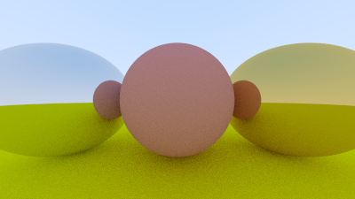
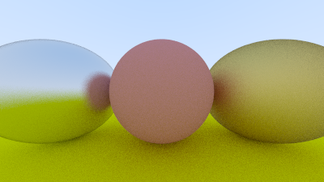

# Metal

## An Abstract Class for Materials

If we want different objects to have different materials, we have a design decision. We could have a
universal material with lots of parameters and different material types just zero out some of those
parameters. This is not a bad approach. Or we could have an abstract material class that
encapsulates behavior. I am a fan of the latter approach. For our program the material needs to do
two things:

1.  Produce a scattered ray (or say it absorbed the incident ray).
2.  If scattered, say how much the ray should be attenuated.

This suggests the abstract class:

<Tabs>
  <Tab label="Rust">
    ```rust filename="material.rs | The Material trait" {1-13}
    use crate::color::Color;
    use crate::hittable::HitRecord;
    use crate::ray::Ray;

    pub trait Material {
        fn scatter(
            &self,
            r_in: &Ray,
            rec: &HitRecord,
            attenuation: &mut Color,
            scattered: &mut Ray,
        ) -> bool;
    }
    ```
  </Tab>

  <Tab label="C++">
    ```cpp filename="material.h | The Material abstract class" {1-20}
    #ifndef MATERIAL_H
    #define MATERIAL_H

    #include "color.h"
    #include "hittable.h"
    #include "ray.h"

    class Material {
    public:
        virtual ~Material() = default;

        virtual bool scatter( //
            const Ray &r_in,
            const HitRecord &rec,
            Color &attenuation,
            Ray &scattered
        ) const = 0;
    };

    #endif
    ```
  </Tab>
</Tabs>

## A Data Structure to Describe Ray-Object Intersections

The `hit_record` is to avoid a bunch of arguments so we can stuff whatever info we want in there.
You can use arguments instead; it's a matter of taste. Hittables and materials need to know each
other so there is some circularity of the references. In C++ you just need to alert the compiler
that the pointer is to a class, which the "class material" in the hittable class below does:

<Tabs>
  <Tab label="Rust">
    ```rust filename="hittable.rs | HitRecord with added pointer to Material trait object" {1-3,11}
    use std::rc::Rc;

    use crate::material::Material;
    use crate::ray::Ray;
    use crate::vec3::{self, Point3, Vec3};

    #[derive(Clone, Default)]
    pub struct HitRecord {
        pub p: Point3,
        pub normal: Vec3,
        pub mat: Option<Rc<dyn Material>>,
        pub t: f64,
        pub front_face: bool,
    }

    impl HitRecord {
        pub fn new() -> HitRecord {
            Default::default()
        }

        pub fn set_face_normal(&mut self, r: &Ray, outward_normal: Vec3) {
            self.front_face = vec3::dot(r.direction(), outward_normal) < 0.0;
            self.normal = if self.front_face {
                outward_normal
            } else {
                -outward_normal
            };
        }
    }

    pub trait Hittable {
        fn hit(&self, ray: &Ray, t_min: f64, t_max: f64, rec: &mut HitRecord) -> bool;
    }
    ```
  </Tab>

  <Tab label="C++">
    ```cpp filename="hittable.h | HitRecord with added pointer to Material abstract class" {3-4,8-9,21}
    #ifndef HITTABLE_H
    #define HITTABLE_H

    #include <memory>

    #include "ray.h"
    #include "vec3.h"

    class Material;

    struct HitRecord {
        HitRecord() = default;

        void set_face_normal(const Ray &r, Vec3 outward_normal) {
            front_face = dot(r.direction(), outward_normal) < 0.0;
            normal = front_face ? outward_normal : -outward_normal;
        }

        Point3 p;
        Vec3 normal;
        std::shared_ptr<Material> mat;
        double t = 0.0;
        bool front_face = false;
    };

    class Hittable {
    public:
        virtual ~Hittable() = default;

        virtual bool hit(const Ray &r, double t_min, double t_max, HitRecord &rec) const = 0;
    };

    #endif
    ```
  </Tab>
</Tabs>

What we have set up here is that material will tell us how rays interact with the surface.
`hit_record` is just a way to stuff a bunch of arguments into a struct so we can send them as a
group. When a ray hits a surface (a particular sphere for example), the material pointer in the
`hit_record` will be set to point at the material pointer the sphere was given when it was set up in
`main()` when we start. When the `ray_color()` routine gets the `hit_record` it can call member
functions of the material pointer to find out what ray, if any, is scattered.

To achieve this, we must have a reference to the material for our sphere class to returned
within `hit_record`. See the highlighted lines below:

<Tabs>
  <Tab label="Rust">
    ```rust filename="sphere.rs | Ray-sphere intersection with added Material information" {1-2,4,6-7,12,16,20,51}
    use std::rc::Rc;

    use crate::hittable::{HitRecord, Hittable};
    use crate::material::Material;
    use crate::ray::Ray;
    use crate::vec3;
    use crate::vec3::Point3;

    pub struct Sphere {
        center: Point3,
        radius: f64,
        mat: Rc<dyn Material>,
    }

    impl Sphere {
        pub fn new(cen: Point3, r: f64, m: Rc<dyn Material>) -> Sphere {
            Sphere {
                center: cen,
                radius: r,
                mat: m,
            }
        }
    }

    impl Hittable for Sphere {
        fn hit(&self, r: &Ray, t_min: f64, t_max: f64, rec: &mut HitRecord) -> bool {
            let oc = r.origin() - self.center;
            let a = r.direction().length_squared();
            let half_b = vec3::dot(oc, r.direction());
            let c = oc.length_squared() - self.radius * self.radius;
            let discriminant = half_b * half_b - a * c;
            if discriminant < 0.0 {
                return false;
            }

            let sqrt_d = f64::sqrt(discriminant);

            // Find the nearest root that lies in the acceptable range
            let mut root = (-half_b - sqrt_d) / a;
            if root <= t_min || t_max <= root {
                root = (-half_b + sqrt_d) / a;
                if root <= t_min || t_max <= root {
                    return false;
                }
            }

            rec.t = root;
            rec.p = r.at(rec.t);
            let outward_normal = (rec.p - self.center) / self.radius;
            rec.set_face_normal(r, outward_normal);
            rec.mat = Some(self.mat.clone());

            true
        }
    }
    ```
  </Tab>

  <Tab label="C++">
    ```cpp filename="sphere.h | Ray-sphere intersection with added Material information" {3-4,7,12-13,20,48}
    #ifndef SPHERE_H
    #define SPHERE_H

    #include <memory>

    #include "hittable.h"
    #include "material.h"
    #include "vec3.h"

    class Sphere : public Hittable {
    public:
        Sphere(Point3 cen, double r, const std::shared_ptr<Material> &m)
            : center{cen}, radius{r}, mat{m} {};

        bool hit(const Ray &r, double t_min, double t_max, HitRecord &rec) const override;

    private:
        Point3 center;
        double radius;
        std::shared_ptr<Material> mat;
    };

    inline bool Sphere::hit(const Ray &r, double t_min, double t_max, HitRecord &rec) const {
        auto oc = r.origin() - center;
        auto a = r.direction().length_squared();
        auto half_b = dot(oc, r.direction());
        auto c = oc.length_squared() - radius * radius;
        auto discriminant = half_b * half_b - a * c;
        if (discriminant < 0.0) {
            return false;
        }

        auto sqrt_d = sqrt(discriminant);

        // Find the nearest root that lies in the acceptable range
        auto root = (-half_b - sqrt_d) / a;
        if (root <= t_min || t_max <= root) {
            root = (-half_b + sqrt_d) / a;
            if (root <= t_min || t_max <= root) {
                return false;
            }
        }

        rec.t = root;
        rec.p = r.at(rec.t);
        auto outward_normal = (rec.p - center) / radius;
        rec.set_face_normal(r, outward_normal);
        rec.mat = mat;

        return true;
    }

    #endif
    ```
  </Tab>
</Tabs>

## Modeling Light Scatter and Reflectance

For the Lambertian (diffuse) case we already have, it can either scatter always and attenuate by its
reflectance $R$, or it can scatter with no attenuation but absorb the fraction $1-R$ of the rays, or
it could be a mixture of those strategies. For Lambertian materials we get this simple class:

<Tabs>
  <Tab label="Rust">
    ```rust filename="material.rs | The Lambertian Material struct" {4,15-39}
    use crate::color::Color;
    use crate::hittable::HitRecord;
    use crate::ray::Ray;
    use crate::vec3;

    pub trait Material {
        fn scatter(
            &self,
            r_in: &Ray,
            rec: &HitRecord,
            attenuation: &mut Color,
            scattered: &mut Ray,
        ) -> bool;
    }

    pub struct Lambertian {
        albedo: Color,
    }

    impl Lambertian {
        pub fn new(a: Color) -> Lambertian {
            Lambertian { albedo: a }
        }
    }

    impl Material for Lambertian {
        fn scatter(
            &self,
            _r_in: &Ray,
            rec: &HitRecord,
            attenuation: &mut Color,
            scattered: &mut Ray,
        ) -> bool {
            let mut scatter_direction = rec.normal + vec3::random_unit_vector();
            *scattered = Ray::new(rec.p, scatter_direction);
            *attenuation = self.albedo;
            true
        }
    }
    ```
  </Tab>

  <Tab label="C++">
    ```cpp filename="material.h | The Lambertian Material class" {19-38}
    #ifndef MATERIAL_H
    #define MATERIAL_H

    #include "color.h"
    #include "hittable.h"
    #include "ray.h"

    class Material {
    public:
        virtual ~Material() = default;

        virtual bool scatter( //
            const Ray &r_in,
            const HitRecord &rec,
            Color &attenuation,
            Ray &scattered
        ) const = 0;
    };

    class Lambertian : public Material {
    public:
        explicit Lambertian(Color a) : albedo{a} {}

        bool scatter( //
            const Ray & /*r_in*/,
            const HitRecord &rec,
            Color &attenuation,
            Ray &scattered
        ) const override {
            auto scatter_direction = rec.normal + random_unit_vector();
            scattered = Ray(rec.p, scatter_direction);
            attenuation = albedo;
            return true;
        }

    private:
        Color albedo;
    };

    #endif
    ```
  </Tab>
</Tabs>

Note we could just as well only scatter with some probability $p$ and have attenuation be
$albedo/p$. Your choice.

If you read the code above carefully, you'll notice a small chance of mischief. If the random unit
vector we generate is exactly opposite the normal vector, the two will sum to zero, which will
result in a zero scatter direction vector. This leads to bad scenarios later on (infinities and
NaNs), so we need to intercept the condition before we pass it on.

In service of this, we'll create a new vector method -- `vec3::near_zero()` -- that returns true if
the vector is very close to zero in all dimensions.

<Tabs>
  <Tab label="Rust">
    ```rust filename="vec3.rs | The vec3::near_zero() method" {51-56}
    use std::fmt::{Display, Formatter, Result};
    use std::ops::{Add, AddAssign, Div, DivAssign, Mul, MulAssign, Neg, Sub};

    use crate::common;

    #[derive(Copy, Clone, Default)]
    pub struct Vec3 {
        e: [f64; 3],
    }

    impl Vec3 {
        pub fn new(x: f64, y: f64, z: f64) -> Vec3 {
            Vec3 { e: [x, y, z] }
        }

        pub fn random() -> Vec3 {
            Vec3::new(
                common::random_double(),
                common::random_double(),
                common::random_double(),
            )
        }

        pub fn random_range(min: f64, max: f64) -> Vec3 {
            Vec3::new(
                common::random_double_range(min, max),
                common::random_double_range(min, max),
                common::random_double_range(min, max),
            )
        }

        pub fn x(&self) -> f64 {
            self.e[0]
        }

        pub fn y(&self) -> f64 {
            self.e[1]
        }

        pub fn z(&self) -> f64 {
            self.e[2]
        }

        pub fn length(&self) -> f64 {
            f64::sqrt(self.length_squared())
        }

        pub fn length_squared(&self) -> f64 {
            self.e[0] * self.e[0] + self.e[1] * self.e[1] + self.e[2] * self.e[2]
        }

        pub fn near_zero(&self) -> bool {
            const EPS: f64 = 1.0e-8;
            // Return true if the vector is close to zero in all dimensions
            self.e[0].abs() < EPS && self.e[1].abs() < EPS && self.e[2].abs() < EPS
        }
    }

    // Type alias
    pub type Point3 = Vec3;

    // Output formatting
    impl Display for Vec3 {
        fn fmt(&self, f: &mut Formatter) -> Result {
            write!(f, "{} {} {}", self.e[0], self.e[1], self.e[2])
        }
    }

    // -Vec3
    impl Neg for Vec3 {
        type Output = Vec3;

        fn neg(self) -> Vec3 {
            Vec3::new(-self.x(), -self.y(), -self.z())
        }
    }

    // Vec3 += Vec3
    impl AddAssign for Vec3 {
        fn add_assign(&mut self, v: Vec3) {
            *self = *self + v;
        }
    }

    // Vec3 *= f64
    impl MulAssign<f64> for Vec3 {
        fn mul_assign(&mut self, t: f64) {
            *self = *self * t;
        }
    }

    // Vec3 /= f64
    impl DivAssign<f64> for Vec3 {
        fn div_assign(&mut self, t: f64) {
            *self = *self / t;
        }
    }

    // Vec3 + Vec3
    impl Add for Vec3 {
        type Output = Vec3;

        fn add(self, v: Vec3) -> Vec3 {
            Vec3::new(self.x() + v.x(), self.y() + v.y(), self.z() + v.z())
        }
    }

    // Vec3 - Vec3
    impl Sub for Vec3 {
        type Output = Vec3;

        fn sub(self, v: Vec3) -> Vec3 {
            Vec3::new(self.x() - v.x(), self.y() - v.y(), self.z() - v.z())
        }
    }

    // Vec3 * Vec3
    impl Mul for Vec3 {
        type Output = Vec3;

        fn mul(self, v: Vec3) -> Vec3 {
            Vec3::new(self.x() * v.x(), self.y() * v.y(), self.z() * v.z())
        }
    }

    // f64 * Vec3
    impl Mul<Vec3> for f64 {
        type Output = Vec3;

        fn mul(self, v: Vec3) -> Vec3 {
            Vec3::new(self * v.x(), self * v.y(), self * v.z())
        }
    }

    // Vec3 * f64
    impl Mul<f64> for Vec3 {
        type Output = Vec3;

        fn mul(self, t: f64) -> Vec3 {
            Vec3::new(self.x() * t, self.y() * t, self.z() * t)
        }
    }

    // Vec3 / f64
    impl Div<f64> for Vec3 {
        type Output = Vec3;

        fn div(self, t: f64) -> Vec3 {
            Vec3::new(self.x() / t, self.y() / t, self.z() / t)
        }
    }

    pub fn dot(u: Vec3, v: Vec3) -> f64 {
        u.e[0] * v.e[0] + u.e[1] * v.e[1] + u.e[2] * v.e[2]
    }

    pub fn cross(u: Vec3, v: Vec3) -> Vec3 {
        Vec3::new(
            u.e[1] * v.e[2] - u.e[2] * v.e[1],
            u.e[2] * v.e[0] - u.e[0] * v.e[2],
            u.e[0] * v.e[1] - u.e[1] * v.e[0],
        )
    }

    pub fn unit_vector(v: Vec3) -> Vec3 {
        v / v.length()
    }

    pub fn random_in_unit_sphere() -> Vec3 {
        loop {
            let p = Vec3::random_range(-1.0, 1.0);
            if p.length_squared() >= 1.0 {
                continue;
            }
            return p;
        }
    }

    pub fn random_unit_vector() -> Vec3 {
        unit_vector(random_in_unit_sphere())
    }

    pub fn random_in_hemisphere(normal: Vec3) -> Vec3 {
        let in_unit_sphere = random_in_unit_sphere();
        if dot(in_unit_sphere, normal) > 0.0 {
            // In the same hemisphere as the normal
            in_unit_sphere
        } else {
            -in_unit_sphere
        }
    }
    ```
  </Tab>

  <Tab label="C++">
    ```cpp filename="vec3.h | The vec3::near_zero() method" {47-52}
    #ifndef VEC3_H
    #define VEC3_H

    #include <array>
    #include <cmath>
    #include <ostream>

    #include "common.h"

    class Vec3 {
    public:
        Vec3() = default;

        Vec3(double e0, double e1, double e2) : e{e0, e1, e2} {}

        static Vec3 random() {
            return Vec3(random_double(), random_double(), random_double());
        }

        static Vec3 random_range(double min, double max) {
            return Vec3(
                random_double_range(min, max),
                random_double_range(min, max),
                random_double_range(min, max)
            );
        }

        double x() const {
            return e[0];
        }

        double y() const {
            return e[1];
        }

        double z() const {
            return e[2];
        }

        double length() const {
            return std::sqrt(length_squared());
        }

        double length_squared() const {
            return e[0] * e[0] + e[1] * e[1] + e[2] * e[2];
        }

        bool near_zero() const {
            const double EPS = 1e-8;
            // Return true if the vector is close to zero in all dimensions
            return fabs(e[0]) < EPS && fabs(e[1]) < EPS && fabs(e[2]) < EPS;
        }

        // -Vec3
        Vec3 operator-() const {
            return Vec3(-e[0], -e[1], -e[2]);
        }

        // Vec3 += Vec3
        Vec3 &operator+=(Vec3 v) {
            e[0] += v.x();
            e[1] += v.y();
            e[2] += v.z();
            return *this;
        }

        // Vec3 *= double
        Vec3 &operator*=(double t) {
            e[0] *= t;
            e[1] *= t;
            e[2] *= t;
            return *this;
        }

        // Vec3 /= double
        Vec3 &operator/=(double t) {
            return *this *= 1.0 / t;
        }

    private:
        std::array<double, 3> e = {0.0, 0.0, 0.0};
    };

    // Type alias
    using Point3 = Vec3;

    // Output formatting
    inline std::ostream &operator<<(std::ostream &out, Vec3 v) {
        return out << v.x() << ' ' << v.y() << ' ' << v.z();
    }

    // Vec3 + Vec3
    inline Vec3 operator+(Vec3 u, Vec3 v) {
        return Vec3(u.x() + v.x(), u.y() + v.y(), u.z() + v.z());
    }

    // Vec3 - Vec3
    inline Vec3 operator-(Vec3 u, Vec3 v) {
        return Vec3(u.x() - v.x(), u.y() - v.y(), u.z() - v.z());
    }

    // Vec3 * Vec3
    inline Vec3 operator*(Vec3 u, Vec3 v) {
        return Vec3(u.x() * v.x(), u.y() * v.y(), u.z() * v.z());
    }

    // double * Vec3
    inline Vec3 operator*(double t, Vec3 v) {
        return Vec3(t * v.x(), t * v.y(), t * v.z());
    }

    // Vec3 * double
    inline Vec3 operator*(Vec3 v, double t) {
        return t * v;
    }

    // Vec3 / double
    inline Vec3 operator/(Vec3 v, double t) {
        return (1.0 / t) * v;
    }

    inline double dot(Vec3 u, Vec3 v) {
        return u.x() * v.x() + u.y() * v.y() + u.z() * v.z();
    }

    inline Vec3 cross(Vec3 u, Vec3 v) {
        return Vec3(
            u.y() * v.z() - u.z() * v.y(),
            u.z() * v.x() - u.x() * v.z(),
            u.x() * v.y() - u.y() * v.x()
        );
    }

    inline Vec3 unit_vector(Vec3 v) {
        return v / v.length();
    }

    inline Vec3 random_in_unit_sphere() {
        while (true) {
            auto p = Vec3::random_range(-1.0, 1.0);
            if (p.length_squared() >= 1.0) {
                continue;
            }
            return p;
        }
    }

    inline Vec3 random_unit_vector() {
        return unit_vector(random_in_unit_sphere());
    }

    inline Vec3 random_in_hemisphere(Vec3 normal) {
        auto in_unit_sphere = random_in_unit_sphere();
        if (dot(in_unit_sphere, normal) > 0.0) {
            // In the same hemisphere as the normal
            return in_unit_sphere;
        } else {
            return -in_unit_sphere;
        }
    }

    #endif
    ```
  </Tab>
</Tabs>

<Tabs>
  <Tab label="Rust">
    ```rust filename="material.rs | Lambertian scatter, bullet-proof" {35-40}
    use crate::color::Color;
    use crate::hittable::HitRecord;
    use crate::ray::Ray;
    use crate::vec3;

    pub trait Material {
        fn scatter(
            &self,
            r_in: &Ray,
            rec: &HitRecord,
            attenuation: &mut Color,
            scattered: &mut Ray,
        ) -> bool;
    }

    pub struct Lambertian {
        albedo: Color,
    }

    impl Lambertian {
        pub fn new(a: Color) -> Lambertian {
            Lambertian { albedo: a }
        }
    }

    impl Material for Lambertian {
        fn scatter(
            &self,
            _r_in: &Ray,
            rec: &HitRecord,
            attenuation: &mut Color,
            scattered: &mut Ray,
        ) -> bool {
            let mut scatter_direction = rec.normal + vec3::random_unit_vector();

            // Catch degenerate scatter direction
            if scatter_direction.near_zero() {
                scatter_direction = rec.normal;
            }

            *scattered = Ray::new(rec.p, scatter_direction);
            *attenuation = self.albedo;
            true
        }
    }
    ```
  </Tab>

  <Tab label="C++">
    ```cpp filename="material.h | Lambertian scatter, bullet-proof" {31-36}
    #ifndef MATERIAL_H
    #define MATERIAL_H

    #include "color.h"
    #include "hittable.h"
    #include "ray.h"

    class Material {
    public:
        virtual ~Material() = default;

        virtual bool scatter( //
            const Ray &r_in,
            const HitRecord &rec,
            Color &attenuation,
            Ray &scattered
        ) const = 0;
    };

    class Lambertian : public Material {
    public:
        explicit Lambertian(Color a) : albedo{a} {}

        bool scatter( //
            const Ray & /*r_in*/,
            const HitRecord &rec,
            Color &attenuation,
            Ray &scattered
        ) const override {
            auto scatter_direction = rec.normal + random_unit_vector();

            // Catch degenerate scatter direction
            if (scatter_direction.near_zero()) {
                scatter_direction = rec.normal;
            }

            scattered = Ray(rec.p, scatter_direction);
            attenuation = albedo;
            return true;
        }

    private:
        Color albedo;
    };

    #endif
    ```
  </Tab>
</Tabs>

## Mirrored Light Reflection

For smooth metals the ray won't be randomly scattered. The key math is: how does a ray get
reflected from a metal mirror? Vector math is our friend here:

![Figure \[reflection\]: Ray reflection](../images/fig-1.11-reflection.jpg)

The reflected ray direction in red is just $\mathbf{v} + 2\mathbf{b}$. In our design, $\mathbf{n}$
is a unit vector, but $\mathbf{v}$ may not be. The length of $\mathbf{b}$ should be $\mathbf{v}
\cdot \mathbf{n}$. Because $\mathbf{v}$ points in, we will need a minus sign, yielding:

<Tabs>
  <Tab label="Rust">
    ```rust filename="vec3.rs | Vec3 reflection function" {192-195}
    use std::fmt::{Display, Formatter, Result};
    use std::ops::{Add, AddAssign, Div, DivAssign, Mul, MulAssign, Neg, Sub};

    use crate::common;

    #[derive(Copy, Clone, Default)]
    pub struct Vec3 {
        e: [f64; 3],
    }

    impl Vec3 {
        pub fn new(x: f64, y: f64, z: f64) -> Vec3 {
            Vec3 { e: [x, y, z] }
        }

        pub fn random() -> Vec3 {
            Vec3::new(
                common::random_double(),
                common::random_double(),
                common::random_double(),
            )
        }

        pub fn random_range(min: f64, max: f64) -> Vec3 {
            Vec3::new(
                common::random_double_range(min, max),
                common::random_double_range(min, max),
                common::random_double_range(min, max),
            )
        }

        pub fn x(&self) -> f64 {
            self.e[0]
        }

        pub fn y(&self) -> f64 {
            self.e[1]
        }

        pub fn z(&self) -> f64 {
            self.e[2]
        }

        pub fn length(&self) -> f64 {
            f64::sqrt(self.length_squared())
        }

        pub fn length_squared(&self) -> f64 {
            self.e[0] * self.e[0] + self.e[1] * self.e[1] + self.e[2] * self.e[2]
        }

        pub fn near_zero(&self) -> bool {
            const EPS: f64 = 1.0e-8;
            // Return true if the vector is close to zero in all dimensions
            self.e[0].abs() < EPS && self.e[1].abs() < EPS && self.e[2].abs() < EPS
        }
    }

    // Type alias
    pub type Point3 = Vec3;

    // Output formatting
    impl Display for Vec3 {
        fn fmt(&self, f: &mut Formatter) -> Result {
            write!(f, "{} {} {}", self.e[0], self.e[1], self.e[2])
        }
    }

    // -Vec3
    impl Neg for Vec3 {
        type Output = Vec3;

        fn neg(self) -> Vec3 {
            Vec3::new(-self.x(), -self.y(), -self.z())
        }
    }

    // Vec3 += Vec3
    impl AddAssign for Vec3 {
        fn add_assign(&mut self, v: Vec3) {
            *self = *self + v;
        }
    }

    // Vec3 *= f64
    impl MulAssign<f64> for Vec3 {
        fn mul_assign(&mut self, t: f64) {
            *self = *self * t;
        }
    }

    // Vec3 /= f64
    impl DivAssign<f64> for Vec3 {
        fn div_assign(&mut self, t: f64) {
            *self = *self / t;
        }
    }

    // Vec3 + Vec3
    impl Add for Vec3 {
        type Output = Vec3;

        fn add(self, v: Vec3) -> Vec3 {
            Vec3::new(self.x() + v.x(), self.y() + v.y(), self.z() + v.z())
        }
    }

    // Vec3 - Vec3
    impl Sub for Vec3 {
        type Output = Vec3;

        fn sub(self, v: Vec3) -> Vec3 {
            Vec3::new(self.x() - v.x(), self.y() - v.y(), self.z() - v.z())
        }
    }

    // Vec3 * Vec3
    impl Mul for Vec3 {
        type Output = Vec3;

        fn mul(self, v: Vec3) -> Vec3 {
            Vec3::new(self.x() * v.x(), self.y() * v.y(), self.z() * v.z())
        }
    }

    // f64 * Vec3
    impl Mul<Vec3> for f64 {
        type Output = Vec3;

        fn mul(self, v: Vec3) -> Vec3 {
            Vec3::new(self * v.x(), self * v.y(), self * v.z())
        }
    }

    // Vec3 * f64
    impl Mul<f64> for Vec3 {
        type Output = Vec3;

        fn mul(self, t: f64) -> Vec3 {
            Vec3::new(self.x() * t, self.y() * t, self.z() * t)
        }
    }

    // Vec3 / f64
    impl Div<f64> for Vec3 {
        type Output = Vec3;

        fn div(self, t: f64) -> Vec3 {
            Vec3::new(self.x() / t, self.y() / t, self.z() / t)
        }
    }

    pub fn dot(u: Vec3, v: Vec3) -> f64 {
        u.e[0] * v.e[0] + u.e[1] * v.e[1] + u.e[2] * v.e[2]
    }

    pub fn cross(u: Vec3, v: Vec3) -> Vec3 {
        Vec3::new(
            u.e[1] * v.e[2] - u.e[2] * v.e[1],
            u.e[2] * v.e[0] - u.e[0] * v.e[2],
            u.e[0] * v.e[1] - u.e[1] * v.e[0],
        )
    }

    pub fn unit_vector(v: Vec3) -> Vec3 {
        v / v.length()
    }

    pub fn random_in_unit_sphere() -> Vec3 {
        loop {
            let p = Vec3::random_range(-1.0, 1.0);
            if p.length_squared() >= 1.0 {
                continue;
            }
            return p;
        }
    }

    pub fn random_unit_vector() -> Vec3 {
        unit_vector(random_in_unit_sphere())
    }

    pub fn random_in_hemisphere(normal: Vec3) -> Vec3 {
        let in_unit_sphere = random_in_unit_sphere();
        if dot(in_unit_sphere, normal) > 0.0 {
            // In the same hemisphere as the normal
            in_unit_sphere
        } else {
            -in_unit_sphere
        }
    }

    pub fn reflect(v: Vec3, n: Vec3) -> Vec3 {
        v - 2.0 * dot(v, n) * n
    }
    ```
  </Tab>

  <Tab label="C++">
    ```cpp filename="vec3.h | Vec3 reflection function" {161-164}
    #ifndef VEC3_H
    #define VEC3_H

    #include <array>
    #include <cmath>
    #include <ostream>

    #include "common.h"

    class Vec3 {
    public:
        Vec3() = default;

        Vec3(double e0, double e1, double e2) : e{e0, e1, e2} {}

        static Vec3 random() {
            return Vec3(random_double(), random_double(), random_double());
        }

        static Vec3 random_range(double min, double max) {
            return Vec3(
                random_double_range(min, max),
                random_double_range(min, max),
                random_double_range(min, max)
            );
        }

        double x() const {
            return e[0];
        }

        double y() const {
            return e[1];
        }

        double z() const {
            return e[2];
        }

        double length() const {
            return std::sqrt(length_squared());
        }

        double length_squared() const {
            return e[0] * e[0] + e[1] * e[1] + e[2] * e[2];
        }

        bool near_zero() const {
            const double EPS = 1e-8;
            // Return true if the vector is close to zero in all dimensions
            return fabs(e[0]) < EPS && fabs(e[1]) < EPS && fabs(e[2]) < EPS;
        }

        // -Vec3
        Vec3 operator-() const {
            return Vec3(-e[0], -e[1], -e[2]);
        }

        // Vec3 += Vec3
        Vec3 &operator+=(Vec3 v) {
            e[0] += v.x();
            e[1] += v.y();
            e[2] += v.z();
            return *this;
        }

        // Vec3 *= double
        Vec3 &operator*=(double t) {
            e[0] *= t;
            e[1] *= t;
            e[2] *= t;
            return *this;
        }

        // Vec3 /= double
        Vec3 &operator/=(double t) {
            return *this *= 1.0 / t;
        }

    private:
        std::array<double, 3> e = {0.0, 0.0, 0.0};
    };

    // Type alias
    using Point3 = Vec3;

    // Output formatting
    inline std::ostream &operator<<(std::ostream &out, Vec3 v) {
        return out << v.x() << ' ' << v.y() << ' ' << v.z();
    }

    // Vec3 + Vec3
    inline Vec3 operator+(Vec3 u, Vec3 v) {
        return Vec3(u.x() + v.x(), u.y() + v.y(), u.z() + v.z());
    }

    // Vec3 - Vec3
    inline Vec3 operator-(Vec3 u, Vec3 v) {
        return Vec3(u.x() - v.x(), u.y() - v.y(), u.z() - v.z());
    }

    // Vec3 * Vec3
    inline Vec3 operator*(Vec3 u, Vec3 v) {
        return Vec3(u.x() * v.x(), u.y() * v.y(), u.z() * v.z());
    }

    // double * Vec3
    inline Vec3 operator*(double t, Vec3 v) {
        return Vec3(t * v.x(), t * v.y(), t * v.z());
    }

    // Vec3 * double
    inline Vec3 operator*(Vec3 v, double t) {
        return t * v;
    }

    // Vec3 / double
    inline Vec3 operator/(Vec3 v, double t) {
        return (1.0 / t) * v;
    }

    inline double dot(Vec3 u, Vec3 v) {
        return u.x() * v.x() + u.y() * v.y() + u.z() * v.z();
    }

    inline Vec3 cross(Vec3 u, Vec3 v) {
        return Vec3(
            u.y() * v.z() - u.z() * v.y(),
            u.z() * v.x() - u.x() * v.z(),
            u.x() * v.y() - u.y() * v.x()
        );
    }

    inline Vec3 unit_vector(Vec3 v) {
        return v / v.length();
    }

    inline Vec3 random_in_unit_sphere() {
        while (true) {
            auto p = Vec3::random_range(-1.0, 1.0);
            if (p.length_squared() >= 1.0) {
                continue;
            }
            return p;
        }
    }

    inline Vec3 random_unit_vector() {
        return unit_vector(random_in_unit_sphere());
    }

    inline Vec3 random_in_hemisphere(Vec3 normal) {
        auto in_unit_sphere = random_in_unit_sphere();
        if (dot(in_unit_sphere, normal) > 0.0) {
            // In the same hemisphere as the normal
            return in_unit_sphere;
        } else {
            return -in_unit_sphere;
        }
    }

    inline Vec3 reflect(Vec3 v, Vec3 n) {
        return v - 2.0 * dot(v, n) * n;
    }

    #endif
    ```
  </Tab>
</Tabs>

The metal material just reflects rays using that formula:

<Tabs>
  <Tab label="Rust">
    ```rust filename="material.rs | Metal Material with reflectance function" {46-71}
    use crate::color::Color;
    use crate::hittable::HitRecord;
    use crate::ray::Ray;
    use crate::vec3;

    pub trait Material {
        fn scatter(
            &self,
            r_in: &Ray,
            rec: &HitRecord,
            attenuation: &mut Color,
            scattered: &mut Ray,
        ) -> bool;
    }

    pub struct Lambertian {
        albedo: Color,
    }

    impl Lambertian {
        pub fn new(a: Color) -> Lambertian {
            Lambertian { albedo: a }
        }
    }

    impl Material for Lambertian {
        fn scatter(
            &self,
            _r_in: &Ray,
            rec: &HitRecord,
            attenuation: &mut Color,
            scattered: &mut Ray,
        ) -> bool {
            let mut scatter_direction = rec.normal + vec3::random_unit_vector();

            // Catch degenerate scatter direction
            if scatter_direction.near_zero() {
                scatter_direction = rec.normal;
            }

            *scattered = Ray::new(rec.p, scatter_direction);
            *attenuation = self.albedo;
            true
        }
    }

    pub struct Metal {
        albedo: Color,
    }

    impl Metal {
        pub fn new(a: Color) -> Metal {
            Metal { albedo: a }
        }
    }

    impl Material for Metal {
        fn scatter(
            &self,
            r_in: &Ray,
            rec: &HitRecord,
            attenuation: &mut Color,
            scattered: &mut Ray,
        ) -> bool {
            let reflected = vec3::reflect(vec3::unit_vector(r_in.direction()), rec.normal);

            *scattered = Ray::new(rec.p, reflected);
            *attenuation = self.albedo;
            vec3::dot(scattered.direction(), rec.normal) > 0.0
        }
    }
    ```
  </Tab>

  <Tab label="C++">
    ```cpp filename="material.h | Metal Material with reflectance function" {7,46-66}
    #ifndef MATERIAL_H
    #define MATERIAL_H

    #include "color.h"
    #include "hittable.h"
    #include "ray.h"
    #include "vec3.h"

    class Material {
    public:
        virtual ~Material() = default;

        virtual bool scatter( //
            const Ray &r_in,
            const HitRecord &rec,
            Color &attenuation,
            Ray &scattered
        ) const = 0;
    };

    class Lambertian : public Material {
    public:
        explicit Lambertian(Color a) : albedo{a} {}

        bool scatter( //
            const Ray & /*r_in*/,
            const HitRecord &rec,
            Color &attenuation,
            Ray &scattered
        ) const override {
            auto scatter_direction = rec.normal + random_unit_vector();

            // Catch degenerate scatter direction
            if (scatter_direction.near_zero()) {
                scatter_direction = rec.normal;
            }

            scattered = Ray(rec.p, scatter_direction);
            attenuation = albedo;
            return true;
        }

    private:
        Color albedo;
    };

    class Metal : public Material {
    public:
        explicit Metal(Color a) : albedo{a} {}

        bool scatter( //
            const Ray &r_in,
            const HitRecord &rec,
            Color &attenuation,
            Ray &scattered
        ) const override {
            auto reflected = reflect(unit_vector(r_in.direction()), rec.normal);

            scattered = Ray(rec.p, reflected);
            attenuation = albedo;
            return dot(scattered.direction(), rec.normal) > 0.0;
        }

    private:
        Color albedo;
    };

    #endif
    ```
  </Tab>
</Tabs>

We need to modify the `ray_color()` function to use this:

<Tabs>
  <Tab label="Rust">
    ```rust filename="main.rs | Ray color with scattered reflectance" {6,29-39}
    mod camera;
    mod color;
    mod common;
    mod hittable;
    mod hittable_list;
    mod material;
    mod ray;
    mod sphere;
    mod vec3;

    use std::io;

    use camera::Camera;
    use color::Color;
    use hittable::{HitRecord, Hittable};
    use hittable_list::HittableList;
    use ray::Ray;
    use sphere::Sphere;
    use vec3::Point3;

    fn ray_color(r: &Ray, world: &dyn Hittable, depth: i32) -> Color {
        // If we've exceeded the ray bounce limit, no more light is gathered
        if depth <= 0 {
            return Color::new(0.0, 0.0, 0.0);
        }

        let mut rec = HitRecord::new();
        if world.hit(r, 0.001, common::INFINITY, &mut rec) {
            let mut scattered = Ray::default();
            let mut attenuation = Color::default();
            if rec
                .mat
                .as_ref()
                .unwrap()
                .scatter(r, &rec, &mut attenuation, &mut scattered)
            {
                return attenuation * ray_color(&scattered, world, depth - 1);
            }
            return Color::new(0.0, 0.0, 0.0);
        }

        let unit_direction = vec3::unit_vector(r.direction());
        let t = 0.5 * (unit_direction.y() + 1.0);
        (1.0 - t) * Color::new(1.0, 1.0, 1.0) + t * Color::new(0.5, 0.7, 1.0)
    }

    fn main() {
        // Image

        const ASPECT_RATIO: f64 = 16.0 / 9.0;
        const IMAGE_WIDTH: i32 = 400;
        const IMAGE_HEIGHT: i32 = (IMAGE_WIDTH as f64 / ASPECT_RATIO) as i32;
        const SAMPLES_PER_PIXEL: i32 = 100;
        const MAX_DEPTH: i32 = 50;

        // World

        let mut world = HittableList::new();
        world.add(Box::new(Sphere::new(Point3::new(0.0, 0.0, -1.0), 0.5)));
        world.add(Box::new(Sphere::new(Point3::new(0.0, -100.5, -1.0), 100.0)));

        // Camera

        let cam = Camera::new();

        // Render

        print!("P3\n{} {}\n255\n", IMAGE_WIDTH, IMAGE_HEIGHT);

        for j in (0..IMAGE_HEIGHT).rev() {
            eprint!("\rScanlines remaining: {} ", j);
            for i in 0..IMAGE_WIDTH {
                let mut pixel_color = Color::new(0.0, 0.0, 0.0);
                for _ in 0..SAMPLES_PER_PIXEL {
                    let u = (i as f64 + common::random_double()) / (IMAGE_WIDTH - 1) as f64;
                    let v = (j as f64 + common::random_double()) / (IMAGE_HEIGHT - 1) as f64;
                    let r = cam.get_ray(u, v);
                    pixel_color += ray_color(&r, &world, MAX_DEPTH);
                }
                color::write_color(&mut io::stdout(), pixel_color, SAMPLES_PER_PIXEL);
            }
        }

        eprint!("\nDone.\n");
    }
    ```
  </Tab>

  <Tab label="C++">
    ```cpp filename="main.cpp | Ray color with scattered reflectance" {20-25}
    #include <iostream>

    #include "camera.h"
    #include "color.h"
    #include "common.h"
    #include "hittable.h"
    #include "hittable_list.h"
    #include "ray.h"
    #include "sphere.h"
    #include "vec3.h"

    Color ray_color(const Ray &r, const Hittable &world, int depth) {
        // If we've exceeded the ray bounce limit, no more light is gathered
        if (depth <= 0) {
            return Color(0.0, 0.0, 0.0);
        }

        auto rec = HitRecord();
        if (world.hit(r, 0.001, INFINITY, rec)) {
            auto scattered = Ray();
            auto attenuation = Color();
            if (rec.mat->scatter(r, rec, attenuation, scattered)) {
                return attenuation * ray_color(scattered, world, depth - 1);
            }
            return Color(0.0, 0.0, 0.0);
        }

        auto unit_direction = unit_vector(r.direction());
        auto t = 0.5 * (unit_direction.y() + 1.0);
        return (1.0 - t) * Color(1.0, 1.0, 1.0) + t * Color(0.5, 0.7, 1.0);
    }

    int main() {
        // Image

        const double ASPECT_RATIO = 16.0 / 9.0;
        const int IMAGE_WIDTH = 400;
        const int IMAGE_HEIGHT = static_cast<int>(IMAGE_WIDTH / ASPECT_RATIO);
        const int SAMPLES_PER_PIXEL = 100;
        const int MAX_DEPTH = 50;

        // World

        auto world = HittableList();
        world.add(std::make_unique<Sphere>(Point3(0.0, 0.0, -1.0), 0.5));
        world.add(std::make_unique<Sphere>(Point3(0.0, -100.5, -1.0), 100.0));

        // Camera

        auto cam = Camera();

        // Render

        std::cout << "P3\n" << IMAGE_WIDTH << ' ' << IMAGE_HEIGHT << "\n255\n";

        for (auto j = IMAGE_HEIGHT - 1; j >= 0; --j) {
            std::cerr << "\rScanlines remaining: " << j << ' ';
            for (auto i = 0; i < IMAGE_WIDTH; ++i) {
                auto pixel_color = Color(0.0, 0.0, 0.0);
                for (auto s = 0; s < SAMPLES_PER_PIXEL; ++s) {
                    auto u = (i + random_double()) / (IMAGE_WIDTH - 1);
                    auto v = (j + random_double()) / (IMAGE_HEIGHT - 1);
                    auto r = cam.get_ray(u, v);
                    pixel_color += ray_color(r, world, MAX_DEPTH);
                }
                write_color(std::cout, pixel_color, SAMPLES_PER_PIXEL);
            }
        }

        std::cerr << "\nDone.\n";

        return 0;
    }
    ```
  </Tab>
</Tabs>

## A Scene with Metal Spheres

Now let's add some metal spheres to our scene:

<Tabs>
  <Tab label="Rust">
    ```rust filename="main.rs | Scene with metal spheres" {12,18,61-86} genImage
    mod camera;
    mod color;
    mod common;
    mod hittable;
    mod hittable_list;
    mod material;
    mod ray;
    mod sphere;
    mod vec3;

    use std::io;
    use std::rc::Rc;

    use camera::Camera;
    use color::Color;
    use hittable::{HitRecord, Hittable};
    use hittable_list::HittableList;
    use material::{Lambertian, Metal};
    use ray::Ray;
    use sphere::Sphere;
    use vec3::Point3;

    fn ray_color(r: &Ray, world: &dyn Hittable, depth: i32) -> Color {
        // If we've exceeded the ray bounce limit, no more light is gathered
        if depth <= 0 {
            return Color::new(0.0, 0.0, 0.0);
        }

        let mut rec = HitRecord::new();
        if world.hit(r, 0.001, common::INFINITY, &mut rec) {
            let mut scattered = Ray::default();
            let mut attenuation = Color::default();
            if rec
                .mat
                .as_ref()
                .unwrap()
                .scatter(r, &rec, &mut attenuation, &mut scattered)
            {
                return attenuation * ray_color(&scattered, world, depth - 1);
            }
            return Color::new(0.0, 0.0, 0.0);
        }

        let unit_direction = vec3::unit_vector(r.direction());
        let t = 0.5 * (unit_direction.y() + 1.0);
        (1.0 - t) * Color::new(1.0, 1.0, 1.0) + t * Color::new(0.5, 0.7, 1.0)
    }

    fn main() {
        // Image

        const ASPECT_RATIO: f64 = 16.0 / 9.0;
        const IMAGE_WIDTH: i32 = 400;
        const IMAGE_HEIGHT: i32 = (IMAGE_WIDTH as f64 / ASPECT_RATIO) as i32;
        const SAMPLES_PER_PIXEL: i32 = 100;
        const MAX_DEPTH: i32 = 50;

        // World

        let mut world = HittableList::new();

        let material_ground = Rc::new(Lambertian::new(Color::new(0.8, 0.8, 0.0)));
        let material_center = Rc::new(Lambertian::new(Color::new(0.7, 0.3, 0.3)));
        let material_left = Rc::new(Metal::new(Color::new(0.8, 0.8, 0.8)));
        let material_right = Rc::new(Metal::new(Color::new(0.8, 0.6, 0.2)));

        world.add(Box::new(Sphere::new(
            Point3::new(0.0, -100.5, -1.0),
            100.0,
            material_ground,
        )));
        world.add(Box::new(Sphere::new(
            Point3::new(0.0, 0.0, -1.0),
            0.5,
            material_center,
        )));
        world.add(Box::new(Sphere::new(
            Point3::new(-1.0, 0.0, -1.0),
            0.5,
            material_left,
        )));
        world.add(Box::new(Sphere::new(
            Point3::new(1.0, 0.0, -1.0),
            0.5,
            material_right,
        )));

        // Camera

        let cam = Camera::new();

        // Render

        print!("P3\n{} {}\n255\n", IMAGE_WIDTH, IMAGE_HEIGHT);

        for j in (0..IMAGE_HEIGHT).rev() {
            eprint!("\rScanlines remaining: {} ", j);
            for i in 0..IMAGE_WIDTH {
                let mut pixel_color = Color::new(0.0, 0.0, 0.0);
                for _ in 0..SAMPLES_PER_PIXEL {
                    let u = (i as f64 + common::random_double()) / (IMAGE_WIDTH - 1) as f64;
                    let v = (j as f64 + common::random_double()) / (IMAGE_HEIGHT - 1) as f64;
                    let r = cam.get_ray(u, v);
                    pixel_color += ray_color(&r, &world, MAX_DEPTH);
                }
                color::write_color(&mut io::stdout(), pixel_color, SAMPLES_PER_PIXEL);
            }
        }

        eprint!("\nDone.\n");
    }
    ```
  </Tab>

  <Tab label="C++">
    ```cpp filename="main.cpp | Scene with metal spheres" {45-53} genImage
    #include <iostream>

    #include "camera.h"
    #include "color.h"
    #include "common.h"
    #include "hittable.h"
    #include "hittable_list.h"
    #include "ray.h"
    #include "sphere.h"
    #include "vec3.h"

    Color ray_color(const Ray &r, const Hittable &world, int depth) {
        // If we've exceeded the ray bounce limit, no more light is gathered
        if (depth <= 0) {
            return Color(0.0, 0.0, 0.0);
        }

        auto rec = HitRecord();
        if (world.hit(r, 0.001, INFINITY, rec)) {
            auto scattered = Ray();
            auto attenuation = Color();
            if (rec.mat->scatter(r, rec, attenuation, scattered)) {
                return attenuation * ray_color(scattered, world, depth - 1);
            }
            return Color(0.0, 0.0, 0.0);
        }

        auto unit_direction = unit_vector(r.direction());
        auto t = 0.5 * (unit_direction.y() + 1.0);
        return (1.0 - t) * Color(1.0, 1.0, 1.0) + t * Color(0.5, 0.7, 1.0);
    }

    int main() {
        // Image

        const double ASPECT_RATIO = 16.0 / 9.0;
        const int IMAGE_WIDTH = 400;
        const int IMAGE_HEIGHT = static_cast<int>(IMAGE_WIDTH / ASPECT_RATIO);
        const int SAMPLES_PER_PIXEL = 100;
        const int MAX_DEPTH = 50;

        // World

        auto world = HittableList();
        auto material_ground = std::make_shared<Lambertian>(Color(0.8, 0.8, 0.0));
        auto material_center = std::make_shared<Lambertian>(Color(0.7, 0.3, 0.3));
        auto material_left = std::make_shared<Metal>(Color(0.8, 0.8, 0.8));
        auto material_right = std::make_shared<Metal>(Color(0.8, 0.6, 0.2));

        world.add(std::make_unique<Sphere>(Point3(0.0, -100.5, -1.0), 100.0, material_ground));
        world.add(std::make_unique<Sphere>(Point3(0.0, 0.0, -1.0), 0.5, material_center));
        world.add(std::make_unique<Sphere>(Point3(-1.0, 0.0, -1.0), 0.5, material_left));
        world.add(std::make_unique<Sphere>(Point3(1.0, 0.0, -1.0), 0.5, material_right));

        // Camera

        auto cam = Camera();

        // Render

        std::cout << "P3\n" << IMAGE_WIDTH << ' ' << IMAGE_HEIGHT << "\n255\n";

        for (auto j = IMAGE_HEIGHT - 1; j >= 0; --j) {
            std::cerr << "\rScanlines remaining: " << j << ' ';
            for (auto i = 0; i < IMAGE_WIDTH; ++i) {
                auto pixel_color = Color(0.0, 0.0, 0.0);
                for (auto s = 0; s < SAMPLES_PER_PIXEL; ++s) {
                    auto u = (i + random_double()) / (IMAGE_WIDTH - 1);
                    auto v = (j + random_double()) / (IMAGE_HEIGHT - 1);
                    auto r = cam.get_ray(u, v);
                    pixel_color += ray_color(r, world, MAX_DEPTH);
                }
                write_color(std::cout, pixel_color, SAMPLES_PER_PIXEL);
            }
        }

        std::cerr << "\nDone.\n";

        return 0;
    }
    ```
  </Tab>
</Tabs>

Which gives:



## Fuzzy Reflection

We can also randomize the reflected direction by using a small sphere and choosing a new endpoint
for the ray:

![Figure \[reflect-fuzzy\]: Generating fuzzed reflection rays](../images/fig-1.12-reflect-fuzzy.jpg)

The bigger the sphere, the fuzzier the reflections will be. This suggests adding a fuzziness
parameter that is just the radius of the sphere (so zero is no perturbation). The catch is that for
big spheres or grazing rays, we may scatter below the surface. We can just have the surface
absorb those.

<Tabs>
  <Tab label="Rust">
    ```rust filename="material.rs | Metal Material fuzziness" {49,53-57,71}
    use crate::color::Color;
    use crate::hittable::HitRecord;
    use crate::ray::Ray;
    use crate::vec3;

    pub trait Material {
        fn scatter(
            &self,
            r_in: &Ray,
            rec: &HitRecord,
            attenuation: &mut Color,
            scattered: &mut Ray,
        ) -> bool;
    }

    pub struct Lambertian {
        albedo: Color,
    }

    impl Lambertian {
        pub fn new(a: Color) -> Lambertian {
            Lambertian { albedo: a }
        }
    }

    impl Material for Lambertian {
        fn scatter(
            &self,
            _r_in: &Ray,
            rec: &HitRecord,
            attenuation: &mut Color,
            scattered: &mut Ray,
        ) -> bool {
            let mut scatter_direction = rec.normal + vec3::random_unit_vector();

            // Catch degenerate scatter direction
            if scatter_direction.near_zero() {
                scatter_direction = rec.normal;
            }

            *scattered = Ray::new(rec.p, scatter_direction);
            *attenuation = self.albedo;
            true
        }
    }

    pub struct Metal {
        albedo: Color,
        fuzz: f64,
    }

    impl Metal {
        pub fn new(a: Color, f: f64) -> Metal {
            Metal {
                albedo: a,
                fuzz: if f < 1.0 { f } else { 1.0 },
            }
        }
    }

    impl Material for Metal {
        fn scatter(
            &self,
            r_in: &Ray,
            rec: &HitRecord,
            attenuation: &mut Color,
            scattered: &mut Ray,
        ) -> bool {
            let reflected = vec3::reflect(vec3::unit_vector(r_in.direction()), rec.normal);

            *scattered = Ray::new(rec.p, reflected + self.fuzz * vec3::random_in_unit_sphere());
            *attenuation = self.albedo;
            vec3::dot(scattered.direction(), rec.normal) > 0.0
        }
    }
    ```
  </Tab>

  <Tab label="C++">
    ```cpp filename="material.h | Metal Material fuzziness" {49,59,66}
    #ifndef MATERIAL_H
    #define MATERIAL_H

    #include "color.h"
    #include "hittable.h"
    #include "ray.h"
    #include "vec3.h"

    class Material {
    public:
        virtual ~Material() = default;

        virtual bool scatter( //
            const Ray &r_in,
            const HitRecord &rec,
            Color &attenuation,
            Ray &scattered
        ) const = 0;
    };

    class Lambertian : public Material {
    public:
        explicit Lambertian(Color a) : albedo{a} {}

        bool scatter( //
            const Ray & /*r_in*/,
            const HitRecord &rec,
            Color &attenuation,
            Ray &scattered
        ) const override {
            auto scatter_direction = rec.normal + random_unit_vector();

            // Catch degenerate scatter direction
            if (scatter_direction.near_zero()) {
                scatter_direction = rec.normal;
            }

            scattered = Ray(rec.p, scatter_direction);
            attenuation = albedo;
            return true;
        }

    private:
        Color albedo;
    };

    class Metal : public Material {
    public:
        Metal(Color a, double f) : albedo{a}, fuzz{f < 1.0 ? f : 1.0} {}

        bool scatter( //
            const Ray &r_in,
            const HitRecord &rec,
            Color &attenuation,
            Ray &scattered
        ) const override {
            auto reflected = reflect(unit_vector(r_in.direction()), rec.normal);

            scattered = Ray(rec.p, reflected + fuzz * random_in_unit_sphere());
            attenuation = albedo;
            return dot(scattered.direction(), rec.normal) > 0.0;
        }

    private:
        Color albedo;
        double fuzz;
    };

    #endif
    ```
  </Tab>
</Tabs>

We can try that out by adding fuzziness 0.3 and 1.0 to the metals:

<Tabs>
  <Tab label="Rust">
    ```rust filename="main.rs | Metal spheres with fuzziness" {64-65} genImage
    mod camera;
    mod color;
    mod common;
    mod hittable;
    mod hittable_list;
    mod material;
    mod ray;
    mod sphere;
    mod vec3;

    use std::io;
    use std::rc::Rc;

    use camera::Camera;
    use color::Color;
    use hittable::{HitRecord, Hittable};
    use hittable_list::HittableList;
    use material::{Lambertian, Metal};
    use ray::Ray;
    use sphere::Sphere;
    use vec3::Point3;

    fn ray_color(r: &Ray, world: &dyn Hittable, depth: i32) -> Color {
        // If we've exceeded the ray bounce limit, no more light is gathered
        if depth <= 0 {
            return Color::new(0.0, 0.0, 0.0);
        }

        let mut rec = HitRecord::new();
        if world.hit(r, 0.001, common::INFINITY, &mut rec) {
            let mut scattered = Ray::default();
            let mut attenuation = Color::default();
            if rec
                .mat
                .as_ref()
                .unwrap()
                .scatter(r, &rec, &mut attenuation, &mut scattered)
            {
                return attenuation * ray_color(&scattered, world, depth - 1);
            }
            return Color::new(0.0, 0.0, 0.0);
        }

        let unit_direction = vec3::unit_vector(r.direction());
        let t = 0.5 * (unit_direction.y() + 1.0);
        (1.0 - t) * Color::new(1.0, 1.0, 1.0) + t * Color::new(0.5, 0.7, 1.0)
    }

    fn main() {
        // Image

        const ASPECT_RATIO: f64 = 16.0 / 9.0;
        const IMAGE_WIDTH: i32 = 400;
        const IMAGE_HEIGHT: i32 = (IMAGE_WIDTH as f64 / ASPECT_RATIO) as i32;
        const SAMPLES_PER_PIXEL: i32 = 100;
        const MAX_DEPTH: i32 = 50;

        // World

        let mut world = HittableList::new();

        let material_ground = Rc::new(Lambertian::new(Color::new(0.8, 0.8, 0.0)));
        let material_center = Rc::new(Lambertian::new(Color::new(0.7, 0.3, 0.3)));
        let material_left = Rc::new(Metal::new(Color::new(0.8, 0.8, 0.8), 0.3));
        let material_right = Rc::new(Metal::new(Color::new(0.8, 0.6, 0.2), 1.0));

        world.add(Box::new(Sphere::new(
            Point3::new(0.0, -100.5, -1.0),
            100.0,
            material_ground,
        )));
        world.add(Box::new(Sphere::new(
            Point3::new(0.0, 0.0, -1.0),
            0.5,
            material_center,
        )));
        world.add(Box::new(Sphere::new(
            Point3::new(-1.0, 0.0, -1.0),
            0.5,
            material_left,
        )));
        world.add(Box::new(Sphere::new(
            Point3::new(1.0, 0.0, -1.0),
            0.5,
            material_right,
        )));

        // Camera

        let cam = Camera::new();

        // Render

        print!("P3\n{} {}\n255\n", IMAGE_WIDTH, IMAGE_HEIGHT);

        for j in (0..IMAGE_HEIGHT).rev() {
            eprint!("\rScanlines remaining: {} ", j);
            for i in 0..IMAGE_WIDTH {
                let mut pixel_color = Color::new(0.0, 0.0, 0.0);
                for _ in 0..SAMPLES_PER_PIXEL {
                    let u = (i as f64 + common::random_double()) / (IMAGE_WIDTH - 1) as f64;
                    let v = (j as f64 + common::random_double()) / (IMAGE_HEIGHT - 1) as f64;
                    let r = cam.get_ray(u, v);
                    pixel_color += ray_color(&r, &world, MAX_DEPTH);
                }
                color::write_color(&mut io::stdout(), pixel_color, SAMPLES_PER_PIXEL);
            }
        }

        eprint!("\nDone.\n");
    }
    ```
  </Tab>

  <Tab label="C++">
    ```cpp filename="main.cpp | Metal spheres with fuzziness" {47-48} genImage
    #include <iostream>

    #include "camera.h"
    #include "color.h"
    #include "common.h"
    #include "hittable.h"
    #include "hittable_list.h"
    #include "ray.h"
    #include "sphere.h"
    #include "vec3.h"

    Color ray_color(const Ray &r, const Hittable &world, int depth) {
        // If we've exceeded the ray bounce limit, no more light is gathered
        if (depth <= 0) {
            return Color(0.0, 0.0, 0.0);
        }

        auto rec = HitRecord();
        if (world.hit(r, 0.001, INFINITY, rec)) {
            auto scattered = Ray();
            auto attenuation = Color();
            if (rec.mat->scatter(r, rec, attenuation, scattered)) {
                return attenuation * ray_color(scattered, world, depth - 1);
            }
            return Color(0.0, 0.0, 0.0);
        }

        auto unit_direction = unit_vector(r.direction());
        auto t = 0.5 * (unit_direction.y() + 1.0);
        return (1.0 - t) * Color(1.0, 1.0, 1.0) + t * Color(0.5, 0.7, 1.0);
    }

    int main() {
        // Image

        const double ASPECT_RATIO = 16.0 / 9.0;
        const int IMAGE_WIDTH = 400;
        const int IMAGE_HEIGHT = static_cast<int>(IMAGE_WIDTH / ASPECT_RATIO);
        const int SAMPLES_PER_PIXEL = 100;
        const int MAX_DEPTH = 50;

        // World

        auto world = HittableList();
        auto material_ground = std::make_shared<Lambertian>(Color(0.8, 0.8, 0.0));
        auto material_center = std::make_shared<Lambertian>(Color(0.7, 0.3, 0.3));
        auto material_left = std::make_shared<Metal>(Color(0.8, 0.8, 0.8), 0.3);
        auto material_right = std::make_shared<Metal>(Color(0.8, 0.6, 0.2), 1.0);

        world.add(std::make_unique<Sphere>(Point3(0.0, -100.5, -1.0), 100.0, material_ground));
        world.add(std::make_unique<Sphere>(Point3(0.0, 0.0, -1.0), 0.5, material_center));
        world.add(std::make_unique<Sphere>(Point3(-1.0, 0.0, -1.0), 0.5, material_left));
        world.add(std::make_unique<Sphere>(Point3(1.0, 0.0, -1.0), 0.5, material_right));

        // Camera

        auto cam = Camera();

        // Render

        std::cout << "P3\n" << IMAGE_WIDTH << ' ' << IMAGE_HEIGHT << "\n255\n";

        for (auto j = IMAGE_HEIGHT - 1; j >= 0; --j) {
            std::cerr << "\rScanlines remaining: " << j << ' ';
            for (auto i = 0; i < IMAGE_WIDTH; ++i) {
                auto pixel_color = Color(0.0, 0.0, 0.0);
                for (auto s = 0; s < SAMPLES_PER_PIXEL; ++s) {
                    auto u = (i + random_double()) / (IMAGE_WIDTH - 1);
                    auto v = (j + random_double()) / (IMAGE_HEIGHT - 1);
                    auto r = cam.get_ray(u, v);
                    pixel_color += ray_color(r, world, MAX_DEPTH);
                }
                write_color(std::cout, pixel_color, SAMPLES_PER_PIXEL);
            }
        }

        std::cerr << "\nDone.\n";

        return 0;
    }
    ```
  </Tab>
</Tabs>


