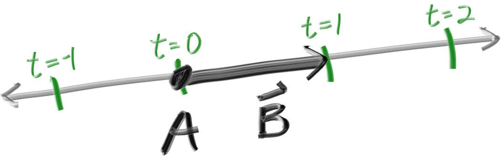
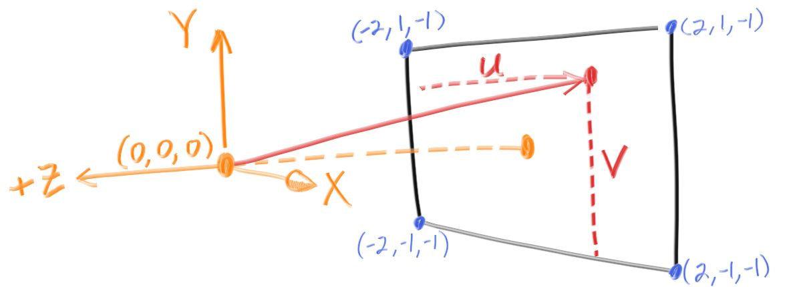

## The ray Class

The one thing that all ray tracers have is a ray class and a computation of what color is seen along
a ray. Let’s think of a ray as a function $\mathbf{P}(t) = \mathbf{A} + t \mathbf{b}$. Here
$\mathbf{P}$ is a 3D position along a line in 3D. $\mathbf{A}$ is the ray origin and $\mathbf{b}$ is
the ray direction. The ray parameter $t$ is a real number (`double` in the code). Plug in a
different $t$ and $\mathbf{P}(t)$ moves the point along the ray. Add in negative $t$ values and you
can go anywhere on the 3D line. For positive $t$, you get only the parts in front of $\mathbf{A}$,
and this is what is often called a half-line or ray.



The function $\mathbf{P}(t)$ in more verbose code form I call `ray::at(t)`:

```cpp filename="ray.h (The ray class)"
#ifndef RAY_H
#define RAY_H

#include "vec3.h"

class ray {
    public:
        ray() {}
        ray(const point3& origin, const vec3& direction)
            : orig(origin), dir(direction)
        {}

        point3 origin() const  { return orig; }
        vec3 direction() const { return dir; }

        point3 at(double t) const {
            return orig + t*dir;
        }

    public:
        point3 orig;
        vec3 dir;
};

#endif
```

## Sending Rays Into the Scene

Now we are ready to turn the corner and make a ray tracer. At the core, the ray tracer sends rays
through pixels and computes the color seen in the direction of those rays. The involved steps are
(1) calculate the ray from the eye to the pixel, (2) determine which objects the ray intersects, and
(3) compute a color for that intersection point. When first developing a ray tracer, I always do a
simple camera for getting the code up and running. I also make a simple `ray_color(ray)` function
that returns the color of the background (a simple gradient).

I’ve often gotten into trouble using square images for debugging because I transpose $x$ and $y$ too
often, so I’ll use a non-square image. For now we'll use a 16:9 aspect ratio, since that's so
common.

In addition to setting up the pixel dimensions for the rendered image, we also need to set up a
virtual viewport through which to pass our scene rays. For the standard square pixel spacing, the
viewport's aspect ratio should be the same as our rendered image. We'll just pick a viewport two
units in height. We'll also set the distance between the projection plane and the projection point
to be one unit. This is referred to as the “focal length”, not to be confused with “focus distance”,
which we'll present later.

I’ll put the “eye” (or camera center if you think of a camera) at $(0,0,0)$. I will have the y-axis
go up, and the x-axis to the right. In order to respect the convention of a right handed coordinate
system, into the screen is the negative z-axis. I will traverse the screen from the upper left hand
corner, and use two offset vectors along the screen sides to move the ray endpoint across the
screen. Note that I do not make the ray direction a unit length vector because I think not doing
that makes for simpler and slightly faster code.



Below in code, the ray `r` goes to approximately the pixel centers (I won’t worry about exactness
for now because we’ll add antialiasing later):

```cpp filename="main.cc (Rendering a blue-to-white gradient)"
#include "color.h"
#include "ray.h"
#include "vec3.h"

#include <iostream>

color ray_color(const ray& r) {
    vec3 unit_direction = unit_vector(r.direction());
    auto t = 0.5*(unit_direction.y() + 1.0);
    return (1.0-t)*color(1.0, 1.0, 1.0) + t*color(0.5, 0.7, 1.0);
}

int main() {
    // Image

    const auto aspect_ratio = 16.0 / 9.0;
    const int image_width = 400;
    const int image_height = static_cast<int>(image_width / aspect_ratio);

    // Camera

    auto viewport_height = 2.0;
    auto viewport_width = aspect_ratio * viewport_height;
    auto focal_length = 1.0;

    auto origin = point3(0, 0, 0);
    auto horizontal = vec3(viewport_width, 0, 0);
    auto vertical = vec3(0, viewport_height, 0);
    auto lower_left_corner = origin - horizontal/2 - vertical/2 - vec3(0, 0, focal_length);

    // Render

    std::cout << "P3\n" << image_width << " " << image_height << "\n255\n";

    for (int j = image_height-1; j >= 0; --j) {
        std::cerr << "\rScanlines remaining: " << j << ' ' << std::flush;
        for (int i = 0; i < image_width; ++i) {
            auto u = double(i) / (image_width-1);
            auto v = double(j) / (image_height-1);
            ray r(origin, lower_left_corner + u*horizontal + v*vertical - origin);
            color pixel_color = ray_color(r);
            write_color(std::cout, pixel_color);
        }
    }

    std::cerr << "\nDone.\n";
}
```

The `ray_color(ray)` function linearly blends white and blue depending on the height of the $y$
coordinate _after_ scaling the ray direction to unit length (so $-1.0 < y < 1.0$). Because we're
looking at the $y$ height after normalizing the vector, you'll notice a horizontal gradient to the
color in addition to the vertical gradient.

I then did a standard graphics trick of scaling that to $0.0 ≤ t ≤ 1.0$. When $t = 1.0$ I want blue.
When $t = 0.0$ I want white. In between, I want a blend. This forms a “linear blend”, or “linear
interpolation”, or “lerp” for short, between two things. A lerp is always of the form

$$ \text{blendedValue} = (1-t)\cdot\text{startValue} + t\cdot\text{endValue}, $$

with $t$ going from zero to one. In our case this produces:


